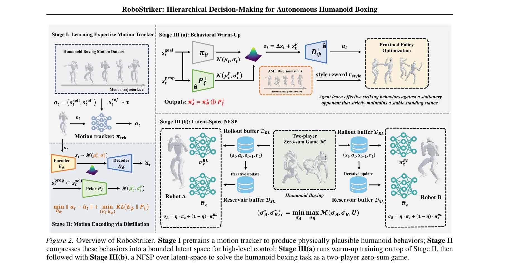
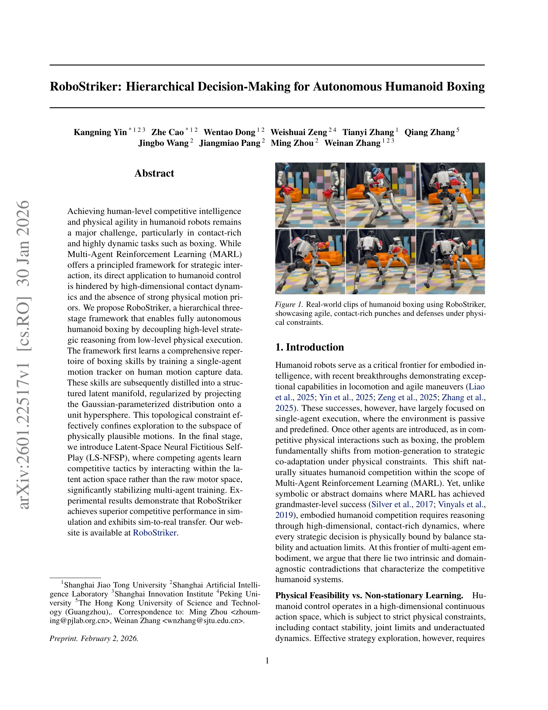

# RoboStriker: Hierarchical Decision-Making for Autonomous Humanoid Boxing

> **저자**: Kangning Yin, Zhe Cao, Wentao Dong, Weishuai Zeng, Tianyi Zhang, Qiang Zhang, Jingbo Wang, Jiangmiao Pang, Ming Zhou, Weinan Zhang | **날짜**: 2026-01-30 | **DOI**: [10.48550/arXiv.2601.22517](https://doi.org/10.48550/arXiv.2601.22517)

---

## Essence

*Figure 2. Overview of RoboStriker. Stage I pretrains a motion tracker to produce physically plausible humanoid behaviors*

RoboStriker는 인간 수준의 경쟁력 있는 휴머노이드 권투를 위해 높은 수준의 전략 추론과 낮은 수준의 물리적 실행을 분리하는 3단계 계층적 프레임워크를 제안한다. Motion capture 데이터로부터 학습된 동작 라이브러리를 구조화된 잠재 공간으로 압축한 후, Latent-Space NFSP를 통해 다중 에이전트 경쟁 학습을 수행한다.

## Motivation

- **Known**: MARL은 전략적 상호작용을 위한 원리적 프레임워크를 제공하며, DeepMimic과 AMP는 모방을 통해 견고한 단일 에이전트 제어를 달성했다. 그러나 이들 접근법은 휴머노이드의 높은 차원 접촉 역학과 비정상적 학습 환경에서의 물리적 실행 가능성을 동시에 해결하지 못한다.
- **Gap**: 기존 게임 이론적 MARL 방법들은 물리적 실행 가능성을 위한 귀납적 편향이 부족하며, 구현된 제어 프레임워크는 전략적 공진화나 상대 인식 적응을 지원하지 않는다. 따라서 높은 차원 접촉 역학 환경에서 안정적인 경쟁 전략 진화를 이루는 방법이 부재하다.
- **Why**: 휴머노이드 권투는 물리적 제약 하에서 전략 탐색의 필요성과 안정성 유지 사이의 모순을 대표하는 과제이며, 이를 해결하는 것은 실제 로봇 경쟁 작업의 실용화에 필수적이다. 또한 이는 추상 게임에서 물리적으로 기반된 시스템으로 MARL을 확장하는 일반적 원칙을 제공할 수 있다.
- **Approach**: RoboStriker는 motion capture 데이터로부터 학습한 물리적으로 실행 가능한 동작 라이브러리를 Gaussian-parameterized 분포를 단위 초구에 투영하여 구조화된 잠재 공간으로 압축한다. 그 후 Latent-Space NFSP를 통해 에이전트들이 원시 모터 공간이 아닌 잠재 동작 공간 내에서 경쟁 전술을 학습하도록 한다.

## Achievement

*Figure 1. Real-world clips of humanoid boxing using RoboStriker,*

- **물리적-전략적 이중성 해결**: 물리적 실행 가능성과 비정상적 학습, 전략 진화와 시스템 안정성 간의 내재적 모순을 공식적으로 특성화하고 해결
- **계층적 분해 프레임워크**: 높은 수준의 전략 추론과 낮은 수준의 물리적 실행을 분리하여 동적 격투 행동의 진화를 위한 안정적 경로 제공
- **시뮬레이션 우수성과 실세계 이전**: Unitree G1 휴머노이드에서 기존 방법 대비 향상된 성능, 견고성, 수렴 안정성을 달성하고 sim-to-real transfer 성공
- **일반화된 구조**: embodied multi-agent 경쟁을 위한 일반적 레시피 제공으로 추상 게임에서 물리 기반 로봇 시스템으로의 MARL 확장 가능성 시연

## How

*Figure 2. Overview of RoboStriker. Stage I pretrains a motion tracker to produce physically plausible humanoid behaviors*

- **Stage I - 동작 추적기 학습**: DeepMimic 기반 tracking policy를 human motion capture 데이터로 훈련하여 다양한 물리적으로 실행 가능한 권투 기술 습득
- **Stage II - 동작 인코딩**: Encoder-Decoder 구조로 학습된 동작들을 구조화된 잠재 공간으로 압축하며, KL divergence 제약과 함께 Gaussian 분포를 단위 초구에 투영하여 물리적으로 가능한 동작의 부분공간에 탐색 제한
- **Stage III(a) - 행동 워밍업**: AMP 기반 curriculum을 사용하여 정책을 이 잠재 다양체 내에서 초기화하고 경쟁적 cold-start 문제 완화
- **Stage III(b) - Latent-Space NFSP**: 두 에이전트가 잠재 동작 공간 내에서 NFSP를 수행하며, 혼합된 전략(best response와 reservoir policy의 가중 조합)으로 상대방과 상호작용하여 게임 이론적 균형점 수렴
- **안정화 메커니즘**: 제한된 잠재 다양체는 compact하고 물리적으로 안전한 전략 탐색 공간을 정의하여 모터 수준 불안정성 없이 LS-NFSP 운영 가능

## Originality

- **최초 형식화**: embodied MARL의 내재적 모순(물리적 실행가능성 vs 비정상적 학습, 전략 진화 vs 시스템 안정성)을 최초로 공식적으로 특성화
- **위상적 제약 활용**: Gaussian 분포를 단위 초구에 투영하는 방식으로 물리적 실행가능 동작의 부분공간에 탐색을 자동으로 제한하는 새로운 정규화 기법
- **Latent-Space NFSP**: 기존 NFSP를 처음으로 잠재 공간에 적용하여 고차원 접촉 역학 환경에서의 다중 에이전트 학습 안정화
- **계층적 분해의 실증**: motion tracking → latent encoding → competitive learning의 3단계 분해가 embodied 경쟁 작업에 얼마나 효과적인지 처음 시연

## Limitation & Further Study

- **도메인 특수성**: 프레임워크가 권투 작업으로 검증되었으나, 다른 유형의 접촉 기반 embodied 경쟁 작업에 대한 일반화 가능성은 명확하지 않음
- **모션 데이터 의존성**: 초기 동작 라이브러리의 질과 다양성이 최종 성능에 직접 영향을 미치므로, 제한된 motion capture 데이터로는 행동 공간의 제약이 발생 가능
- **실세계 검증 제한**: sim-to-real transfer가 시연되었으나 정량적 성능 비교와 더 복잡한 실세계 시나리오에서의 안정성 평가 필요
- **계산 복잡도 분석 부재**: 3단계 파이프라인의 전체 훈련 시간 및 계산 비용에 대한 상세 분석이 논문에서 제공되지 않음
- **후속 연구**: 다중 객체 상호작용, 장시간 경쟁 안정성, 다양한 체형의 로봇 적응, 온라인 적응 학습 메커니즘 개발이 필요

## Evaluation

- Novelty: 4/5
- Technical Soundness: 3/5
- Significance: 4/5
- Clarity: 4/5
- Overall: 4/5

**총평**: RoboStriker는 embodied MARL의 근본적 모순을 처음으로 공식화하고 계층적 분해를 통해 실질적으로 해결하는 주요 기여를 제시한다. 물리 시뮬레이션과 실제 로봇에서 권투라는 도전적 작업을 성공적으로 달성하여, 추상 게임에서 물리 기반 로봇 시스템으로 MARL을 확장하는 중요한 마일스톤을 제공한다.
