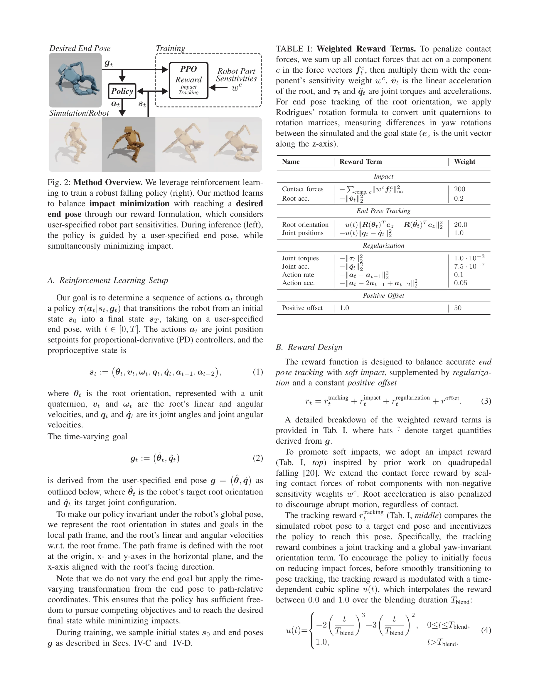
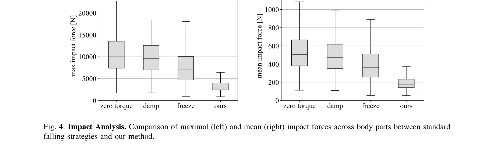

# Robot Crash Course: Learning Soft and Stylized Falling

> **저자**: Pascal Strauch, David Müller, Sammy Christen, Agon Serifi, Ruben Grandia, Espen Knoop, Moritz Bächer | **날짜**: 2025-11-13 | **DOI**: [10.48550/arXiv.2511.10635](https://doi.org/10.48550/arXiv.2511.10635)

---

## Essence

*Fig. 2: Method Overview. We leverage reinforcement learn-*

이 논문은 양족 로봇의 낙하 현상 자체에 초점을 맞춰, 충격을 최소화하면서 사용자가 지정한 목표 자세에 도달하도록 하는 강화학습 기반 낙하 정책을 제안한다.

## Motivation

- **Known**: 기존 연구는 낙하 방지에 중점을 두거나 손으로 만든 낙하 전략과 미리 정의된 접촉 수열에 의존한다. 최근 RL 기반 방법들이 적응형 접촉 수열을 통해 낙하를 다루고 있지만, 여전히 특정 낙하 방향이나 시나리오에 제한적이다.
- **Gap**: 기존 방법들은 여러 낙하 방향을 일반적으로 처리하면서 동시에 충격 최소화, 중요 부품 보호, 원하는 자세 달성이라는 여러 목표를 균형있게 다루지 못한다. 또한 추론 시 임의의 미지 자세를 지정할 수 있는 범용 낙하 정책이 부재하다.
- **Why**: 현실의 양족 로봇은 동적 모션 중 불가피하게 낙하할 수 있으며, 제어되지 않은 낙하는 로봇 손상과 부자연스러운 움직임을 야기한다. 낙하를 우아하게 수행하도록 학습시키면 손상 감소, 미적 제어, 회복 자세 제공이 가능해진다.
- **Approach**: 로봇 범용적 보상 함수를 설계하여 영향 최소화, 목표 자세 추적, 중요 부품 보호를 균형있게 조정한다. 초기 및 종료 자세의 시뮬레이션 기반 샘플링 전략을 도입하여 다양한 낙하 조건과 미지 자세에 대한 견고한 정책을 학습한다.

## Achievement

*Fig. 4: Impact Analysis. Comparison of maximal (left) and mean (right) impact forces across body parts between standard*

- **다목적 낙하 정책**: 충격 최소화와 사용자 정의 목표 자세를 동시에 달성하며, 예술적 제어와 회복 용이성을 제공
- **범용적 샘플링 전략**: 초기 및 종료 자세의 포괄적 샘플링으로 추론 시 미지의 임의 자세 지정 가능
- **실제 시연**: 양족 로봇의 제어된 부드러운 낙하를 시뮬레이션 및 현실 실험으로 입증하며, 기존 전략 대비 정량적 개선 달성

## How

*Fig. 2: Method Overview. We leverage reinforcement learn-*

- PPO(Proximal Policy Optimization)를 사용하여 정책 π(a_t|s_t, g_t) 학습
- 보상 함수를 충격 최소화, 자세 추적, 로봇 부품 민감도 가중치로 구성
- 시간 변화 목표 g_t를 사용자 지정 종료 자세로부터 유도
- 초기 및 종료 자세에 대한 물리 기반 샘플링 전략으로 광범위 낙하 조건 커버
- PD 컨트롤러로 조인트 위치 목표값 생성
- 절제 연구를 통해 충격 vs. 자세 추적 간 트레이드오프 검증

## Originality

- 기존 낙하 예방 연구와 달리, 낙하 현상 자체를 우아하게 수행하도록 학관하는 역발상적 접근
- 충격 최소화와 자세 스타일화를 단일 RL 프레임워크로 통합한 최초 시도
- 사용자 지정 부품 민감도와 미지 자세 지정을 모두 지원하는 로봇 범용 방법론
- 물리 기반 샘플링 전략으로 광범위 초기/종료 상태 분포 학습

## Limitation & Further Study

- 현재 방법은 낙하 발생 여부를 판단하지 않으며, 낙하 후 일어서는 회복 정책과의 통합은 추후 과제
- 실험이 주로 양족 로봇에 국한되어 있으며, 다리 수가 다른 로봇에 대한 일반화 검증 필요
- 실제 실험이 정성적 평가 중심이며, 더 다양한 낙하 시나리오와 로봇 플랫폼에서의 정량적 검증 부족
- 목표 자세의 물리적 실현 가능성 사전 검증 메커니즘이 명확하지 않음
- 환경 변수(바닥 재질, 장애물 등)의 영향에 대한 도메인 랜더마이제이션 전략 미상세

## Evaluation

- Novelty: 4/5
- Technical Soundness: 3/5
- Significance: 4/5
- Clarity: 4/5
- Overall: 4/5

**총평**: 이 논문은 로봇 낙하를 예방이 아닌 제어 대상으로 재정의하는 독창적 관점을 제시하며, RL 기반 다목적 보상 함수와 샘플링 전략으로 범용적 해결책을 제공한다. 실제 양족 로봇에서 부드럽고 스타일화된 낙하를 시연한 점에서 높은 의의가 있으나, 정량적 평가 확대와 다양한 로봇 플랫폼 검증이 필요하다.