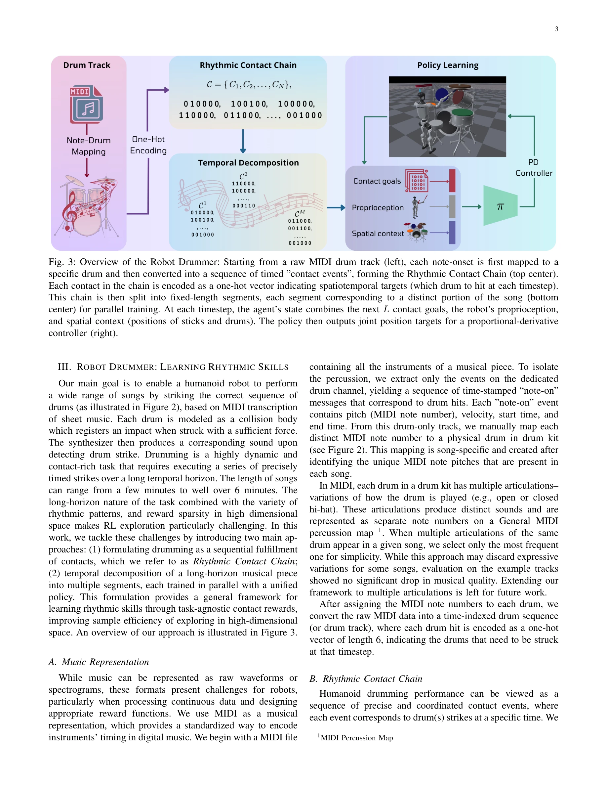
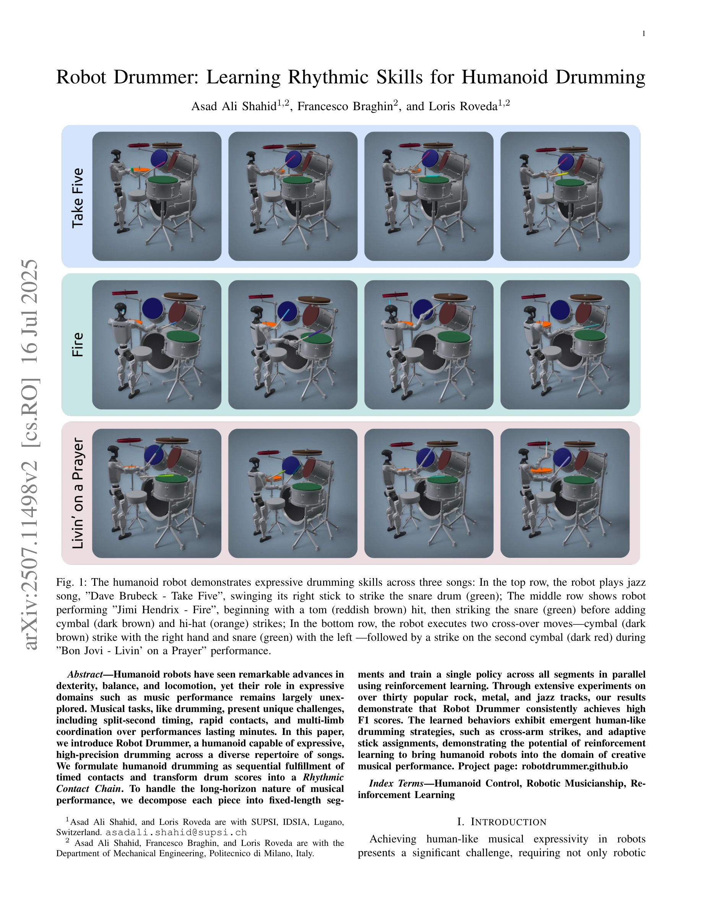

# Robot Drummer: Learning Rhythmic Skills for Humanoid Drumming

> **저자**: Asad Ali Shahid, Francesco Braghin, Loris Roveda | **날짜**: 2025-07-15 | **URL**: [https://arxiv.org/abs/2507.11498](https://arxiv.org/abs/2507.11498)

---

## Essence

*Fig. 3: Overview of the Robot Drummer: Starting from a raw MIDI drum track (left), each note-onset is first mapped to a*

본 논문은 인문형 로봇이 MIDI 악보를 기반으로 드럼을 연주하는 기술을 제시하며, Rhythmic Contact Chain 표현과 temporal decomposition을 활용한 reinforcement learning 프레임워크를 제안한다.

## Motivation

- **Known**: 최근 humanoid robotics는 motion imitation 기반의 학습으로 locomotion과 manipulation 기술을 발전시켰으나, 이는 주로 goal-driven 작업에 제한되어 있다. 음악 연주는 process-driven 작업으로 정밀한 타이밍과 장시간의 temporal coordination을 요구한다.
- **Gap**: 기존 RL 기반 음악 연주 연구는 단순화된 시스템(piano의 anthropomorphic hand 또는 2-DoF underactuated drum arm)에만 적용되었으며, humanoid 전신을 활용한 정밀한 드럼 연주 학습에 대한 연구가 부재하다.
- **Why**: 음악 공연과 같은 표현적(expressive) 도메인으로 humanoid robot의 역할을 확장하는 것은 창의적 로봇 제어의 새로운 경계를 의미하며, temporal precision, spatial coordination, dynamic adaptation을 동시에 요구하는 복잡한 제어 문제의 해결을 시연한다.
- **Approach**: 드럼 연주를 시간이 정해진 접촉 이벤트의 순차적 수행으로 공식화하고, 이를 Rhythmic Contact Chain으로 변환한다. 장시간 음악 공연을 고정 길이 segment로 분해하여 단일 policy로 병렬 학습함으로써 exploration 효율성을 높인다.

## Achievement

*Fig. 1: The humanoid robot demonstrates expressive drumming skills across three songs: In the top row, the robot plays j*

- **다양한 장르의 곡 연주**: 30개 이상의 rock, metal, jazz 트랙에서 높은 F1 score 달성
- **신흥 인간형 연주 전략**: cross-arm strikes와 adaptive stick assignments 같은 자발적 인간형 드럼 기술 발현
- **장시간 temporal coordination**: 분 단위 길이의 복잡한 리듬 패턴을 정밀하게 수행하는 능력 시연

## How

*Fig. 3: Overview of the Robot Drummer: Starting from a raw MIDI drum track (left), each note-onset is first mapped to a*

- MIDI 파일에서 드럼 채널을 추출하고 각 note를 물리적 드럼으로 매핑
- 시간 인덱싱된 드럼 시퀀스를 one-hot 벡터로 인코딩하여 Rhythmic Contact Chain 구성
- 각 곡을 고정 길이 segment로 temporal decomposition
- Agent state를 다음 L개 contact goals, robot proprioception, stick/drum 공간 정보로 구성
- Dense rhythmic contact reward를 통해 각 contact 이벤트(정확, 오류, 누락)를 학습 신호로 활용
- Proportional-derivative controller를 통해 joint position target 생성

## Originality

- Rhythmic Contact Chain이라는 새로운 음악 표현 방식으로 RL에 적합한 형태로 변환
- Temporal decomposition 기법을 통해 장시간 process-driven 작업의 탐색 효율 문제 해결
- Dense rhythmic contact reward 설계로 스파스한 피드백 문제 개선
- Humanoid 전신의 다중 팔(multi-limb)을 활용한 드럼 연주의 첫 체계적 RL 적용

## Limitation & Further Study

- MIDI note에서 가장 빈번한 articulation만 선택하여 표현력이 제한됨 (다중 articulation 지원 필요)
- Song-specific MIDI-to-drum 매핑이 필요하여 새로운 곡에 대한 확장성 부족
- 실제 음악 연주의 표현력(dynamics, timing variation 등) 측면의 평가가 부족
- 단순 접촉 성공 여부만이 아닌 음악적 품질에 대한 정성적 평가 필요
- 다양한 drumming style(swing, shuffle 등) 적응에 대한 체계적 분석 부재

## Evaluation

- Novelty: 4/5
- Technical Soundness: 3/5
- Significance: 4/5
- Clarity: 4/5
- Overall: 4/5

**총평**: 본 논문은 humanoid robotics에서 process-driven 창의적 작업으로의 확장을 의미 있게 시연하며, Rhythmic Contact Chain과 temporal decomposition이라는 실용적 기법을 통해 장시간 정밀 제어 문제를 효과적으로 해결한다. 30개 이상의 곡에서의 성공적 성과와 신흥 인간형 전략의 발현은 RL 기반 로봇 제어의 창의적 응용 가능성을 강력하게 보여준다.