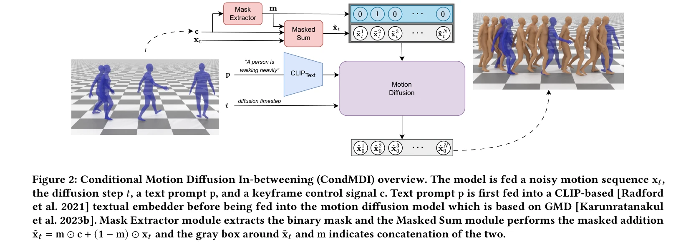

# Robot Motion Diffusion Model: Motion Generation for Robotic Characters

> **저자**:  | **날짜**:  | **URL**: [https://la.disneyresearch.com/publication/robot-motion-diffusion-model-motion-generation-for-robotic-characters/](https://la.disneyresearch.com/publication/robot-motion-diffusion-model-motion-generation-for-robotic-characters/)

---

## Essence

*Figure 1: Flexible motion in-betweening given a text prompt and spatio-temporally sparse keyframes. From left to right: *

본 논문은 diffusion model을 기반으로 한 Conditional Motion Diffusion In-betweening (CondMDI)를 제안하여, 텍스트 프롬프트와 희소한 키프레임 제약 조건을 유연하게 수용하면서 고품질의 다양한 모션을 생성한다.

## Motivation

- **Known**: 기존 RNN 기반 방법들은 장기 종속성 모델링에 어려움이 있으며, transformer 기반 방법과 diffusion 모델들도 고정된 키프레임 패턴이나 특정 관절(pelvis만) 제약에만 대응 가능했다.
- **Gap**: 이전 diffusion 기반 모션 생성 방법들은 temporal하게 희소한 키프레임, 부분적 포즈 스펙 피케이션, 텍스트 조건을 동시에 유연하게 처리할 수 있는 통합된 솔루션이 부족했다.
- **Why**: 모션 in-betweening은 캐릭터 애니메이션의 핵심 작업이며 수작업 방식이 노동집약적이므로, 자동화된 고품질 모션 생성 방법은 애니메이션 제작 효율을 대폭 향상시킬 수 있다.
- **Approach**: 본 논문은 무작위로 샘플링된 키프레임과 관절, 마스킹 토큰을 포함한 조건부 diffusion model을 훈련하여, 추론 시간에 임의의 sparse/dense 키프레임 배치와 partial 키프레임 제약을 유연하게 수용한다.

## Achievement

*Figure 1: Flexible motion in-betweening given a text prompt and spatio-temporally sparse keyframes. From left to right: *

- **통합된 유연한 모션 in-betweening 모델**: Temporal하게 희소한 키프레임, 부분적 포즈 스펙 피케이션, 텍스트 프롬프트를 동시에 지원하는 단일 unified model 개발
- **고품질 다양한 모션 생성**: HumanML3D 데이터셋에서 키프레임 제약을 정확히 준수하면서도 다양한 모션 생성 능력 입증
- **빠른 추론 속도**: 대안적 diffusion 기반 방법들 대비 빠른 추론 성능 달성
- **inference-time 조건화의 유연성**: imputation 및 reconstruction guidance 방법과의 비교를 통해 diffusion model의 조건화 장점 분석

## How

*Figure 2: Conditional Motion Diffusion In-betweening (CondMDI) overview. The model is fed a noisy motion sequence x𝑡,*

- Masked conditional diffusion model 훈련: 무작위로 샘플링된 시간적 위치의 키프레임과 무작위로 선택된 관절 부분집합으로 학습
- 유연한 마스킹 전략: 관찰된 키프레임과 피처를 나타내는 마스크를 사용하여 다양한 in-betweening 시나리오 커버
- Text conditioning 통합: HumanML3D 데이터셋의 텍스트 프롬프트와 함께 모션 조건화
- Guidance와 imputation 기반 접근법 비교: inference-time 키프레이밍을 위한 여러 기법 평가
- 부분 관절 포즈 스펙 피케이션 지원: 전체 포즈가 아닌 특정 관절 부분집합만으로 제약 조건 설정 가능

## Originality

- 기존 diffusion 기반 방법과 달리 temporal하게 희소한 keyframe과 partial joint 제약을 동시에 유연하게 처리하는 통합된 접근법 제시
- 무작위 키프레임 샘플링 및 마스킹 기법으로 모든 가능한 in-betweening 시나리오를 훈련 시간에 커버하는 단순하면서도 효과적인 전략
- Text conditioning, root trajectory 제약, sparse keyframe 조건을 하나의 모델에서 seamlessly 통합하는 첫 시도

## Limitation & Further Study

- 평가가 HumanML3D 데이터셋으로 제한되어 있으며, 다른 모션 도메인이나 캐릭터 타입(비인간 로봇 등)에 대한 일반화 능력 미검증
- Foot sliding 문제를 완전히 해결했는지 명확하지 않으며, 물리적 제약(collision, 중력)을 전혀 고려하지 않음
- 부분 관절 제약의 경우 생성된 모션의 자연스러움 평가 부족
- 후속 연구: 물리 시뮬레이션과의 통합, 더 긴 모션 시퀀스 생성, 실시간 interactive 애니메이션 제작 시스템 개발

## Evaluation

- Novelty: 4/5
- Technical Soundness: 3/5
- Significance: 4/5
- Clarity: 4/5
- Overall: 4/5

**총평**: 본 논문은 diffusion model의 유연한 조건화 능력을 활용하여 motion in-betweening 문제에 대한 실용적이고 통합된 솔루션을 제시하며, 단순하면서도 효과적인 마스킹 전략으로 다양한 제약 조건을 우아하게 처리한다. SIGGRAPH 수준의 높은 완성도와 실용성을 갖춘 우수한 연구이다.