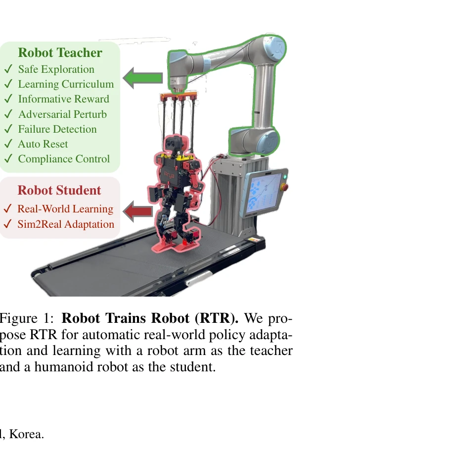
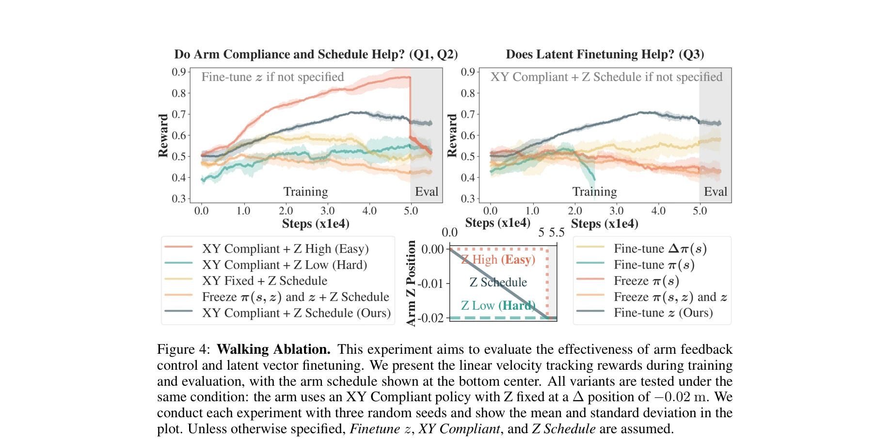
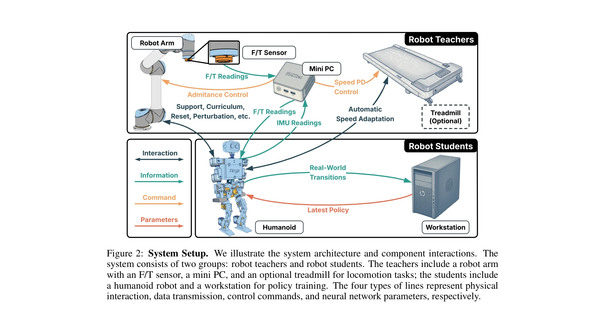

# Robot Trains Robot: Automatic Real-World Policy Adaptation and Learning for Humanoids

> **저자**: Kaizhe Hu, Haochen Shi, Yao He, Weizhuo Wang, C. Karen Liu, Shuran Song | **날짜**: 2025-08-17 | **URL**: [https://arxiv.org/abs/2508.12252](https://arxiv.org/abs/2508.12252)

---

## Essence

*Figure 1: Robot Trains Robot (RTR). We pro-*

로봇 팔(teacher)이 휴머노이드 로봇(student)을 지원하고 가이드하는 Robot-Trains-Robot(RTR) 프레임워크를 제안하여, 안전하고 효율적인 실제 환경에서의 휴머노이드 학습을 가능하게 한다. Dynamics-encoded latent variable 최적화를 통한 sim-to-real 전이 방법을 함께 제안한다.

## Motivation

- **Known**: 시뮬레이션 기반 강화학습(RL)은 휴머노이드 로보틱스에서 상당한 진전을 이루었으나, 직접적인 실제 환경 학습이나 실제 환경에서의 미세조정은 드물다. Domain randomization을 활용한 zero-shot sim-to-real 전이나 온라인 적응 방법들이 제안되었지만 휴머노이드의 불안정성으로 인해 안전한 실제 환경 학습은 여전히 도전적이다.
- **Gap**: 휴머노이드 로봇의 실제 환경 학습은 안전성, 보상 설계, 학습 효율성 측면에서 심각한 도전과제를 가지고 있으며, 현재 고정 갠트리 방식의 수동적 보호는 데이터 수집 범위를 제한하고 학습 효율을 저해한다. 실제 환경에서 측정 불가능한 보상 신호(예: 글로벌 속도)와 빈번한 리셋으로 인한 높은 인력 비용도 해결되지 않은 문제이다.
- **Why**: 휴머노이드 로봇이 현실 세계의 복잡한 동역학을 완전히 학습하려면 실제 환경에서의 직접 학습이 필수적이며, 이는 sim-to-real 갭을 근본적으로 극복할 수 있는 방법이다. 실제 환경 학습이 가능해지면 휴머노이드 로봇의 성능과 적응성이 획기적으로 향상될 수 있다.
- **Approach**: 로봇 팔(UR5)을 teacher로 활용하여 탄성 로프를 통해 휴머노이드에게 능동적 지지와 힘 피드백을 제공하고, F/T 센서로부터 실시간 보상 신호를 획득하며, 자동 커리큘럼과 perturbation을 적용한다. 추가로 도메인 랜덤화된 dynamics-aware 정책을 시뮬레이션에서 학습한 후, 범용 latent vector를 최적화하고 실제 환경에서 이 latent를 PPO로 미세조정하는 3단계 sim-to-real 파이프라인을 제안한다.

## Achievement

*Figure 4: Walking Ablation. This experiment aims to evaluate the effectiveness of arm feedback*

- **종합적 실제 환경 학습 시스템**: 안전 보호, 학습 커리큘럼, 자동 리셋, perturbation, 실시간 보상 신호 제공 등 휴머노이드 실제 환경 학습에 필요한 모든 기능을 통합한 RTR 시스템 구축
- **효율적 sim-to-real 미세조정 알고리즘**: Dynamics-encoded latent variable 최적화를 통해 안정적이고 빠른 실제 환경 적응 가능 (기존 context-based meta-RL을 휴머노이드에 실용적으로 적용)
- **실제 환경 실험 검증**: Walking 태스크에서 20분의 실제 환경 학습으로 zero-shot 성능 대비 속도 2배 향상, Swing-up 태스크에서 15분 이내에 처음부터 학습 성공

## How

*Figure 2: System Setup. We illustrate the system architecture and component interactions. The*

- **Hardware 설계**: UR5 로봇 팔과 ATI mini45 F/T 센서를 사용하여 탄성 로프를 통해 휴머노이드 어깨에 능동적 지지력 제공, Compliance control을 통해 안전하고 부드러운 힘 전달
- **Reward 설계**: F/T 센서 측정값으로부터 proxy reward signal 도출 (예: 글로벌 속도 대신 힘 기반 신호 활용)
- **Learning Curriculum**: 자동화된 커리큘럼으로 학습 난이도 동적 조정, Adversarial perturbation으로 견고성 강화, 실패 감지 및 자동 리셋으로 인력 개입 최소화
- **Sim-to-real 파이프라인**: (1) 도메인 랜덤화로 simulation에서 latent encoder와 FiLM layer를 통해 physics 정보를 정책에 임베딩, (2) 다양한 시뮬레이션 환경에서 범용 latent vector 최적화, (3) RTR 하드웨어를 활용해 실제 환경에서 PPO로 dynamics latent 미세조정
- **Asynchronous Data Collection**: 정책 업데이트와 데이터 수집 분리로 높은 처리량 달성

## Originality

- **새로운 teacher-student 패러다임**: 로봇 팔이 학생 휴머노이드를 적극적으로 지원하는 혁신적 하드웨어 아키텍처로, 기존의 수동적 갠트리 방식과 차별화
- **휴머노이드를 위한 실용적 적응**: Context-based meta-RL의 dynamics latent 최적화를 휴머노이드 시스템에 처음으로 안전하게 적용 (기존 시도는 단순 플랫폼과 스크립트 정책에만 국한)
- **통합 실제 환경 학습 시스템**: 안전성, 보상, 학습 효율, 자동화를 모두 아우르는 포괄적 시스템 설계로 실제 휴머노이드 학습의 실용적 해결책 제시
- **짧은 학습 시간**: 20분, 15분의 극단적으로 짧은 실제 환경 학습으로 유의미한 성과 달성

## Limitation & Further Study

- **스케일 문제**: ToddlerBot (소형 휴머노이드)에서만 검증; 대형 휴머노이드에서의 작동 가능성은 이론적 추론에만 근거 (산업용 로봇 팔의 들어올리기 용량으로 가능할 것으로 예상)
- **실험 범위 제한**: 2개 태스크(walking speed tracking, swing-up)만 검증하여 복잡한 동작이나 다양한 시나리오로의 일반화 가능성 미지수
- **비용과 복잡성**: UR5 로봇 팔과 F/T 센서 기반 시스템의 높은 비용과 복잡성으로 인한 접근성 제한
- **Latent 최적화 이론**: Dynamics-encoded latent의 최적화가 실제로 어떤 동역학 특성을 인코딩하는지에 대한 심층 분석 부족
- **후속 연구**: 더 복잡한 휴머노이드 플랫폼(full-scale, 더 많은 DoF)과 다양한 태스크에서의 검증 필요, Latent 해석 가능성 향상, 더 효율적인 F/T 센서 활용 방안 탐색

## Evaluation

- Novelty: 4/5
- Technical Soundness: 3/5
- Significance: 4/5
- Clarity: 4/5
- Overall: 4/5

**총평**: 실제 환경에서의 휴머노이드 학습이라는 중요하면서도 실제로 구현되지 않았던 문제에 대해, 혁신적인 teacher-robot 지원 방식과 효율적 sim-to-real 알고리즘을 결합하여 실질적인 해결책을 제시한다. 실험적 검증과 전반적 설계의 견고성이 우수하지만, 제한된 플랫폼과 태스크에서의 검증이라는 한계가 있다.
