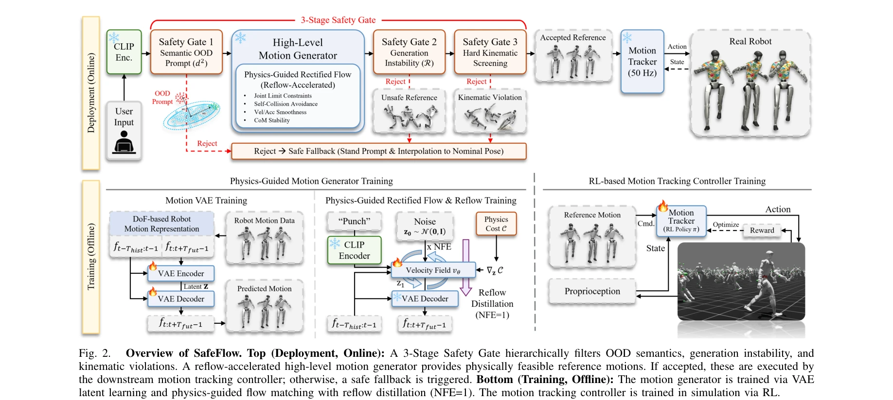

# SafeFlow: Real-Time Text-Driven Humanoid Whole-Body Control via Physics-Guided Rectified Flow and Selective Safety Gating

> **저자**: Hanbyel Cho, Sang-Hun Kim, Jeonguk Kang, Donghan Koo | **날짜**: 2026-03-25 | **URL**: [https://arxiv.org/abs/2603.23983](https://arxiv.org/abs/2603.23983)

---

## Essence

*Fig. 2.*

SafeFlow는 physics-guided rectified flow matching과 3단계 안전 게이팅을 결합하여 텍스트 명령 기반 휴머노이드 전신 제어에서 물리적으로 실현 불가능한 동작 생성 문제를 해결한다.

## Motivation

- **Known**: 최근 텍스트 기반 모션 생성 기술이 발전하여 실시간 대화형 로봇 제어가 가능해졌으나, 기하학적 생성기는 joint limit 위반, self-collision, 불안정한 균형 등 물리적 hallucination을 생성하는 문제가 있다.
- **Gap**: 기존 대화형 텍스트 제어 시스템은 생성 단계에서 physics-aware 목표 함수가 부족하고, 배포 시점에 out-of-distribution 입력에 대한 안전성 검증 메커니즘이 없다.
- **Why**: 휴머노이드 로봇의 실시간 제어에서 물리적 실행 불가능성과 OOD 입력으로 인한 안전성 문제를 해결하여 실제 로봇 배포의 신뢰성과 강건성을 높이는 것이 중요하다.
- **Approach**: Physics-Guided Rectified Flow Matching을 VAE latent space에서 수행하여 실행 가능한 모션을 생성하고, Reflow 증류로 실시간 추론을 가능하게 하며, Mahalanobis score, directional sensitivity discrepancy, kinematic constraint 기반의 3단계 safety gate를 도입한다.

## Achievement

*Fig. 2.*

- **Physics-Guided Motion Generation**: VAE latent space에서 physics-aware objectives(joint feasibility, self-collision avoidance, stability, smoothness)를 포함한 rectified flow matching으로 물리적으로 실현 가능한 모션 생성
- **Real-Time Acceleration**: Reflow 증류를 통해 function evaluation 수를 대폭 감소시켜 실시간 제어 가능 (NFE=1)
- **Hierarchical Safety Gating**: 의미적 OOD 탐지(Mahalanobis score), 생성 불안정성 필터링(directional sensitivity discrepancy), 하드 kinematic constraint 적용으로 안전성 보장
- **Superior Performance**: Unitree G1에서 success rate, physical compliance, inference speed 모두 기존 diffusion 기반 방법 대비 우수하면서 표현력 유지

## How

*Fig. 2.*

- VAE를 통해 고차원 모션을 저차원 latent space로 인코딩
- Physics-guided rectified flow matching으로 latent space에서 physics constraint를 고려한 샘플링 수행
- Reflow 증류를 적용하여 physics guidance를 모델에 internalize하고 sampling step 최소화
- Text embedding space에서 Mahalanobis distance를 이용한 semantic OOD 검출
- 생성된 모션의 directional flow sensitivity를 측정하여 구조적 불안정성 필터링
- Joint limit, velocity limit 등 hard kinematic constraint 적용으로 최종 검증
- 거부된 경우 safe fallback 메커니즘 트리거

## Originality

- **Physics-Guided Rectified Flow의 실시간 로봇 제어 적용**: 기존 character animation 영역의 physics-guided sampling을 실시간 텍스트 기반 휴머노이드 제어로 처음 확장
- **Reflow를 통한 실시간성 확보**: Physics guidance를 유지하면서 NFE=1로 축소하여 streaming control 가능하게 함
- **Training-Free 3-Stage Safety Gate**: 의미적, 생성 품질, 운동학적 세 단계의 explicit risk indicator 기반 hierarchical filtering으로 OOD 입력에 대한 robust한 rejection mechanism 제시

## Limitation & Further Study

- VAE latent space에서의 motion generation은 original space의 정보 손실 가능성 존재
- 3단계 safety gate의 threshold 설정이 경험적/휴리스틱 기반일 수 있어 다양한 로봇 플랫폼으로의 일반화 가능성 미확인
- OOD 검출의 Mahalanobis score는 training data의 distribution 형태에 크게 의존
- 실제 물리 시뮬레이션과 sim-to-real gap에 대한 논의 부족
- 후속 연구: 적응적 threshold learning, 다중 로봇 플랫폼 검증, 더욱 정교한 physics simulator integration

## Evaluation

- Novelty: 4/5
- Technical Soundness: 3/5
- Significance: 4/5
- Clarity: 4/5
- Overall: 4/5

**총평**: SafeFlow는 physics-guided generation과 hierarchical safety gating을 효과적으로 결합하여 텍스트 기반 휴머노이드 제어의 안전성과 실행 가능성을 동시에 달성한 실질적으로 중요한 연구이며, Unitree G1에서의 광범위한 실험 검증으로 실제 로봇 배포의 가능성을 보여준다.
