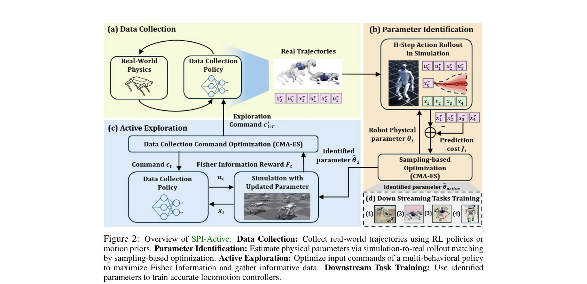
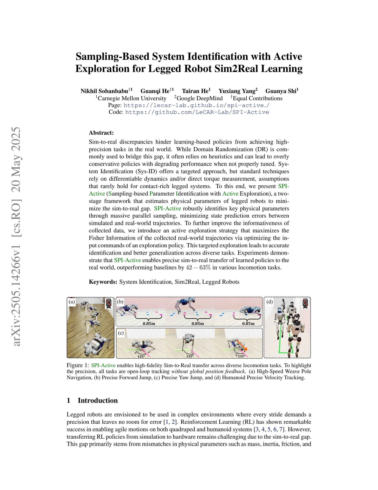

# Sampling-Based System Identification with Active Exploration for Legged Robot Sim2Real Learning

> **저자**: Nikhil Sobanbabu, Guanqi He, Tairan He, Yuxiang Yang, Guanya Shi | **날짜**: 2025-05-20 | **URL**: [https://arxiv.org/abs/2505.14266](https://arxiv.org/abs/2505.14266)

---

## Essence

*Figure 2: Overview of SPI-Active. Data Collection: Collect real-world trajectories using RL policies or*

SPI-Active는 legged robot의 물리 파라미터를 샘플링 기반으로 식별하고 Fisher Information 최대화를 통한 active exploration으로 sim-to-real 갭을 최소화하는 two-stage 프레임워크이다.

## Motivation

- **Known**: Domain Randomization은 sim-to-real 갭 해결에 광범위하게 사용되지만 휴리스틱에 의존하며, System Identification은 물리 파라미터의 원리적 추정을 제공한다.
- **Gap**: 기존 System Identification 기법들은 differentiable dynamics나 직접 torque measurement를 가정하는데, contact-rich legged robot에서는 이러한 조건이 성립하지 않는다. 또한 충분히 정보성 높은 데이터 수집이 어렵다.
- **Why**: 정확한 물리 파라미터 식별은 고정밀 legged locomotion 작업의 zero-shot sim-to-real transfer를 가능하게 하며, 보수적인 정책 대신 성능 최적화된 제어기 학습을 지원한다.
- **Approach**: SPI-Active는 Stage 1에서 병렬 샘플링을 통해 state prediction error를 최소화하는 물리 파라미터를 식별하고, Stage 2에서 optimal experiment design 원리를 적용하여 Fisher Information을 최대화하는 exploration policy의 command sequence를 최적화한다.

## Achievement

*Figure 1: SPI-Active enables high-fidelity Sim-to-Real transfer across diverse locomotion tasks. To highlight*

- **Specialized sensor-free identification**: Differentiable simulator나 ground-truth torque 측정 없이 contact-rich legged system의 구조화된 물리 파라미터를 식별 가능
- **Hierarchical active exploration strategy**: Pre-trained multi-behavioral RL policy의 command space 최적화를 통해 안정성을 보장하면서 정보성 높은 데이터 수집
- **Significant sim-to-real performance gains**: Quadruped과 humanoid 모두에서 baseline 대비 42-63% 향상된 diverse locomotion task 성능 달성
- **Generalizable framework**: 개별 task-specific tuning 없이 다양한 고정밀 locomotion 작업(jumping, pole weaving, velocity tracking)으로 일반화

## How

*Figure 2: Overview of SPI-Active. Data Collection: Collect real-world trajectories using RL policies or*

- GPU 기반 병렬 샘플링으로 대규모 파라미터 공간 탐색 수행
- RL 정책으로부터 수집한 real-world trajectory와 simulation rollout 간의 state mismatch 최소화 via zeroth-order 최적화
- Fisher Information Matrix 계산으로 각 파라미터의 uncertainty 정량화
- Multi-behavioral RL policy의 command input을 FIM 기반으로 최적화하여 informative trajectory 생성
- 식별된 파라미터를 simulator에 적용하여 downstream task의 RL 정책 학습

## Originality

- Contact-rich legged system을 위한 최초의 complete white-box system identification 프레임워크로, inertial parameter와 actuator dynamics를 joint하게 식별
- Legged robot의 erratic behavior 문제를 해결하기 위해 hierarchical command optimization 도입 (기존 ASID 등과 차별화)
- Pre-trained policy의 command space 최적화로 active exploration의 안정성과 정보성을 동시에 확보하는 novel approach

## Limitation & Further Study

- 식별 정확도는 초기 데이터 수집 정책(RL policy)의 quality에 의존하며, 부실한 초기 정책은 poor identification으로 이어질 수 있음
- Stage 2의 active exploration은 추가적인 계산 비용(Fisher Information 계산 및 optimization)을 요구함
- 현재는 Unitree Go2와 G1 humanoid에만 검증되었으며, 다른 morphology의 robot으로의 generalization 미검증
- 식별된 파라미터의 물리적 interpretability 검증이 부분적으로만 제공됨 (예: 식별된 질량, 관성의 절대값 정확성 평가 미흡)
- 후속연구: (1) 다양한 robot platform에서의 확장, (2) online refinement 메커니즘 추가, (3) 식별 불확실성의 명시적 propagation

## Evaluation

- Novelty: 4/5
- Technical Soundness: 3/5
- Significance: 4/5
- Clarity: 4/5
- Overall: 4/5

**총평**: 이 논문은 legged robot의 sim-to-real 갭 해결을 위한 원리적이고 실용적인 system identification 프레임워크를 제시하며, Fisher Information 기반 active exploration 전략의 창의적 적용으로 고정밀 locomotion 작업에서 현저한 성능 향상을 달성했다.
