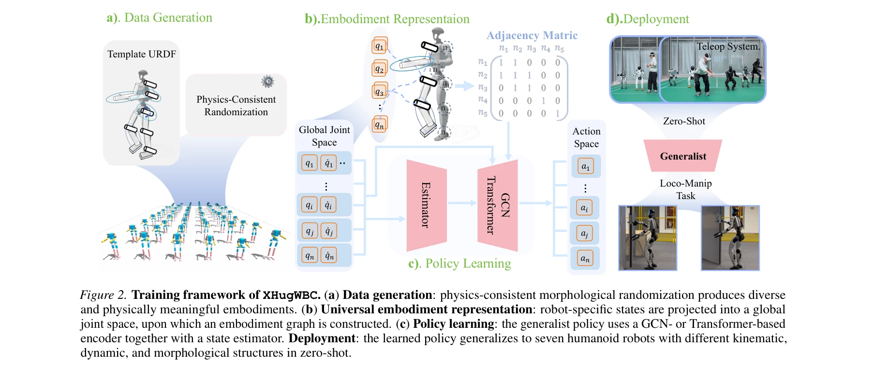
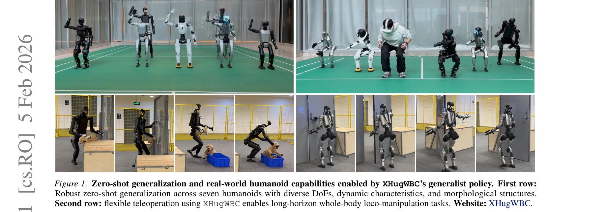

# Scalable and General Whole-Body Control for Cross-Humanoid Locomotion

> **저자**: Yufei Xue, YunFeng Lin, Wentao Dong, Yang Tang, Jingbo Wang, Jiangmiao Pang, Ming Zhou, Minghuan Liu, Weinan Zhang | **날짜**: 2026-02-05 | **URL**: [https://arxiv.org/abs/2602.05791](https://arxiv.org/abs/2602.05791)

---

## Essence

*Figure 2. Training framework of XHugWBC. (a) Data generation: physics-consistent morphological randomization produces di*

XHugWBC는 물리적으로 일관성 있는 형태학적 랜덤화, 의미론적으로 정렬된 관찰-행동 공간, 그래프 기반 정책 아키텍처를 통해 단일 정책으로 다양한 인간형 로봇에 대한 제로샷 제너럴화를 실현하는 교차-신체 전신 제어 프레임워크이다.

## Motivation

- **Known**: 학습 기반 전신 제어기는 인간형 로봇의 주요 동인이지만, 대부분의 기존 접근법은 로봇별 재훈련이 필요하다. 도메인 랜덤화는 강건한 제어기 훈련에 성공했으나, 인간형 로봇의 높은 형태학적 이질성으로 인해 단순 랜덤화는 물리적 일관성을 위반할 수 있다.
- **Gap**: 기존 교차-신체 학습은 좁은 로봇 계열, 유사한 역학, 정렬된 상태-행동 공간을 가정하는데, 인간형 로봇은 운동학, 자유도, 물리적 특성에서 상당히 다르다. 또한 물리적으로 타당한 형태 파라미터 공간은 비볼록 비연속이므로 임의의 랜덤화는 시뮬레이션 불안정성과 현실 전이 실패를 초래할 수 있다.
- **Why**: 인간형 로봇이 빠르게 다양화되면서 로봇별 훈련은 비용이 많이 들고 비효율적이다. 제너럴 정책은 새로운 플랫폼에 즉시 배포 가능하여 개발 시간과 자원을 절감하고 상용화를 가속한다.
- **Approach**: XHugWBC는 (1) 물리 법칙 기반 형태 파라미터 리파라미터화를 통한 일관성 있는 랜덤화, (2) 전역 관절 공간으로의 상태-행동 정규화, (3) 로봇 토폴로지 기반 GCN/Transformer 기반 정책 아키텍처를 결합한다.

## Achievement

*Figure 1. Zero-shot generalization and real-world humanoid capabilities enabled by XHugWBC’s generalist policy. First ro*

- **제로샷 제너럴화**: 단일 정책이 다양한 운동학, 역학, 형태를 가진 7개 실제 인간형 로봇에서 강건하게 작동
- **시뮬레이션 확장성**: 12개 시뮬레이션 인간형에서 specialist 성능의 약 85% 달성, 파인튜닝 후 specialist 초과 10%
- **물리 일관성**: 비볼록 파라미터 공간에서 물리적으로 타당한 형태 랜덤화 실현, 현실 전이 안정성 확보
- **통합 표현**: 운동학적 이질성을 극복하는 의미론적 상태-행동 정렬 달성

## How

*Figure 2. Training framework of XHugWBC. (a) Data generation: physics-consistent morphological randomization produces di*

- Template URDF에서 형태 파라미터 κ = [κ_link, κ_joint]로 인간형 로봇의 공유 구조 캡처
- 질량, 질량 중심, 회전 관성, 관절 위치, 방향, 동작축, 운동 제약을 포함하는 10+13 차원 파라미터 공간 정의
- 관성 파라미터의 positive-definiteness 제약을 만족하도록 콜레스키 분해, QR 분해 등으로 리파라미터화
- 전역 관절 공간으로 상태를 정규화하고 로봇 토폴로지 그래프 구성
- GCN 또는 Transformer 인코더와 state estimator를 포함하는 하이브리드 정책 아키텍처 사용
- 12개 다양한 시뮬레이션 인간형에서 통합 훈련 후 미지의 로봇에 제로샷 배포

## Originality

- 물리 법칙 기반 형태 랜덤화를 통해 기존 단순 스케일링의 물리적 무효성 문제 해결
- 의미론적 상태-행동 정렬로 운동학적 이질성을 가진 로봇들 간 지식 이전 실현
- 7개 실제 로봇에서의 제로샷 제너럴화는 기존 연구의 시뮬레이션 한정 또는 제한된 로봇군 이전을 넘어선 첫 사례
- 그래프 기반 인코더로 로봇 토폴로지 구조를 명시적으로 모델링하여 신체 특이 역학 포착

## Limitation & Further Study

- 현실 실험이 7개 로봇으로 제한적이며, 더 극단적 형태 변이(예: 다리 수 변경)에 대한 성능 미평가
- 전신 제어는 조작과 이동의 조율 복잡도가 높아, 제한된 조작 작업에서만 검증
- 물리적 일관성 제약이 적용된 파라미터 공간이 여전히 실제 로봇의 전체 다양성을 완전히 포괄하는지 미확인
- 후속 연구로 더 큰 규모 로봇 집합, 극단적 형태 변이, 비인간형 로봇(사족/팔다리형) 확장이 필요
- sim-to-real gap 완전 해소 및 동적 부분 관찰(occlusion) 상황 강건성 개선 가능

## Evaluation

- Novelty: 4/5
- Technical Soundness: 3/5
- Significance: 4/5
- Clarity: 4/5
- Overall: 4/5

**총평**: 본 논문은 물리적으로 일관성 있는 형태 랜덤화와 의미론적 정렬을 통해 단일 정책의 다중 인간형 로봇 제너럴화를 처음으로 달성했으며, 7개 실제 로봇에서의 강건한 제로샷 성능과 시뮬레이션 확장성으로 로봇 학습의 현실적 가치를 입증했다.
