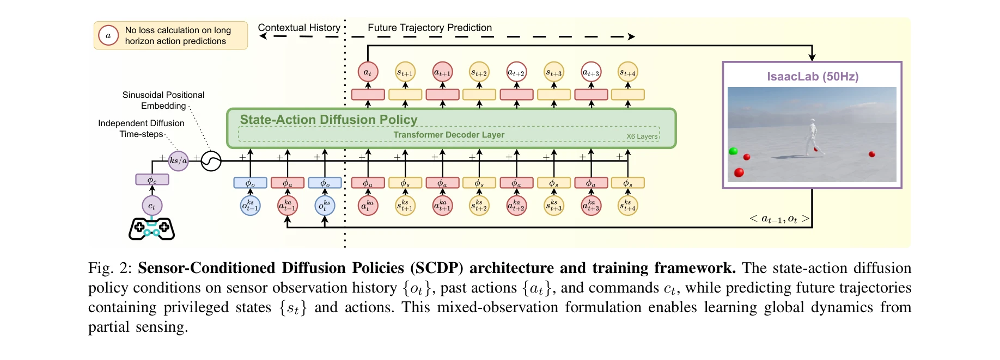
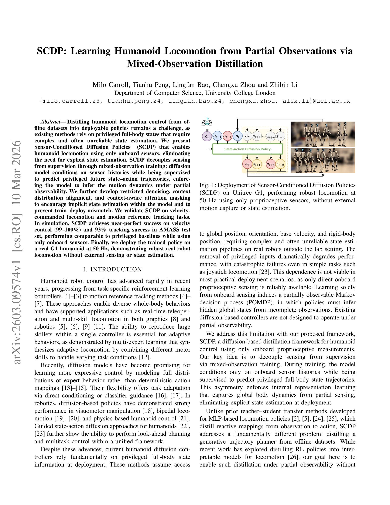

# SCDP: Learning Humanoid Locomotion from Partial Observations via Mixed-Observation Distillation

> **저자**: Milo Carroll, Tianhu Peng, Lingfan Bao, Chengxu Zhou, Zhibin Li | **날짜**: 2026-03-10 | **URL**: [https://arxiv.org/abs/2603.09574](https://arxiv.org/abs/2603.09574)

---

## Essence

*Fig. 2: Sensor-Conditioned Diffusion Policies (SCDP) architecture and training framework. The state-action diffusion*

온보드 센서만으로 휴머노이드 보행을 학습하기 위해 mixed-observation distillation을 사용하는 SCDP(Sensor-Conditioned Diffusion Policies)를 제안하며, diffusion model이 센서 이력에 조건화되면서 privileged 미래 상태-행동 궤적을 예측하도록 학습한다.

## Motivation

- **Known**: Diffusion model은 보행 제어에서 유망한 성과를 보였으나, 기존 humanoid diffusion controller는 배포 시 privileged full-body state(전역 위치, 방향, base velocity 등)에 의존하므로 복잡하고 신뢰성 낮은 state estimation 파이프라인이 필요하다.
- **Gap**: Privileged state 없이는 성능이 급격히 저하되며, 기존 diffusion 방법은 POMDP 환경에서 partial observability를 처리하도록 설계되지 않았다.
- **Why**: 실제 로봇 배포 시 외부 센서(motion capture)와 복잡한 state estimation 없이 온보드 센서만으로 강건한 보행이 가능하면, 휴머노이드 로봇의 실용적 적용성이 크게 향상된다.
- **Approach**: Mixed-observation training으로 센서 이력(Ot)에만 조건화하면서 privileged state(st)를 감독 신호로 사용하여, 모델이 암묵적으로 부분 관찰에서 전역 동역학을 추론하도록 강제한다. Restricted denoising, context distribution alignment, context-aware attention masking 등의 기법으로 implicit state estimation을 유도한다.

## Achievement

*Fig. 1: Deployment of Sensor-Conditioned Diffusion Policies*

- **시뮬레이션 성능**: Velocity control에서 99-100% 성공률, AMASS test set에서 93% tracking 성공률 달성하며 privileged baseline과 비교 가능한 수준
- **실로봇 배포**: 외부 센싱이나 state estimation 없이 Unitree G1에서 50Hz로 강건한 보행 수행
- **방법론 일반성**: Velocity-commanded locomotion과 motion reference tracking 모두에서 검증되어 다양한 작업에 적용 가능

## How

*Fig. 2: Sensor-Conditioned Diffusion Policies (SCDP) architecture and training framework. The state-action diffusion*

- Mixed-observation training: 조건(conditioning)은 onboard sensor history Ot를 사용하되, 감독(supervision)은 privileged state trajectory st+1:t+H를 대상으로 함
- Restricted denoising: Pelvis linear velocity vpelvis를 denoising input에서 제외하고 supervision target에만 포함하여, 모델이 context에서 velocity를 추론하도록 강제
- Context distribution alignment: Training과 inference 간 상태-행동 인과관계의 일관성 유지
- Context-aware attention masking: Context window 내에서 양방향 attention을 활성화하여 부분 관찰에서 latent dynamics 추론 촉진
- Multi-Motion Tracking Policy(MMP)를 expert demonstrator로 사용하여 offline dataset 생성
- DDPM 기반 diffusion model로 state와 action에 독립적인 noise schedule 적용

## Originality

- Mixed-observation distillation의 개념적 혁신: 기존 teacher-student 방법은 reactive mapping(observation→action)을 distill하지만, 본 논문은 generative trajectory planner를 partial observability 하에서 distill하는 근본적으로 다른 문제를 해결
- Restricted denoising 기법: Velocity 피드백 없이 velocity control을 가능하게 하는 창의적인 학습 제약
- Sensor-only humanoid control: Privileged state 없이 diffusion policy를 실로봇에 배포한 첫 사례

## Limitation & Further Study

- 실로봇 실험이 Unitree G1 단일 플랫폼에만 국한되어 다른 humanoid 로봇의 일반화 가능성 미검증
- Context history 길이(N)와 prediction horizon(H)에 대한 상세한 ablation 분석이 제한적
- Sensor noise나 IMU drift 같은 실제 센서 오류에 대한 robustness 정량 분석 부재
- 온라인 학습(online adaptation)이나 domain shift 처리 메커니즘 미포함
- Computational cost와 inference latency에 대한 명시적 분석 부재

## Evaluation

- Novelty: 4/5
- Technical Soundness: 3/5
- Significance: 4/5
- Clarity: 4/5
- Overall: 4/5

**총평**: Mixed-observation distillation은 개념적으로 우수한 해결책이며, 실로봇 배포까지 달성한 점이 높게 평가된다. 다만 일반화 범위와 센서 robustness 측면의 추가 검증이 필요하며, IROS 채택으로 인정된 견고한 연구이다.
