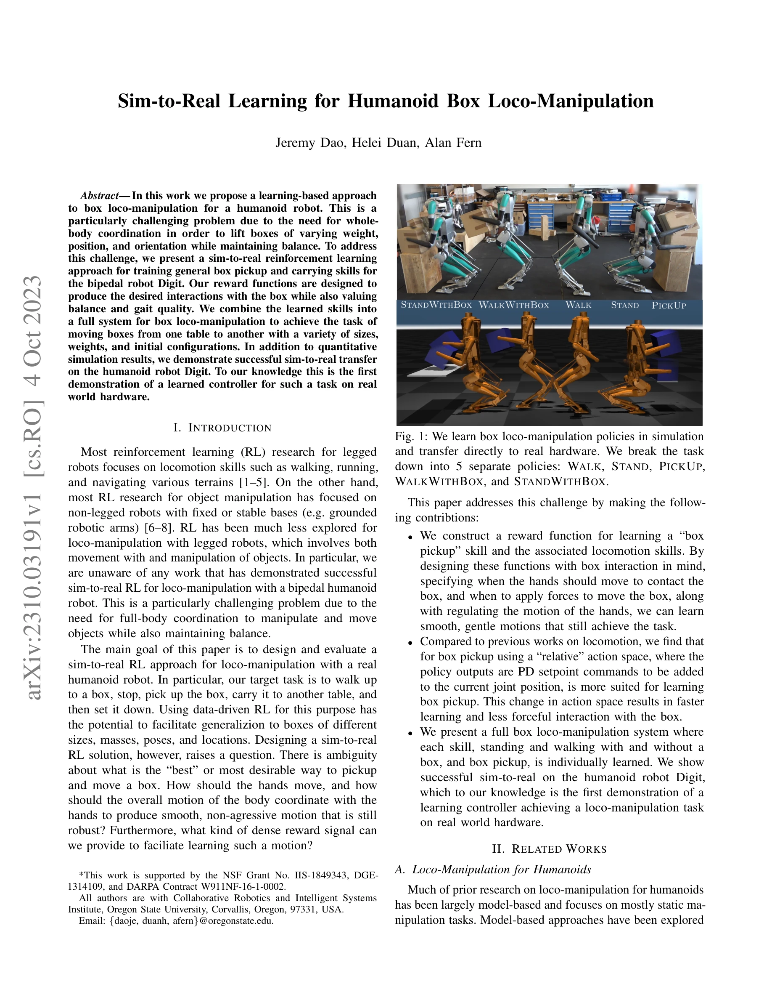
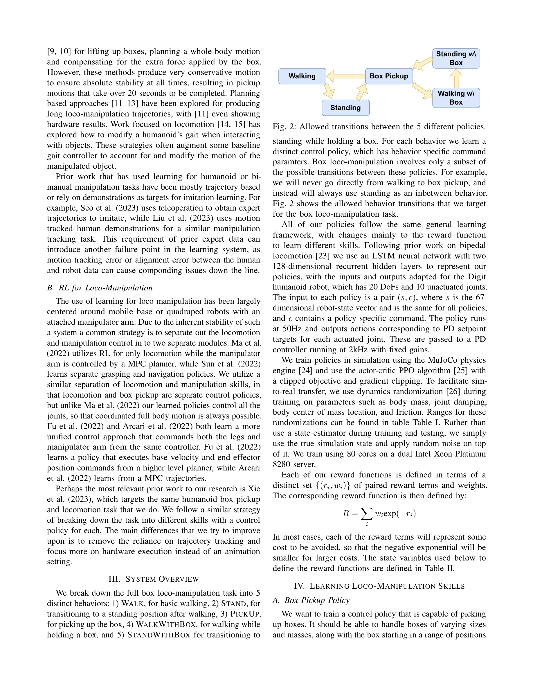

# Sim-to-Real Learning for Humanoid Box Loco-Manipulation

> **저자**: Jeremy Dao, Helei Duan, Alan Fern | **날짜**: 2023-10-04 | **URL**: [https://arxiv.org/abs/2310.03191](https://arxiv.org/abs/2310.03191)

---

## Essence

*Fig. 1: We learn box loco-manipulation policies in simulation*

본 연구는 인간형 로봇 Digit의 박스 집기 및 운반 작업을 위해 강화학습 기반의 sim-to-real 접근법을 제시하며, 5가지 분리된 정책(걷기, 서기, 집기, 박스 들고 걷기, 박스 들고 서기)을 학습하여 실제 하드웨어에서 성공적으로 전이했다.

## Motivation

- **Known**: 인간형 로봇의 조작 연구는 주로 모델 기반 접근법으로 보수적인 동작을 생성하며, 사족 로봇의 loco-manipulation은 분리된 모듈로 처리되어 왔다. 또한 대부분의 학습 기반 조작은 시연(demonstration)에 의존한다.
- **Gap**: 인간형 이족 로봇의 loco-manipulation에 대한 sim-to-real RL 적용은 이전에 시연되지 않았으며, 시연 데이터 없이 자연스럽고 부드러운 박스 집기 동작을 학습하기 위한 효과적인 보상 함수 설계가 부족했다.
- **Why**: 인간형 로봇이 다양한 크기, 무게, 위치의 박스를 균형을 유지하며 집고 운반할 수 있다면 실제 환경에서의 일반화 능력이 크게 향상되어 산업용 및 서비스 로봇의 활용성이 증가할 수 있다.
- **Approach**: MuJoCo 시뮬레이션에서 dynamics randomization을 적용하여 PPO 알고리즘으로 5가지 정책을 독립적으로 학습하고, 각 정책에 맞춤형 보상 함수(R = Σ wi·exp(-ri) 형태)를 설계하여 실제 로봇으로 직접 전이했다.

## Achievement

*Fig. 1: We learn box loco-manipulation policies in simulation*

- **첫 인간형 이족 로봇의 sim-to-real 박스 loco-manipulation**: 시뮬레이션에서 학습된 정책이 실제 Digit 로봇에서 다양한 박스 크기, 무게, 초기 배치에 대해 성공적으로 작동함을 입증
- **보상 함수 설계 기여**: 박스와의 상호작용을 명시적으로 모델링하는 two-phase 보상 함수(contact phase와 lift phase)로 자연스럽고 부드러운 동작 학습
- **Relative action space의 효과**: 절대 위치 대신 상대 위치 기반 PD setpoint 명령이 더 빠른 학습과 덜 공격적인 박스 상호작용을 가능하게 함
- **모듈식 정책 아키텍처**: 5가지 독립적 정책의 조합으로 일반화 가능한 전체 시스템 구축

## How

*Fig. 2: Allowed transitions between the 5 different policies.*

- MuJoCo 물리 시뮬레이터에서 LSTM 기반 신경망 정책(128-dimensional recurrent hidden layer 2개)을 PPO 알고리즘으로 학습
- Body mass (±20%), joint damping (±250%), ground friction (±30%), center of mass position (±5%)에 대한 dynamics randomization 적용
- 정책 입력: 67-dimensional robot state vector + policy-specific command; 출력: 20 DoF에 대한 PD setpoint 목표값
- Box pickup 정책을 두 단계로 분해: (1) contact phase (t=0~100): 손이 박스와 접촉, (2) lift phase (t=100~175): 박스를 목표 위치로 이동
- 보상 함수를 지수 형태 R = Σ wi·exp(-ri)로 정의하여 각 행동 단계별로 최적화
- 50Hz 정책 실행 루프와 2kHz PD 컨트롤러 루프로 계층적 제어 구조 구성
- 5가지 정책 간 상태 전이 제약(Fig. 2)을 명시하여 안전한 행동 순서 보장

## Originality

- 인간형 이족 로봇의 박스 loco-manipulation에 대한 **첫 sim-to-real RL 시연**으로, 기존 모델 기반 또는 시연 기반 접근법과 차별화
- 두 단계 phase indicator를 활용한 **task-aware 보상 함수 설계**로 시간에 따른 동작 진행 명시
- Relative action space 도입으로 **학습 효율성과 로봇 친화성 동시 달성**
- 모듈식 정책 구조는 이전 연구(Xie et al. 2023)와 유사하지만, **시연 추적 제거 및 실제 하드웨어 실행 중심**으로 개선

## Limitation & Further Study

- 박스 pose 추정이 초기 위치만 명시적으로 알고 이후 hand pose의 평균으로 근사하여 오차 누적 가능성
- Hand-selected phase times (tcontact=100, tlift=175)로 인한 경직된 시간 구조로, 상황에 따른 유연한 전환 불가
- 5가지 분리된 정책으로 인한 학습 복잡도 증가 및 상태 전이 실패 시 복구 불가
- Dynamics randomization 범위가 고정되어 있어 실제 환경의 예상 외 변화(예: 카펫, 기울어진 바닥)에 대한 강건성 미검증
- **후속 연구**: (1) 단일 end-to-end 정책으로 phase 전환을 자동으로 학습, (2) 시각 정보 통합으로 박스 pose 추정 개선, (3) 더 광범위한 동역학 무작위화 또는 도메인 적응 기법 적용, (4) 손상된 정책에서의 복구 메커니즘 추가

## Evaluation

- Novelty: 4/5
- Technical Soundness: 3/5
- Significance: 4/5
- Clarity: 4/5
- Overall: 4/5

**총평**: 본 논문은 인간형 이족 로봇의 복합적인 loco-manipulation 작업에 대한 첫 sim-to-real RL 성공 사례를 제시하며, 실용적인 보상 함수 설계와 action space 선택을 통해 자연스러운 동작을 학습했다는 점에서 의의가 있다. 다만 phase 관리의 경직성과 박스 pose 추정 오차 등 개선의 여지가 있어 기술적으로는 중간 수준이지만 실제 하드웨어 적용이라는 중요한 성과와 명확한 기여로 높은 가치를 가진다.