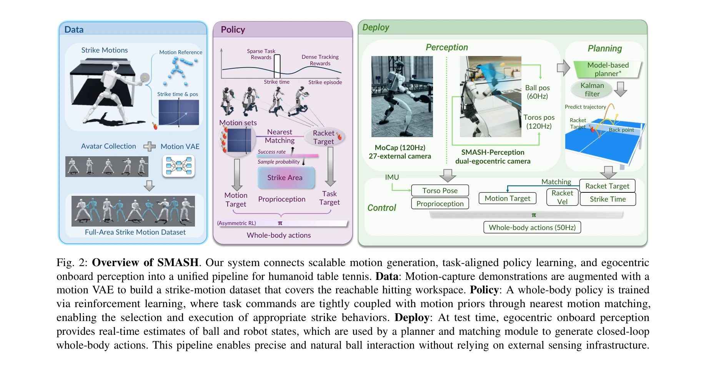
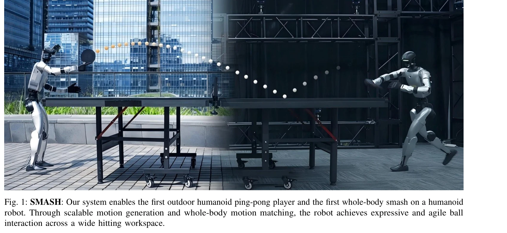

# SMASH: Mastering Scalable Whole-Body Skills for Humanoid Ping-Pong with Egocentric Vision

> **저자**:  | **날짜**: 2026-04-01 | **URL**: [https://arxiv.org/abs/2604.01158](https://arxiv.org/abs/2604.01158)

---

## Essence

*Fig. 2: Overview of SMASH. Our system connects scalable motion generation, task-aligned policy learning, and egocentric*

휴머노이드 로봇의 탁구 게임을 위해 확장 가능한 전신 동작 학습과 자체 에고센트릭 비전을 통합한 SMASH 시스템을 제시하며, 외부 카메라나 모션 캡처 없이 실외에서 연속적인 탁구 스트라이킹을 처음으로 달성했다.

## Motivation

- **Known**: 휴머노이드 로봇의 탁구는 기존에 외부 센싱(고속 카메라, 모션 캡처)에 의존했으며, 상하체를 분리한 제어나 제한된 동작 집합만 사용했다.
- **Gap**: 자체 에고센트릭 센싱만으로 저지연 인식을 구현하기 어렵고, 충분히 다양한 과제 정렬 스트라이크 동작을 확보하기 어렵다.
- **Why**: 휴머노이드 로봇이 동적 실시간 상호작용 환경에서 자율적으로 작동하려면 온보드 지각과 전신 협응 제어가 필수적이며, 탁구는 이를 검증하는 대표적인 벤치마크이다.
- **Approach**: Motion VAE를 통한 동작 확장으로 스트라이크 모션 라이브러리를 구축하고, Task-aligned motion matching으로 강화학습 정책을 훈련하며, 듀얼 에고센트릭 카메라를 이용한 온보드 지각 파이프라인으로 배포 시 실시간 폐루프 제어를 구현한다.

## Achievement

*Fig. 1: SMASH: Our system enables the first outdoor humanoid ping-pong player and the first whole-body smash on a humano*

- **첫 실외 자율 탁구 연속 스트라이킹**: 외부 카메라나 모션 캡처 시스템 없이 에고센트릭 센싱만으로 실외 연속 탁구 게임 실현
- **전신 협응 동작**: Smash, low crouching shot, 큰 측면 이동 등 다양한 역동적 전신 동작 구현
- **Motion VAE 기반 확장성**: 모션 캡처 데이터를 생성 모델로 보강하여 도달 가능 작업 영역(reachable hitting workspace) 전체를 커버하는 동작 라이브러리 구성
- **온보드 실시간 지각**: 50Hz 이상의 공 상태 추정과 로봇 자세 동시 인식으로 빠른 반응 시간 확보

## How

*Fig. 2: Overview of SMASH. Our system connects scalable motion generation, task-aligned policy learning, and egocentric*

- Motion VAE를 이용하여 스파스한 모션 캡처 데이터를 확장하고 전신 스트라이크 동작의 워크스페이스 커버리지 증대
- Task-conditioned motion matching으로 목표 스트라이크 위치에 정렬된 모션 참조를 선택하여 강화학습과 모션 사전(motion prior) 결합
- 듀얼 에고센트릭 카메라 기반 온보드 지각 파이프라인: 공 추적, 로봇 자세 추정, 120Hz 모션 캡처 데이터와 Kalman filter로 상태 예측
- Asymmetric RL: 희소한 과제 보상(task rewards)과 밀집한 추적 보상(tracking rewards)을 결합하여 전신 제어 정책 훈련
- 배포 시 Model-based planner와 motion matching 모듈이 에고센트릭 지각 입력으로부터 폐루프 전신 동작 생성

## Originality

- 기존 HITTER, PACE 등과 달리 전신 추적(full-body strike tracking)과 과제 주도 강화학습을 결합하여 인간다운 협응과 다양한 스트라이킹 스타일 구현
- Motion VAE 기반 생성 모델로 제한된 모션 캡처 데이터를 확장하는 확장 가능한 동작 생성 방식 도입
- Task-aligned motion matching이라는 새로운 동작 매칭 방식으로 과제 목표와 모션 사전을 직접 결합
- 탁구 도메인에서 처음으로 에고센트릭 센싱만으로 연속 상호작용 달성

## Limitation & Further Study

- 에고센트릭 비전의 제한된 시야각(limited field of view)로 인한 인식 취약성 존재 가능성
- outdoor 환경에서의 조명 변화, 반사 등 시각적 간섭에 대한 견고성 추가 검증 필요
- 다른 동적 과제(배드민턴, 테니스 등)로의 일반화 가능성 미검증
- 모션 VAE의 생성 동작 질과 자연스러움이 모션 캡처 데이터 품질에 의존하는 한계
- 휴머노이드 로봇 플랫폼 특화 설계로 다양한 로봇 형태로의 이전 가능성 불명확

## Evaluation

- Novelty: 4/5
- Technical Soundness: 3/5
- Significance: 4/5
- Clarity: 4/5
- Overall: 4/5

**총평**: 이 논문은 휴머노이드 탁구에서 에고센트릭 온보드 지각과 전신 협응 제어를 통합한 최초의 자율 시스템을 구현함으로써 로봇 동적 상호작용 연구에 중요한 기여를 하였다. Motion VAE 기반 동작 확장과 task-aligned motion matching이라는 확장 가능한 방법론은 다른 동적 로봇 과제에도 적용 가능한 잠재력이 있다.
