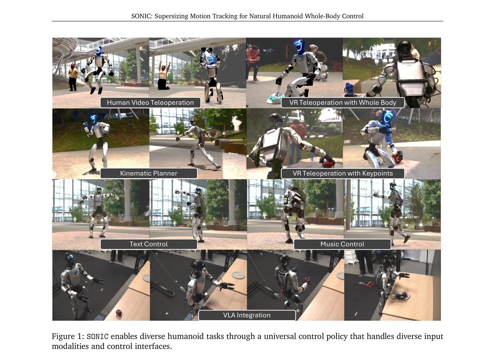

# SONIC: Supersizing Motion Tracking for Natural Humanoid Whole-Body Control

> **저자**: Zhengyi Luo, Ye Yuan, Tingwu Wang, Chenran Li, Sirui Chen, Fernando Castañeda, Zi-Ang Cao, Jiefeng Li, David Minor, Qingwei Ben, Xingye Da, Runyu Ding, Cyrus Hogg, Lina Song, Edy Lim, Eugene Jeong, Tairan He, Haoru Xue, Wenli Xiao, Zi Wang, Simon Yuen, Jan Kautz, Yan Chang, Umar Iqbal, Linxi "Jim" Fan, Yuke Zhu | **날짜**: 2025-12-04 | **DOI**: [10.48550/arXiv.2511.07820](https://doi.org/10.48550/arXiv.2511.07820)

---

## Essence

*Figure 1: SONIC enables diverse humanoid tasks through a universal control policy that handles diverse input*

인간의 모션 캡처 데이터를 활용한 motion tracking을 기반 작업으로 삼아 42M 파라미터의 대규모 humanoid controller를 학습하고, kinematic planner와 unified token space를 통해 다양한 제어 인터페이스를 지원하는 자연스러운 전신 움직임 제어 시스템을 제시한다.

## Motivation

- **Known**: 기존 humanoid control은 작은 크기의 신경망으로 제한된 행동만 학습하며 각 작업마다 reward engineering이 필요했고, 대규모 foundation models의 성공에도 불구하고 로봇 제어 분야에서는 유사한 스케일링 이점이 입증되지 않았다.
- **Gap**: Humanoid control에서 수십억 파라미터 규모로 스케일링할 수 있는 자연스럽고 확장 가능한 작업이 부재했으며, 다양한 실제 제어 방식을 통합하면서도 단일 정책으로 작동하는 유연한 시스템이 없었다.
- **Why**: 자연스러운 인간형 로봇의 전신 제어는 산업 응용과 실제 배포에 필수적이며, 대규모 모델 학습의 이점이 입증되면 더욱 강건하고 일반화 가능한 control policy 개발을 가능하게 한다.
- **Approach**: Motion tracking을 scalable한 기초 작업으로 선정하여 100M 프레임의 mocap 데이터로 42M 파라미터 모델을 9k GPU hours로 학습하고, kinematic motion planning과 unified token space를 설계하여 VR teleoperation, human video, VLA 모델 등 다양한 입력을 지원한다.

## Achievement

- **대규모 스케일링의 효과 입증**: 데이터, 모델, 계산량을 각각 확장할 때 성능이 지속적으로 개선되는 favorable scaling properties 확인 (94.5% → 98.5% 성공률)
- **범용 motion tracking 달성**: 100M 프레임 학습으로 unseen motion에 대한 강력한 generalization 성능 달성 (AMASS 테스트셋에서 94.3% 성공률, baselines 대비 우수)
- **Interactive kinematic planning**: Real-time universal kinematic planner로 motion space에서의 goal-directed 제어 구현 (navigation, squatting, kneeling, crawling)
- **멀티모달 통합 제어**: VR teleoperation, human video, music, text, VLA 모델을 unified token space를 통해 단일 정책으로 처리
- **실제 로봇 배포**: Unitree G1 humanoid에서 sim-to-real 성능 검증 및 foundation model 학습 파이프라인 구축

## How

- Motion capture 데이터셋(AMASS 등)에서 100M 프레임의 다양한 인간 운동 수집 및 전처리
- Transformer 기반 architecture로 1.2M → 16M → 42M 파라미터 규모로 점진적 확장
- Dense frame-by-frame supervision으로 reward engineering 없이 직접적인 motion tracking 학습
- Kinematic space에서의 motion generation을 통해 interactive goal-directed control 실현
- Token-based unified interface 설계로 heterogeneous input modalities (VR pose, video, text, VLA embeddings)를 동일한 representation space로 통합
- Retargeting 기법으로 human motion을 humanoid 제어 신호로 직접 변환
- SIM-to-real transfer를 위한 simulator와 실제 로봇 간 domain adaptation

## Originality

- Motion tracking을 humanoid control의 scalable foundation task로 명확히 제시한 것 (기존 prior works는 제한적 downstream tasks만 시연)
- Humanoid 제어에서 처음으로 10M 규모를 초과하는 42M 파라미터 모델 및 100M 프레임 규모의 학습 달성
- Unified token space를 통해 teleoperation, video, music, text, VLA 등 이질적인 제어 입력들을 단일 정책으로 통합 (distillation 없는 단일 단계 학습)
- Interactive kinematic planning으로 motion space에서의 goal-directed 제어와 motion tracking을 연결하는 새로운 방식 제시

## Limitation & Further Study

- Evaluation이 주로 simulation 기반이며 실제 로봇 배포는 Unitree G1에만 한정 (다른 humanoid 형태에 대한 일반화 미검증)
- Real-world teleoperation 성능과 시뮬레이션 간의 성능 격차 분석 부족 (real MPJPE = 40.9 vs sim = 42.7은 보고되지만 원인 분석 제한적)
- Motion tracking 기반 foundation의 한계점에 대한 논의 부재 (e.g., 모션 데이터로 표현 불가능한 제어 문제나 높은 불확실성 환경에서의 성능)
- 후속 연구로 더 광범위한 humanoid 형태와 실제 복잡한 환경에서의 실시간 성능, 다양한 embodiment으로의 cross-modal transfer 개선, 그리고 motion tracking 외 보강 학습 신호와의 hybrid 접근 검토 필요

## Evaluation

- Novelty: 4/5
- Technical Soundness: 4/5
- Significance: 4/5
- Clarity: 4/5
- Overall: 4/5

**총평**: 이 논문은 humanoid control에 대규모 스케일링을 성공적으로 적용한 첫 사례로, motion tracking을 foundation task로 선정하고 100M 프레임 데이터와 42M 파라미터로 학습하여 강력한 generalization을 보인다. Kinematic planner와 unified token space를 통해 다양한 제어 인터페이스를 단일 정책으로 통합함으로써 실제 응용 가능성을 입증했으며, 체계적인 ablation과 comprehensive evaluation은 연구의 엄밀성을 보강한다.
