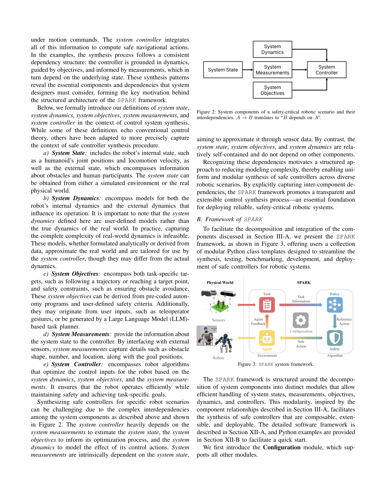
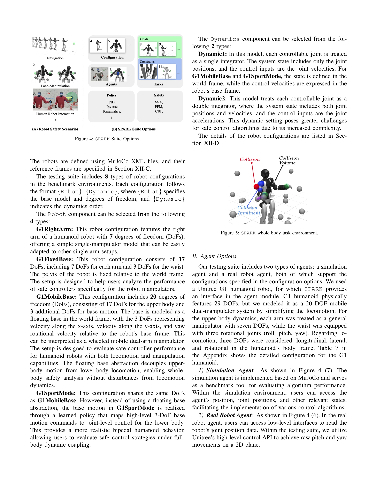

# SPARK: Safe Protective and Assistive Robot Kit

> **저자**: Yifan Sun, Rui Chen, Kai S. Yun, Yikuan Fang, Sebin Jung, Feihan Li, Bowei Li, Weiye Zhao, Changliu Liu | **날짜**: 2025-02-05 | **URL**: [https://arxiv.org/abs/2502.03132](https://arxiv.org/abs/2502.03132)

---

## Essence

*Figure 3: SPARK system framework.*

SPARK는 휴머노이드 로봇의 안전한 자율 제어와 원격 조종을 위한 포괄적인 벤치마크 프레임워크로, 모듈식 안전 제어 알고리즘과 시뮬레이션 환경을 제공하여 비전문가도 안전 컨트롤러를 효율적으로 설계하고 배포할 수 있도록 지원한다.

## Motivation

- **Known**: 휴머노이드 로봇의 안전은 중요한 과제이며, Control Barrier Function (CBF)과 Potential Field Method (PFM) 같은 모델 기반의 안전 제어 방법들이 개발되어 있다. 하지만 기존 도구들은 모듈화 부족 또는 간단한 시스템에만 적용 가능하다.
- **Gap**: 휴머노이드 같은 고차원 복잡 로봇 시스템을 위한 표준화된 벤치마크와 모듈식 프레임워크가 부재하며, 각 새로운 상황마다 안전 컨트롤러를 처음부터 재설계해야 하는 비효율성이 존재한다.
- **Why**: 휴머노이드 로봇이 실제 환경에 광범위하게 배포되기 위해서는 다양한 작업, 환경, 제어 모드에서 안전성을 보장하는 체계적인 프레임워크가 필수적이며, 이는 로봇 산업의 실질적 발전을 가능하게 한다.
- **Approach**: SPARK는 Composable, Extensible, Deployable의 세 가지 설계 원칙을 바탕으로, 모듈식 컴포넌트를 조합 가능하게 제공하고, 사용자 정의 확장을 지원하며, 실제 하드웨어(Unitree G1)로의 빠른 배포를 가능하게 한다.

## Achievement

*Figure 4: SPARK Suite Options.*

- **모듈식 안전 제어 프레임워크**: 안전 알고리즘, 로봇 동역학, 환경 모델, 센서 등을 독립적인 모듈로 분리하여 다양한 조합으로 새로운 제어 시스템을 구성할 수 있도록 설계
- **시뮬레이션 벤치마크**: 다양한 환경, 작업, 로봇 모델에서 여러 안전 접근법을 비교 평가할 수 있는 표준화된 벤치마크 제공
- **실시간 배포 지원**: Apple Vision Pro, Motion Capture System 등 다양한 센서를 지원하며 ROS, DDS 같은 실시간 미들웨어와 호환성 확보
- **하드웨어 검증**: Unitree G1 휴머노이드 로봇을 활용한 실제 환경 실험으로 프레임워크의 실용성과 안전성 입증
- **오픈소스 공개**: 재현성과 커뮤니티 기여를 위해 전체 코드를 GitHub에 공개

## How

*Figure 2: System components of a safety-critical robotic scenario and their*

- **CBF (Control Barrier Function)**, PFM (Potential Field Method) 등 기존의 검증된 모델 기반 안전 제어 알고리즘을 모듈화하여 통합
- **Quadratic Programming (QP) 기반 최적화**: 작업 목표와 안전 제약 조건을 제약 최적화 문제로 공식화하고 QP 솔버를 통해 효율적으로 해결
- **Human Motion Prediction 통합**: 인간-로봇 상호작용 환경에서 인간 동작 예측 모델을 제어 스택에 포함하여 동적 장애물 회피
- **Simulation-to-Reality Transfer**: 시뮬레이션에서 합성한 안전 컨트롤러를 실제 로봇으로 신속하게 배포하기 위한 인터페이스 제공
- **사용자 정의 템플릿**: 사용자가 자신의 안전 컨트롤러나 로봇 동역학 모듈을 제공된 템플릿을 따라 개발하고 플러그인할 수 있는 구조

## Originality

- **첫 휴머노이드 특화 안전 벤치마크**: 고차원 휴머노이드 시스템을 대상으로 한 표준화된 멀티태스크, 멀티로봇 벤치마크 프레임워크는 기존에 없었음
- **Composable-Extensible-Deployable의 통합 설계 철학**: 단순한 모듈화를 넘어 사용자 확장성과 실제 배포를 동시에 고려한 체계적 설계
- **Apple Vision Pro 센서 통합**: 최신 AR/VR 기술을 원격 조종 시스템에 통합하여 새로운 형태의 텔레오퍼레이션 경험 제시
- **모델 기반 vs 모델 없는 방법의 명확한 위치 설정**: 모델 기반 접근법의 해석 가능성과 구성 가능성에 중점을 두고 안전성 보증의 기초로 삼음

## Limitation & Further Study

- **모델 정확도 의존성**: 제시된 방법이 로봇과 환경의 정확한 동역학 모델을 필요로 하므로, 모델 오차가 안전 보증을 훼손할 수 있음
- **계산 복잡도 스케일링**: 휴머노이드의 고차원성으로 인해 QP 문제의 크기가 증가하면 실시간 제어에 병목이 될 가능성
- **일반화 한계**: 현재 구현이 특정 로봇(Unitree G1) 중심이므로 다른 플랫폼으로의 이전 시 추가 작업 필요
- **인간 행동 예측의 불확실성**: 동적 인간 참여자 환경에서 동작 예측 모델의 오류가 안전성을 저하시킬 수 있음
- **후속 연구**: 신경망 기반 동역학 모델 또는 하이브리드 방식으로 모델 오차를 보정하는 방법, 분산 최적화를 통한 계산 효율 개선, 형식 검증(Formal Verification)과의 결합

## Evaluation

- Novelty: 4/5
- Technical Soundness: 3/5
- Significance: 4/5
- Clarity: 4/5
- Overall: 4/5

**총평**: SPARK는 휴머노이드 로봇의 안전한 제어를 위한 실질적이고 체계적인 프레임워크를 제시하는 높은 가치의 연구로, 모듈식 설계, 벤치마크 제공, 실제 배포 검증을 통해 안전 로봇 연구를 가속화할 수 있는 견고한 기반을 마련했다.