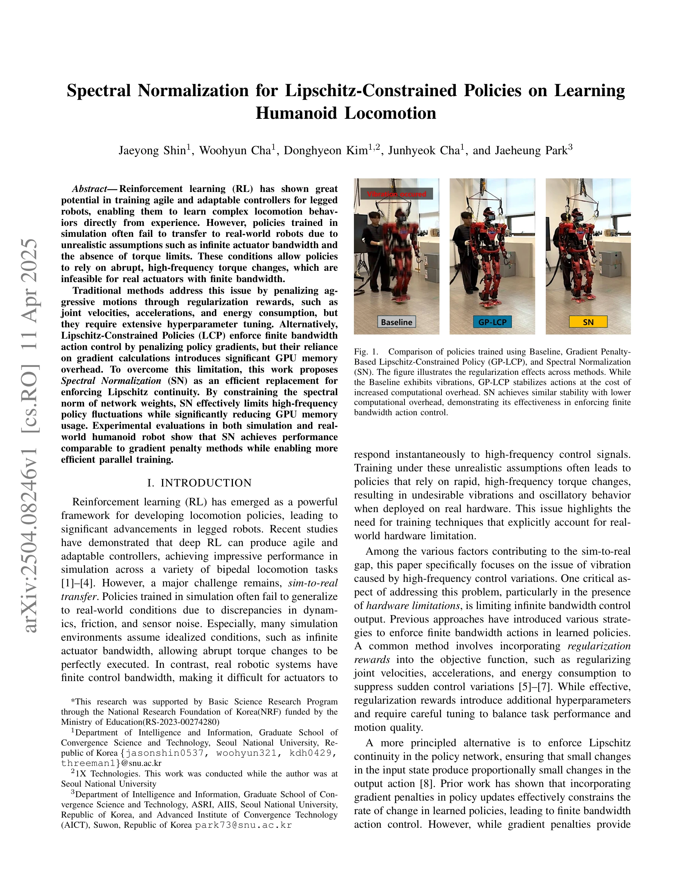
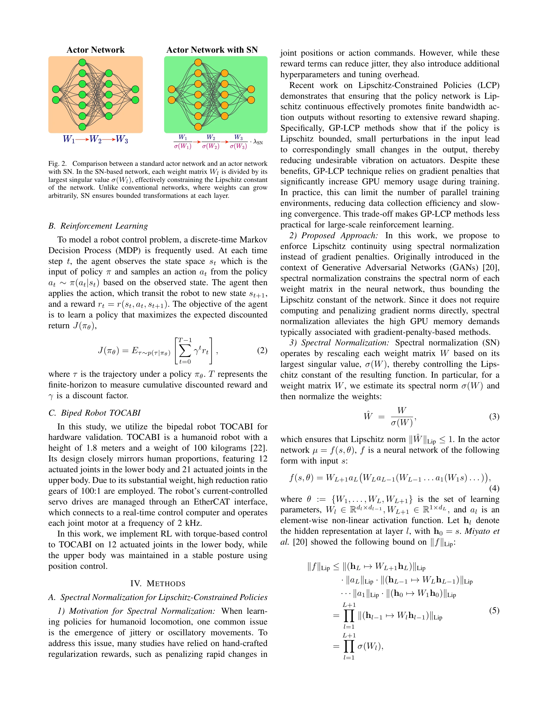

# Spectral Normalization for Lipschitz-Constrained Policies on Learning Humanoid Locomotion

> **저자**: Jaeyong Shin, Woohyun Cha, Donghyeon Kim, Junhyeok Cha, Jaeheung Park | **날짜**: 2025-04-11 | **URL**: [https://arxiv.org/abs/2504.08246](https://arxiv.org/abs/2504.08246)

---

## Essence

*Fig. 1.*

본 논문은 인간형 로봇의 보행 학습에서 Spectral Normalization (SN)을 사용하여 Lipschitz 연속성을 효율적으로 강제하고, 기존의 gradient penalty 기반 방법보다 GPU 메모리 오버헤드를 줄이면서도 유사한 성능을 달성한다.

## Motivation

- **Known**: 강화학습으로 학습된 로봇 제어 정책은 시뮬레이션에서 뛰어난 성능을 보이지만, 실제 로봇의 유한한 actuator 대역폭 등 현실적 제약을 반영하지 않아 sim-to-real 전이에 실패한다. 기존에는 regularization reward나 gradient penalty 기반 Lipschitz-Constrained Policy (LCP)로 이를 완화했다.
- **Gap**: Gradient penalty 기반 LCP는 효과적이지만 정책 gradient 계산으로 인한 GPU 메모리 오버헤드가 크며, 대규모 병렬 시뮬레이션 환경에서 훈련 속도를 제한한다.
- **Why**: 로봇의 실제 배포 시 고주파 토크 변화는 진동과 불안정성을 야기하므로, 효율적인 대역폭 제한 방법은 실제 로봇 제어의 실용성을 크게 향상시킨다.
- **Approach**: Spectral Normalization을 정책 네트워크의 가중치 행렬에 적용하여 가중치의 최대 singular value로 정규화함으로써, 명시적인 gradient 계산 없이 Lipschitz 상수를 제약한다.

## Achievement

*Fig. 1.*

- **메모리 효율성**: SN은 gradient penalty 기반 방법 대비 GPU 메모리 사용량을 크게 감소시켜 더 효율적인 병렬 훈련을 가능하게 함
- **성능 동등성**: 시뮬레이션과 실제 인간형 로봇 플랫폼 모두에서 SN은 GP-LCP와 유사한 제어 안정성을 달성
- **Sim-to-real 전이 개선**: 실제 actuator 대역폭 및 제어 제약을 고려하여 현실적인 정책 학습을 도모

## How

*Fig. 2. Comparison between a standard actor network and an actor network*

- Lipschitz 연속성: 함수 f에 대해 ‖f(x) − f(y)‖ ≤ L‖x − y‖를 만족하는 Lipschitz 상수 L이 존재하도록 제약
- Spectral Normalization 적용: 각 가중치 행렬 W_l을 최대 singular value σ(W_l)로 정규화하여 W_l / σ(W_l) 형태로 변환
- 네트워크 아키텍처: 표준 actor 네트워크에 SN을 적용하여 고주파 동작 변화를 억제
- 훈련: Actor-Critic 기반 강화학습 프레임워크에서 SN 정규화된 정책으로 학습 진행

## Originality

- GAN의 discriminator 안정화를 위해 개발된 Spectral Normalization을 로봇 보행 정책의 Lipschitz 제약에 처음 적용
- Gradient penalty 기반 방법의 대체재로서 SN의 효율성을 체계적으로 실증하고, 메모리-성능 트레이드오프 분석 제공
- 시뮬레이션과 실제 로봇 모두에서 검증하여 실용적 가치 증명

## Limitation & Further Study

- Spectral Normalization의 singular value 계산 비용과 수렴 특성에 대한 이론적 분석 부족
- 다양한 로봇 형태(쌍족, 사족 등)와 복잡한 지형에서의 일반화 성능 검증 필요
- SN의 spectral norm 제약이 정책의 표현력을 제한할 가능성에 대한 상세 분석 필요
- 실제 로봇 실험이 하나의 인간형 플랫폼에만 제한되어 있어, 더 다양한 하드웨어에서의 검증 필요

## Evaluation

- Novelty: 4/5
- Technical Soundness: 3/5
- Significance: 4/5
- Clarity: 4/5
- Overall: 4/5

**총평**: 본 논문은 Spectral Normalization이라는 기존 기법을 로봇 정책 학습의 대역폭 제약 문제에 창의적으로 적용하여, 계산 효율성과 성능을 모두 달성한 실용적인 솔루션을 제시한다. 시뮬레이션과 실제 로봇 양쪽에서의 검증으로 신뢰성을 높였으며, sim-to-real 전이 문제 해결에 중요한 기여를 한다.
