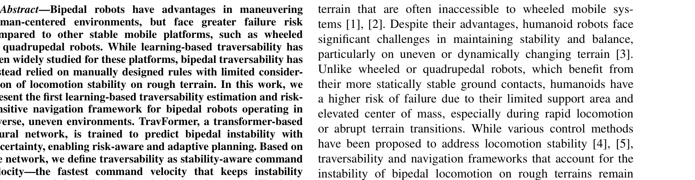
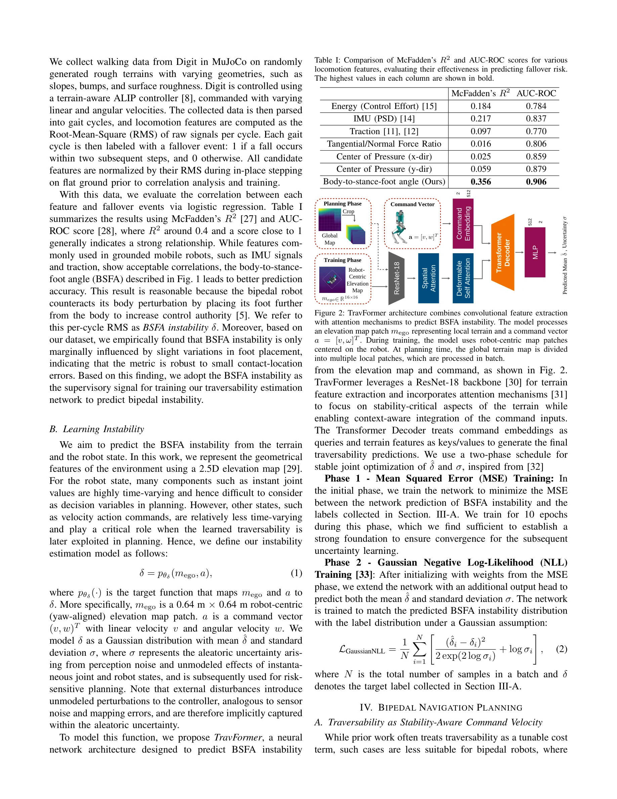

# STATE-NAV: Stability-Aware Traversability Estimation for Bipedal Navigation on Rough Terrain

> **저자**: Ziwon Yoon, Lawrence Y. Zhu, Jingxi Lu, Lu Gan, Ye Zhao | **날짜**: 2025-06-01 | **URL**: [https://arxiv.org/abs/2506.01046](https://arxiv.org/abs/2506.01046)

---

## Essence

*Figure 1: Overall diagram of the proposed traversability estimation and the navigation framework. A transformer-based bi*

이족 로봇의 불안정성을 예측하는 TravFormer 신경망을 개발하고, 안정성 기반 명령 속도를 traversability로 정의하여 거친 지형에서의 안전하고 효율적인 네비게이션을 실현한다.

## Motivation

- **Known**: 바퀴형 및 사족 로봇에 대한 학습 기반 traversability 추정이 광범위하게 연구되었으나, 이족 로봇의 traversability는 주로 수동으로 설계된 규칙에 의존해왔다. 이족 로봇은 제한된 지지 영역과 높은 무게중심으로 인해 안정성 유지가 더 어렵다.
- **Gap**: 기존 이족 traversability 방법들은 기하학적 규칙만 고려하며 실제 보행 안정성을 제대로 반영하지 못한다. 이족 로봇 고유의 불안정성 특성을 학습 기반으로 추정하고 이를 네비게이션 계획에 통합하는 프레임워크가 부재하다.
- **Why**: 이족 로봇은 인간 중심 환경에서의 우수한 조종성에도 불구하고 높은 낙상 위험을 가지고 있으므로, 안정성을 명시적으로 고려하는 traversability 추정과 위험 인식형 네비게이션이 필수적이다.
- **Approach**: Body-to-stance-foot angle (BSFA)을 자감독 신호로 사용하여 이족 불안정성과의 상관관계를 검증하고, Transformer 기반 TravFormer 네트워크를 학습시켜 지형과 명령 속도로부터 불안정성을 예측한다. 예측된 불안정성 값 자체가 아닌 안정성 임계값 이하를 유지하는 최대 명령 속도를 traversability로 정의하여 계층적 TravRRT*-MPC 플래너에 통합한다.

## Achievement

*Figure 1: Overall diagram of the proposed traversability estimation and the navigation framework. A transformer-based bi*

- **이족 불안정성 특성 식별**: 다양한 보행 특성 중 BSFA가 이족 낙상 위험을 가장 잘 반영하는 자감독 신호임을 입증
- **TravFormer 개발**: 불확실성을 포함하여 이족 불안정성을 예측하는 첫 학습 기반 traversability 추정기 제시
- **안정성 기반 표현**: Traversability를 속도 기반 메트릭으로 정의하여 환경별 가중치 재조정 필요성 제거
- **계층적 네비게이션 프레임워크**: TravRRT* 전역 플래너와 LIPM 기반 MPC 지역 플래너를 안정성 제약과 통합
- **실증 검증**: MuJoCo 시뮬레이션 및 Digit 로봇의 실제 실험을 통해 다양한 지형에서의 안정성, 시간 효율성, 강건성 향상 입증

## How

*Figure 2: TravFormer architecture combines convolutional feature extraction*

- Digit 로봇을 MuJoCo에서 다양한 거친 지형(경사, 범프, 표면 거칠기)에서 실행하고 varying linear/angular velocities로 보행 데이터 수집
- 수집한 데이터를 gait cycle로 파싱하고 다양한 보행 특성(ground reaction wrench, foothold scores, traction, IMU variance 등)의 RMS 값 계산
- 각 gait cycle을 낙상 여부로 라벨링하고 로지스틱 회귀로 특성과 낙상 위험의 상관관계 분석
- BSFA를 자감독 신호로 선정하여 TravFormer (convolutional feature extraction + transformer blocks) 학습
- Traversability-aware velocity를 iterative search로 계산: 예측 불안정성이 임계값 이하인 최대 속도 도출
- 전역 경로 계획을 위해 TravRRT*에 traversability 기반 informed sampling 적용하여 시간 최적화
- 지역 제어를 위해 LIPM 기반 MPC에 계산된 안정 속도를 제약 조건으로 통합

## Originality

- 이족 로봇 traversability 추정의 첫 학습 기반 접근: 기존 수동 규칙 방식을 데이터 기반 방식으로 전환
- 이족 보행 고유 특성(BSFA) 식별 및 자감독 학습에 활용한 혁신적 설계
- Traversability를 직접 점수가 아닌 안정성 제약 하에서의 명령 속도로 정의하는 새로운 표현 방식
- 계층적 TravRRT*-MPC 프레임워크: 전역 계획의 시간 최적화와 지역 제어의 안정성 제약을 명시적으로 통합
- Uncertainty 예측 기능: 예측 불확실성을 고려한 위험 인식형 네비게이션 가능

## Limitation & Further Study

- MuJoCo 시뮬레이션 데이터로 학습되어 현실 세계 센서 노이즈 및 모델 불일치에 대한 강건성 추가 검증 필요
- 단일 로봇 플랫폼(Digit)에서만 검증되어 다양한 이족 로봇 구조에 대한 일반화 가능성 미지수
- 사용자 정의 불안정성 임계값 설정에 대한 가이드라인 부족으로 실제 배포 시 튜닝 부담 가능
- 계산 복잡도 및 실시간 처리 성능(latency)에 대한 상세 분석 부재
- 후속 연구: 실제 센서 데이터 기반 도메인 적응, 다중 로봇 플랫폼 확장, 동적 장애물 환경에서의 성능 검증

## Evaluation

- Novelty: 4/5
- Technical Soundness: 4/5
- Significance: 4/5
- Clarity: 4/5
- Overall: 4/5

**총평**: 이 논문은 이족 로봇의 안정성 기반 traversability 추정이라는 중요하면서도 미개척된 문제를 처음 체계적으로 다루며, BSFA 특성 식별부터 TravFormer 개발, 계층적 네비게이션 프레임워크까지 일관된 기술적 기여를 제시한다. 시뮬레이션과 실제 로봇 실험을 통한 검증이 견고하고, 안정성 기반 속도 표현이라는 혁신적 설계로 가중치 재조정 문제를 해결하여 실용적 가치가 높다.