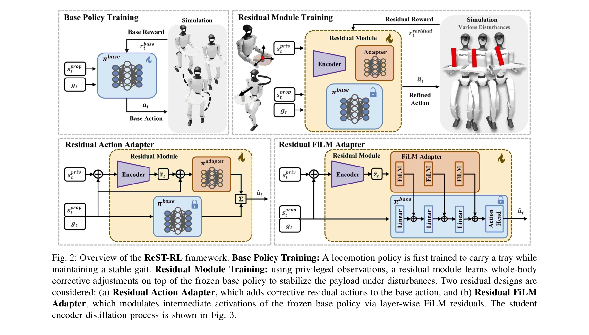
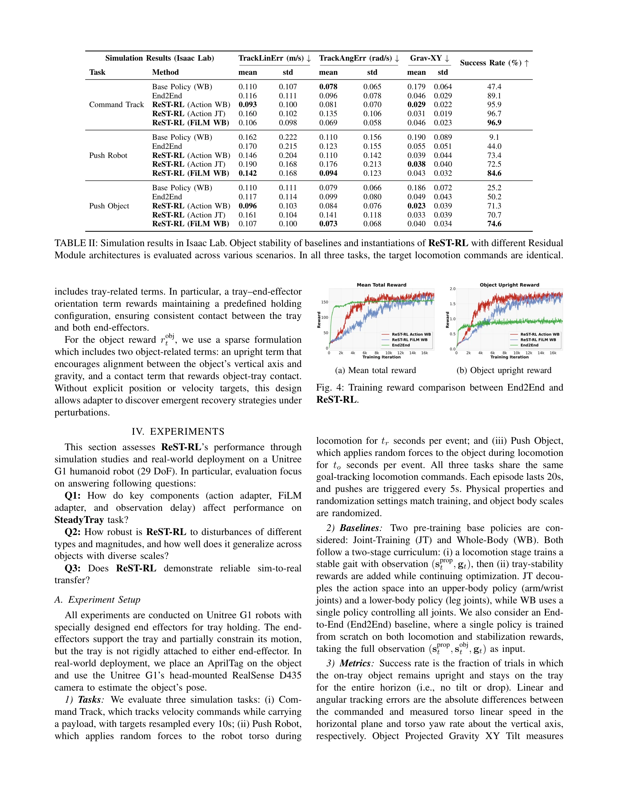

# SteadyTray: Learning Object Balancing Tasks in Humanoid Tray Transport via Residual Reinforcement Learning

> **저자**: Anlun Huang, Zhenyu Wu, Soofiyan Atar, Yuheng Zhi, Michael Yip | **날짜**: 2026-03-11 | **DOI**: [10.48550/arXiv.2603.10306](https://doi.org/10.48550/arXiv.2603.10306)

---

## Essence

*Fig. 2: Overview of the ReST-RL framework. Base Policy Training: A locomotion policy is first trained to carry a tray wh*

ReST-RL은 사전학습된 이족 보행 정책에 잔차 모듈을 추가하여 휴머노이드 로봇이 동적 보행 중 트레이 위의 불안정한 물체를 안정적으로 운반할 수 있도록 하는 계층적 강화학습 아키텍처이다.

## Motivation

- **Known**: 휴머노이드 로봇의 이족 보행과 조작 작업은 개별적으로 진전이 있었으나, 동적 보행 중 고정되지 않은 물체의 안정적 운반은 미해결 문제로 남아있었다.
- **Gap**: 기존 SoFTA 같은 end-effector 안정화 방법들은 액체가 들은 잔과 같은 불안정한 물체의 트레이 운반을 해결하지 못했으며, 회전, 가속, 외부 충격 등 동적 조작 상황에서 입증된 방법이 없었다.
- **Why**: 의료, 식음료, 요양 서비스 등 인간 중심 환경에서 휴머노이드를 활용한 자동화는 노동 부족 해결의 핵심이며, 신뢰성 높은 물체 운반 능력은 실용적 배포의 필수 조건이다.
- **Approach**: ReST-RL은 사전학습된 보행 정책을 고정하고 그 위에 특권 관찰(privileged observations)을 이용하여 잔차 모듈(인코더-어댑터)을 학습한 후, 정책 증류(policy distillation)를 통해 배포 가능한 형태로 변환한다.

## Achievement

*Fig. 4: Training reward comparison between End2End and*

- **시뮬레이션 성능**: 96.9% 변속 추적 성공률과 74.5% 외부 힘 교란 대항력을 달성하며 gait smoothness와 방향 정확도에서 end-to-end 기준선을 크게 초과
- **실제 배포**: Unitree G1 휴머노이드에서 zero-shot sim-to-real 일반화를 통해 다양한 물체와 외부 교란에 대한 신뢰성 높은 운반 시연
- **아키텍처 기여**: 보행과 안정화 목표를 명시적으로 분리하여 기저 정책의 성능 저하 없이 payload 안정화에 학습 용량 집중

## How

*Fig. 2: Overview of the ReST-RL framework. Base Policy Training: A locomotion policy is first trained to carry a tray wh*

- Base Policy Training: 수평 트레이 유지 조건 하에서 robust 보행을 수행하는 기저 정책 πbase를 goal-conditioned PPO로 사전학습
- Privileged Observation 설계: 로봇 선속도, 트레이 위치/중력, 물체 위치/속도/각속도/중력 등을 포함한 특권 관찰 spriv_t 구성
- Residual Module 학습: 고정된 기저 정책 위에 인코더(특권 관찰 처리)와 어댑터(잔차 액션 또는 FiLM 변조) 구성으로 교정 업데이트 학습
- Policy Distillation: H=32 길이 temporal window로 학습한 교사 인코더를 배포 가능한 관찰(privileged 정보 제외)을 사용하는 학생 인코더로 증류
- Domain Randomization: 관찰 지연, 제어 지연, 물체 특성 등 도메인 랜덤화를 통해 sim-to-real 전이 강화

## Originality

- 사전학습 보행 정책 고정 위에 잔차 모듈을 추가하는 구조로 locomotion-stabilization 간 objective conflict를 명시적으로 해결
- 특권 관찰과 정책 증류를 결합한 two-stage 학습 파이프라인으로 데이터 효율성과 실제 배포 가능성 동시 달성
- Residual Action Adapter와 Residual FiLM Adapter 두 가지 메커니즘 탐색으로 아키텍처 선택지 제시
- 불안정한 물체(액체가 든 잔, 깨지기 쉬운 도구) 운반이라는 구체적 loco-manipulation 문제에 대한 첫 성공적 해결책

## Limitation & Further Study

- 특권 관찰 설계가 수동적(hand-crafted)이며, 다른 작업으로의 일반화 가능성이 미평가됨
- 시뮬레이션과 실제 환경의 물리 차이(마찰, 접촉 역학 등)가 완전히 해결되지 않을 수 있으며, 보다 극단적 교란 조건에 대한 한계 미검토
- Unitree G1 단일 로봇에서만 실증되었으며, 타 휴머노이드 플랫폼 호환성 미확인
- 후속 연구는 meta-learning이나 적응형 도메인 랜덤화를 통한 더 강건한 sim-to-real 전이, 다중 접촉 물체 운반, end-to-end 학습과의 상세 비교 분석 필요

## Evaluation

- Novelty: 4/5
- Technical Soundness: 3/5
- Significance: 4/5
- Clarity: 4/5
- Overall: 4/5

**총평**: ReST-RL은 보행 안정성을 보존하면서 payload 안정화를 분리 학습하는 우아한 설계로, 휴머노이드 로봇의 실제 서비스 응용(식음료 배송, 의료 기구 운반)에 필수적인 신뢰성 높은 물체 운반을 처음 성공적으로 시연했다.
