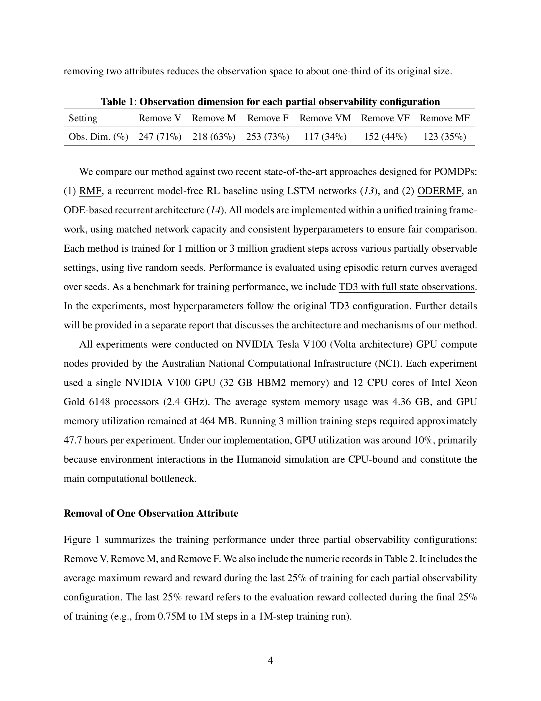

# Success in Humanoid Reinforcement Learning under Partial Observation

> **저자**: Wuhao Wang, Zhiyong Chen | **날짜**: 2025-07-25 | **URL**: [https://arxiv.org/abs/2507.18883](https://arxiv.org/abs/2507.18883)

---

## Essence

*Figure 1 summarizes the training performance under three partial observability configurations:*

부분 관찰 환경에서 고정 길이 과거 관찰 시퀀스를 병렬로 처리하는 novel history encoder를 제안하여, Gymnasium Humanoid-v4 환경에서 부분 관찰 하에서의 안정적인 humanoid 정책 학습을 처음으로 성공시켰다.

## Motivation

- **Known**: 강화학습은 로봇 제어에 널리 적용되어 왔으나, 부분 관찰성(partial observability) 하에서의 효과적인 정책 학습은 여전히 미해결 과제이며, 특히 humanoid 같은 고차원 작업에서 어렵다. LSTM, Mamba 등 RNN 기반 메모리 접근법이 단순 POMDP 벤치마크에서 성공했으나 humanoid 같은 복잡한 환경에서는 미증명 상태다.
- **Gap**: 기존 연구는 부분 관찰 환경에서 humanoid 정책의 안정적 학습을 입증하지 못했으며, RMF와 ODERMF 같은 최신 메모리 기반 POMDP 방법들도 고차원 humanoid 제어에서 실패한다.
- **Why**: Humanoid 로봇의 제어는 현실의 많은 로봇 시스템에서 센싱이 불완전한 부분 관찰 상황에서 이루어지므로, 부분 관찰 하에서의 안정적 학습이 실제 로봇 제어에 필수적이다.
- **Approach**: 표준 model-free 알고리즘(TD3)에 통합되는 novel history encoder를 제안하며, 이는 과거 관찰의 고정 길이 시퀀스를 순차적 메모리 메커니즘 대신 병렬로 처리하여 숨겨진 상태를 복구한다.

## Achievement

- **부분 관찰 환경에서의 첫 성공**: Gymnasium Humanoid-v4에서 부분 관찰(전체 상태의 1/3~2/3만 사용) 하에서도 완전 관찰 TD3 베이스라인과 동등한 성능 달성
- **기존 방법 대비 우월성**: RMF와 ODERMF는 단일 속성 제거에서도 실패하지만, 제안 방법은 모든 부분 관찰 구성에서 안정적으로 수렴
- **정보 복구 및 중복성 활용**: Remove M, Remove F 설정에서 완전 관찰 베이스라인을 초과하는 성능으로 인코더가 누락된 정보를 효과적으로 복구함을 시사
- **로봇 특성 적응성**: 학습된 정책이 신체 부위 질량 변화 같은 로봇 속성 변화에 적응할 수 있음을 보임

## How

- 상태 공간의 348개 차원을 position, velocity, mass/inertia, force 네 가지 의미론적 속성으로 분류
- 각 속성을 선택적으로 제거하여 부분 관찰 설정 생성 (단일 속성 제거: ~70%, 이중 속성 제거: ~35% 차원 유지)
- 고정 길이 과거 관찰 시퀀스를 병렬로 처리하는 history encoder를 설계하여 각 타임스텝을 동등하게 취급
- TD3 기반 model-free RL 프레임워크에 인코더 통합, 동일한 네트워크 용량과 하이퍼파라미터로 RMF, ODERMF와 공정하게 비교
- 1M 또는 3M 그래디언트 스텝으로 5개 random seed로 학습, 에피소드 리턴 곡선 평균화로 평가

## Originality

- 부분 관찰 humanoid 제어에서의 첫 성공 달성 - 기존 RNN 기반 메모리 방법들의 한계를 극복
- 순차 처리 대신 병렬 처리를 사용하는 novel history encoder 제안 - 기존 LSTM/Mamba 같은 순차 메모리 아키텍처와 근본적으로 다른 접근
- 고차원 복잡 제어 환경에서의 POMDP 해결 - 단순 벤치마크를 넘어 실제적 로봇 제어 규모의 문제 해결

## Limitation & Further Study

- 제안된 history encoder의 구체적 아키텍처와 메커니즘이 논문 본문에서 충분히 설명되지 않았으며, 향후 상세 보고서에서 다룬다고 언급
- 부분 관찰 시뮬레이션에서만 평가되었으며, 실제 로봇 하드웨어에서의 검증 부재
- 네 가지 의미론적 속성 제거 방식만 평가했으며, 다른 부분 관찰 패턴(예: 노이즈, 센싱 오류)의 효과 미검토
- GPU 활용률이 ~10%에 불과하여 환경 상호작용의 CPU 병목 현상을 보임 - 확장성 개선 여지
- 향후 연구는 실제 부분 관찰 특성이 있는 실제 로봇 플랫폼으로의 이전과 다양한 센싱 제약 하에서의 성능 평가가 필요

## Evaluation

- Novelty: 4/5
- Technical Soundness: 3/5
- Significance: 4/5
- Clarity: 3/5
- Overall: 4/5

**총평**: 본 연구는 부분 관찰 환경에서의 고차원 humanoid 제어라는 미해결 문제를 처음으로 성공적으로 해결하며, 병렬 history encoder를 통해 기존 RNN 기반 메모리 방법들을 압도적으로 능가한다. 다만 방법론의 구체적 설명이 부족하고 실제 로봇 검증이 필요하다.