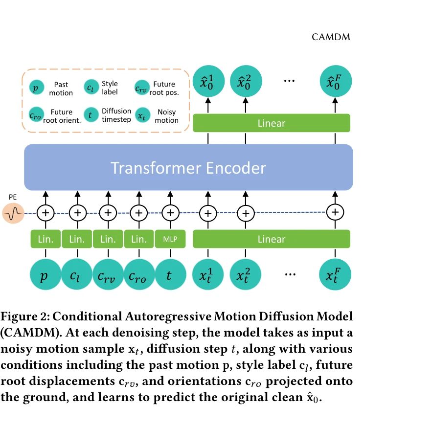
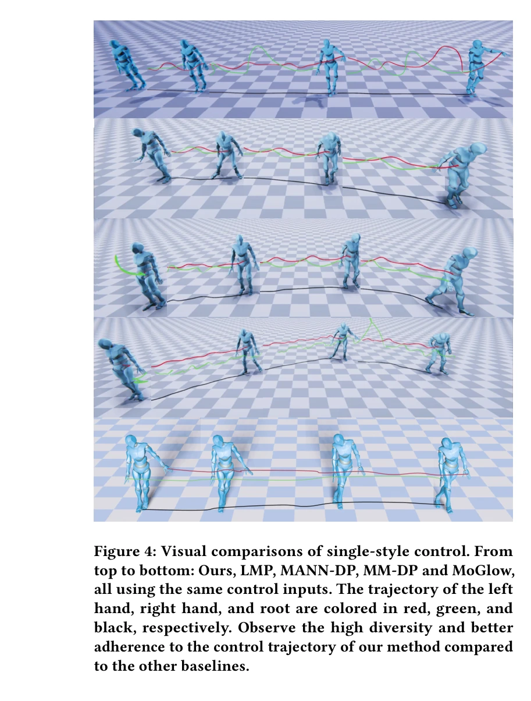
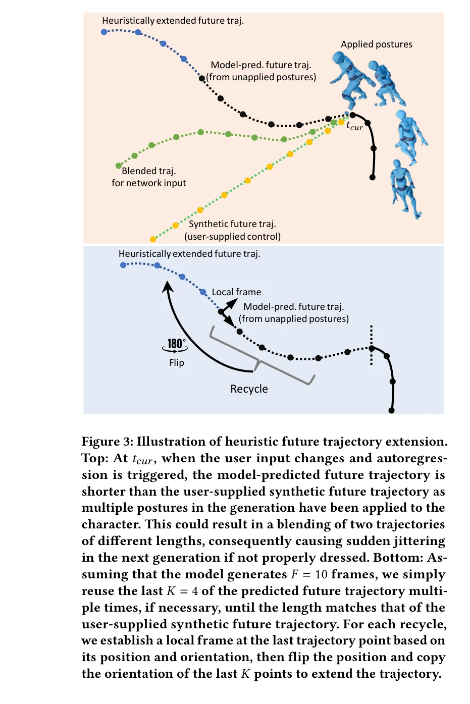

# Taming Diffusion Probabilistic Models for Character Control

> **저자**: Rui Chen, Mingyi Shi, Shaoli Huang, Ping Tan, Taku Komura, Xuelin Chen | **날짜**: 2024-04-23 | **URL**: [https://arxiv.org/abs/2404.15121](https://arxiv.org/abs/2404.15121)

---

## Essence

*Figure 2: Conditional Autoregressive Motion Diffusion Model*

Transformer 기반 Conditional Autoregressive Motion Diffusion Model (CAMDM)을 제안하여 사용자의 동적 제어 신호에 실시간으로 반응하면서 고품질의 다양한 캐릭터 애니메이션을 생성한다.

## Motivation

- **Known**: 기존 deterministic 캐릭터 컨트롤러는 회귀 대평균(regression to the mean)으로 인한 발 미끄러짐 등의 아티팩트와 반복적인 모션으로 시각적 단조로움을 보이며, 최근 diffusion probabilistic model이 고품질 다양한 샘플 생성에 효과적임이 알려졌다.
- **Gap**: 기존 diffusion model 기반 접근은 실시간 처리의 계산 효율성 부족, 단일 모델로 다중 스타일 지원 불가, 그리고 복잡한 조건 제어 메커니즘이 없다는 문제점이 있다.
- **Why**: 실시간 캐릭터 컨트롤은 게임, VR 등 인터랙티브 애플리케이션의 핵심 요소이며, 고품질의 다양하고 제어 가능한 모션을 단일 통합 모델로 생성할 수 있다면 창작의 유연성과 시스템 효율성을 크게 향상시킨다.
- **Approach**: Autoregressive 프레임워크에 transformer 기반 diffusion model을 적용하되, 별도 조건 토큰화(separate condition tokenization), 과거 모션에 대한 classifier-free guidance, 휴리스틱 미래 궤적 확장(heuristic future trajectory extension) 등의 설계를 통해 실시간 성능과 제어 안정성을 확보한다.

## Achievement

*Figure 4: Visual comparisons of single-style control. From*

- **실시간 생성**: 기존 1000단계 대비 8단계 denoising만으로 실시간 캐릭터 제어 달성
- **다양성 지원**: 동일한 제어 신호에서도 여러 모션을 생성하는 intra-style 다양성 및 단일 모델로 다중 스타일 간 seamless transition 지원
- **제어 안정성**: 별도 조건 토큰화와 attention mechanism을 통해 기존의 불안정한 벡터 기반 조건보다 안정적인 제어 달성
- **실용성**: 공개 mocap 데이터셋에서 다양한 locomotion 스킬에 대해 기존 캐릭터 컨트롤러 대비 우수한 성능 입증

## How

*Figure 3: Illustration of heuristic future trajectory extension.*

- Transformer 기반 encoder-decoder 구조로 과거 모션 히스토리를 입력받아 미래 모션을 조건부로 생성
- Style, speed, facing direction, ground trajectory 등 각 조건을 독립적인 토큰으로 표현하여 attention mechanism을 통해 효과적으로 통합
- Classifier-free guidance를 style 레이블이 아닌 과거 모션 조건 토큰에 적용하여 스타일 전환 시 자연스러운 중간 모션 생성
- 이전 모션의 마지막 프레임 세그먼트를 재활용하여 다음 예측 프레임과의 불연속성을 완화하는 heuristic future trajectory extension 적용
- 모션 예측 길이를 길게 설정하고 사용자 입력 미변화 시 최대한 많은 프레임을 적용하여 intra-style 다양성 향상

## Originality

- 조건 토큰을 분리하여 각 조건의 영향을 명확히 하는 설계는 기존의 단일 벡터 기반 조건화와 차별화
- Classifier-free guidance를 스타일이 아닌 과거 모션에 적용한 것은 intuitive하지 않으면서도 실제로 더 효과적인 novel한 선택
- Heuristic trajectory extension은 간단하지만 diffusion model의 실시간화를 위한 창의적인 문제 해결책
- 단일 unified model로 다중 스타일과 intra/inter-style 다양성을 동시에 지원하는 첫 실시간 시스템

## Limitation & Further Study

- Locomotion 스킬에만 평가되었으며 jumping, attacking 등 다른 형태의 동작에 대한 일반화 가능성 미검증
- Mocap 데이터의 스타일 분포 편향이 있을 경우 특정 스타일의 전환 품질 저하 가능성
- 사용자 조건 입력이 'high-level, coarse'로 제한되어 세밀한 joint 레벨 제어 불가", '8단계 denoising으로 계산 효율성을 얻은 대신 더 많은 단계와의 품질 비교 분석 부재
- 후속 연구: 상체 동작, 감정 표현 등 다양한 모션 타입으로 확장; 더 세밀한 제어 조건 설계; 사용자 연구를 통한 사용성 평가

## Evaluation

- Novelty: 4/5
- Technical Soundness: 3/5
- Significance: 4/5
- Clarity: 4/5
- Overall: 4/5

**총평**: Diffusion model을 실시간 캐릭터 컨트롤에 적용하기 위한 체계적이고 실용적인 해결책을 제시한 우수한 논문으로, 별도 조건 토큰화와 classifier-free guidance의 novel한 조합이 다양성과 제어 안정성을 동시에 달성하며, 단일 모델의 다중 스타일 지원은 산업 응용 가치가 높다.
