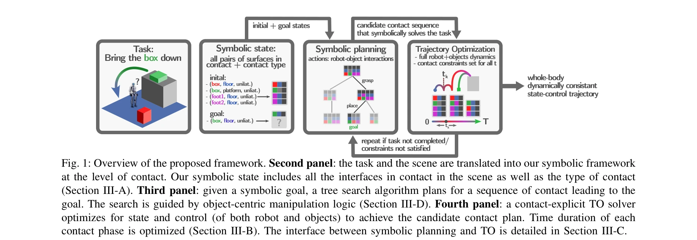

# Task and Motion Planning for Humanoid Loco-manipulation

> **저자**: Michal Ciebielski, Victor Dhédin, Majid Khadiv | **날짜**: 2025-08-16 | **DOI**: [10.48550/arXiv.2508.14099](https://doi.org/10.48550/arXiv.2508.14099)

---

## Essence

*Fig. 1: Overview of the proposed framework. Second panel: the task and the scene are translated into our symbolic framew*

본 논문은 접촉 모드의 통일된 표현을 통해 로봇 이동과 조작을 함께 계획하는 최적화 기반 TAMP 프레임워크를 제시하며, 인형로봇의 장시간 복잡한 로코-조작 행동 생성을 가능하게 한다.

## Motivation

- **Known**: 기존 TAMP 방법들은 고정 안정성 가정 또는 사전 정의된 접촉 주기로 제한되어 있으며, 심화학습 및 모방학습 기반 접근법은 단순 작업에만 적용 가능하다.
- **Gap**: 인형로봇의 동적 안정성을 보장하면서 비순환적 발 계획과 구동 제약을 포함한 완전 통합 TAMP 문제를 해결한 사례가 없다.
- **Why**: 인형로봇은 내재적 불안정성을 가지므로 장시간 동적 로코-조작 계획이 필수이며, 복잡한 실제 작업(높은 선반에서 물건 집기 등)의 해결이 중요하다.
- **Approach**: 심볼릭 계획과 접촉 명시적 궤적 최적화를 반복적으로 결합하되, 접촉 수준의 통일된 기호 표현으로 전신 동역학 및 구동 제약을 포함한 최적화를 수행한다.

## Achievement

- **통합 TAMP 공식화**: 로봇 전신 제약, 조작된 물체 동역학, 환경 제약을 모두 포함하면서 작업, 접촉, 동작 계획을 동시에 수행
- **비순환적 종단 기획 지원**: 사전 정의된 로봇 주기 없이 동적 접촉 전환 및 임의의 발 배치 가능
- **전신 동역학 및 구동 제약 통합**: 2차 운동학 모델과 전신 원심동량 동역학으로 인형로봇의 동적 안정성 보장
- **복잡한 로코-조작 행동 생성**: 한 손 파지, 양손 협조 등 다양한 접촉 양식의 장시간 행동 시퀀스 생성 실증

## How

*Fig. 1: Overview of the proposed framework. Second panel: the task and the scene are translated into our symbolic framew*

- 심볼릭 상태를 장면의 모든 능동 접촉(로봇-환경, 로봇-물체, 물체-환경 등)의 집합으로 정의
- 접촉 모드 변화를 심볼릭 동작으로 모델링하여 로코모션과 조작을 통일된 표현으로 처리
- 트리 탐색 알고리즘으로 심볼릭 레벨에서 접촉 시퀀스 후보 생성
- 각 트리 확장 시마다 접촉 명시적 궤적 최적화(TO) 해결로 전신 동역학, 접촉 제약, 구동 제약 만족
- 물체 중심 조작 로직으로 탐색 공간 유도하여 계획 효율성 향상
- 목표 달성 또는 제약 위반 시 재반복하여 심볼릭-연속 변수 공동 최적화

## Originality

- 인형로봇 로코-조작에 대한 첫 번째 완전 통합 TAMP 공식화 제시
- 비순환적 발 계획과 동적 패치 전환을 지원하는 제너릭 TAMP 공식화
- 로코모션과 조작을 통일된 접촉 레벨 기호로 표현하여 기존 LGP 확장
- 제약 추가 시마다 전 지평선 궤적 최적화로 이전 동작의 영향을 고려한 누적 최적화 적용

## Limitation & Further Study

- 계산 복잡도에 대한 구체적인 분석 및 실시간성 평가 부재
- 시뮬레이션 결과만 제시되어 실제 로봇 실험 검증 필요
- 트리 탐색 휴리스틱의 일반성과 다른 도메인에 대한 적용 가능성 제한적
- 긴 지평선의 경우 탐색 공간 폭발 가능성에 대한 대응 전략 미흡
- 후속 연구로는 대규모 문제에 대한 계산 효율 개선, 실제 로봇 시스템 적용, 환경 불확실성 처리 강화 필요

## Evaluation

- Novelty: 4/5
- Technical Soundness: 3/5
- Significance: 4/5
- Clarity: 4/5
- Overall: 4/5

**총평**: 본 논문은 인형로봇의 동적 로코-조작 계획이라는 도전적 문제에 대해 접촉 수준의 통일된 기호 표현을 통해 이론적으로 견고한 TAMP 솔루션을 제시하며, 전신 동역학과 구동 제약을 포함한 점에서 학술적 기여도가 높다. 다만 실제 로봇 실험 검증과 대규모 문제에 대한 계산 효율 평가가 추가되면 영향력을 더욱 높일 수 있을 것으로 판단된다.
