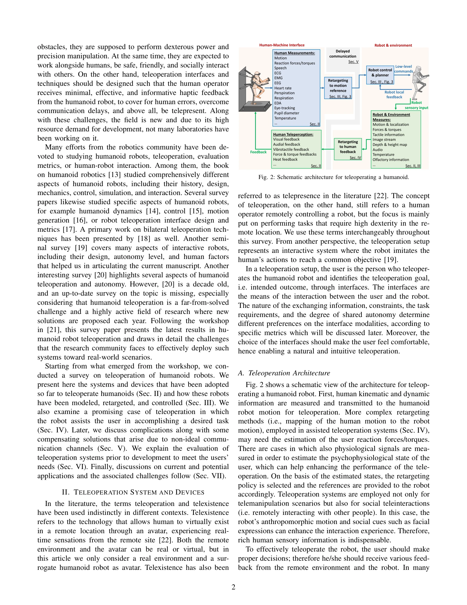

# Teleoperation of Humanoid Robots: A Survey

> **저자**: Kourosh Darvish, Luigi Penco, Joao Ramos, Rafael Cisneros, Jerry Pratt, Eiichi Yoshida, Serena Ivaldi, Daniele Pucci | **날짜**: 2023-01-11 | **URL**: [https://arxiv.org/abs/2301.04317](https://arxiv.org/abs/2301.04317)

---

## Essence

*Fig. 2: Schematic architecture for teleoperating a humanoid.*

이 논문은 인간형 로봇의 원격 조종(teleoperation) 분야에 대한 포괄적인 서베이로, 시스템 아키텍처, 기술 및 방법론적 진전, 실제 응용 분야를 종합적으로 분석한다.

## Motivation

- **Known**: 지난 수십 년간 humanoid robot 원격 조종 분야에서 많은 진전이 이루어졌으며, 동역학, 제어, 모션 생성 등 특정 측면에 대한 연구들이 존재한다.
- **Gap**: 최근의 발전을 반영한 포괄적이고 최신의 서베이가 부족하며, humanoid robot teleoperation은 여전히 미해결된 도전 과제로 매년 새로운 솔루션이 제시되고 있다.
- **Why**: 인간형 로봇은 인간의 인지 능력과 전문 지식을 로봇의 물리적 능력과 결합할 수 있어 재해 환경, 우주, 화학 시설 등 위험한 지역에서 인간을 대체할 수 있는 이상적인 플랫폼이기 때문이다.
- **Approach**: teleoperation system의 일반적인 아키텍처를 제시하고 인터페이스, 모션 retargeting, 제어, assisted teleoperation, 통신 지연 보상, 성능 평가, 실제 응용 분야 등 여러 핵심 구성 요소를 체계적으로 분석한다.

## Achievement

*Fig. 2: Schematic architecture for teleoperating a humanoid.*

- **Teleoperation System Architecture**: 인간 측정(motion, reaction forces, physiological signals)에서 로봇 제어까지의 전체 시스템 흐름을 통합적으로 모델링
- **Interface 분류**: 다양한 teleoperation 인터페이스 모달리티와 선택 기준을 상세히 분석
- **Motion Retargeting**: 인간의 모션을 humanoid 로봇의 운동학적, 동역학적 제약에 맞게 변환하는 방법론 설명
- **Assisted Teleoperation**: 공유 자율성(shared autonomy) 개념과 로봇의 자율적 지원이 사용자를 돕는 방식 논의
- **Communication Challenges**: 제한된 대역폭과 통신 지연에 대한 보상 기술 제시
- **Evaluation Metrics**: teleoperation 시스템의 성능을 평가하기 위한 다양한 메트릭 제안

## How

*Fig. 2: Schematic architecture for teleoperating a humanoid.*

- Human measurements에서 kinematic/dynamic 정보와 physiological 신호를 수집
- Motion retargeting을 통해 인간의 동작을 로봇 제어 명령으로 변환
- Haptic feedback, visual feedback, auditory feedback 등 다양한 감각 피드백을 사용자에게 제공
- Bilateral teleoperation 기법으로 양방향 정보 교환 구현
- Stability analysis와 control 알고리즘으로 동적 환경에서의 안정성 보장
- Shared autonomy를 통해 사용자 오류 보정 및 의사결정 지원

## Originality

- 최신 workshop (2021년 기준)에서 도출된 내용을 포함한 최근 동향 반영으로 과거 10년 전의 서베이를 크게 업데이트
- Humanoid teleoperation의 multidisciplinary 특성을 종합적으로 다루어 역학, 제어, 통신, 인간 심리 등을 통합적으로 분석
- Teleoperation architecture를 도식화하여 전체 시스템의 흐름과 각 구성 요소 간의 상호작용을 명확히 표현
- Web-based interactive platform 제공으로 서베이를 동적으로 업데이트 가능한 형태로 제시

## Limitation & Further Study

- 논문이 서베이 형태이므로 새로운 알고리즘이나 기술적 혁신을 제시하지 못함
- 특정 humanoid platform (예: iCub, HRP-4 등)에 대한 심화된 사례 연구 부족
- Neural network 기반의 end-to-end learning 접근법에 대한 논의가 제한적으로 보임
- 실제 배포된 시스템의 성능 비교 데이터 부재
- **후속 연구**: 각 기술 구성 요소의 성능을 정량적으로 비교하는 벤치마크 연구 필요; AI 기반 자율성과의 통합 연구; 5G/6G 통신 활용에 대한 심화 연구

## Evaluation

- Novelty: 3/5
- Technical Soundness: 3/5
- Significance: 4/5
- Clarity: 4/5
- Overall: 4/5

**총평**: 이 서베이는 humanoid robot teleoperation의 포괄적이고 최신의 개요를 제공하며, 복잡한 시스템을 명확한 아키텍처로 정리하고 다양한 기술적 도전과 솔루션을 체계적으로 분석한다. 해당 분야의 연구자와 실무자들에게 매우 유용한 참고 자료이지만, 구체적인 기술 혁신보다는 기존 연구의 종합과 정리에 초점을 두고 있다.