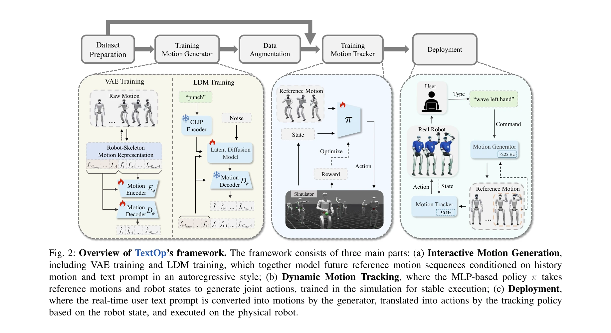

# TextOp: Real-time Interactive Text-Driven Humanoid Robot Motion Generation and Control

> **저자**: Weiji Xie, Jiakun Zheng, Jinrui Han, Jiyuan Shi, Weinan Zhang, Chenjia Bai, Xuelong Li | **날짜**: 2026-02-07 | **DOI**: [10.48550/arXiv.2602.07439](https://doi.org/10.48550/arXiv.2602.07439)

---

## Essence

*Fig. 2: Overview of TextOp’s framework. The framework consists of three main parts: (a) Interactive Motion Generation,*

TextOp는 streaming 자연어 명령으로 인간형 로봇의 운동을 실시간으로 생성하고 제어하는 프레임워크로, 고수준의 autoregressive motion diffusion 모델과 저수준의 motion tracking policy를 결합하여 실행 중 동적으로 명령 수정을 지원한다.

## Motivation

- **Known**: 최근 humanoid whole-body motion tracking 기술로 다양한 협조 운동을 실행할 수 있으며, 텍스트 기반 motion generation이 자연어로 복잡한 의도를 표현할 수 있음이 알려져 있다. 그러나 기존 접근법은 고정된 trajectory 기반이거나 지속적 human teleoperation이 필요하여 유연성과 자율성이 제한된다.
- **Gap**: 높은 수준의 언어 기반 의도 표현과 실시간 물리적 실행 가능한 humanoid 제어 간의 연결고리가 부족하며, 실행 중 명령 수정을 지원하면서도 제어 안정성을 유지하는 방법이 미해결 상태이다.
- **Why**: 자율 로봇의 상호작용성과 적응성을 향상시키고, 사용자의 변화하는 의도에 실시간으로 응답하면서도 연속적이고 부드러운 전신 운동을 유지하는 것이 실제 응용에서 필수적이다.
- **Approach**: TextOp는 두 수준의 구조를 채택하여 고수준에서 현재 텍스트 입력과 최근 motion context에 기반한 short-horizon kinematic trajectory를 autoregressive하게 생성하고, 저수준에서 robust whole-body motion tracking policy가 물리 로봇에서 이들 trajectory를 실행한다.

## Achievement

- **실시간 상호작용 제어**: Streaming 언어 명령과 on-the-fly 명령 수정을 지원하며 instant responsiveness를 달성
- **Two-Level Architecture**: Motion diffusion 모델과 motion tracking policy의 분리로 의도 업데이트와 제어 안정성의 균형 달성
- **Robot-Skeleton Motion Representation**: 휴머노이드 로봇의 단일-DoF 관절 구조를 반영한 컴팩트한 kinematic 표현으로 생성 품질 개선
- **Distribution Gap 해결**: Motion generator가 생성한 궤적으로 tracking policy 학습 데이터를 증강하여 현실 로봇 배포 시 견고성 향상
- **실제 로봇 검증**: 춤, 점프 등 다양한 도전적 행동들 간의 부드러운 전환으로 continuous motion execution 달성

## How

- VAE(Variational Autoencoder)를 사용하여 motion을 latent space로 인코딩
- Latent Diffusion Model(LDM)을 이용해 CLIP encoder로 인코딩된 텍스트 조건 하에서 autoregressive하게 미래 motion latent 생성
- 생성된 short-horizon trajectory를 robot-skeleton representation으로 표현하여 6.25 Hz에서 운동 참조값 생성
- MLP 기반 motion tracking policy를 시뮬레이션에서 학습하여 reference motion과 로봇 상태를 입력받아 50 Hz에서 joint-level 제어 명령 생성
- Motion generator로 생성된 궤적을 포함한 augmented dataset으로 tracking policy를 재학습하여 분포 간격 감소

## Originality

- humanoid animation 분야의 interactive motion generation과 실제 로봇 whole-body control을 최초로 통합하는 시스템 제시
- Streaming 자연어 명령으로 실행 중 동적 수정을 지원하는 새로운 humanoid 제어 paradigm 제안
- Robot-skeleton motion representation이라는 로봇 특화 설계를 통해 생성-추적 간의 alignment 개선
- Motion generator의 출력으로 tracking policy 데이터를 증강하는 domain adaptation 전략의 창의적 활용

## Limitation & Further Study

- Motion generator의 context window(최근 motion history)가 제한되어 있어 장기적 coherence 유지 능력에 제약
- 학습 데이터에 포함된 motion들에 대해서만 효과적이며, 데이터셋에 없는 새로운 동작에 대한 일반화 능력 불명확
- 실제 로봇 실험이 단일 humanoid platform(체형, 구동 방식)에 한정되어 다양한 로봇 플랫폼에의 적응성 미검증
- 외부 교란에 대한 회복 능력은 보여졌으나, 극단적 교란이나 예기치 않은 환경 변화에 대한 견고성 평가 부족
- **후속 연구**: 더 긴 context window와 hierarchical planning으로 장기 coherence 향상, 다중 로봇 플랫폼에 대한 일반화 방법 개발, adversarial robustness 강화

## Evaluation

- Novelty: 4/5
- Technical Soundness: 3/5
- Significance: 4/5
- Clarity: 4/5
- Overall: 4/5

**총평**: TextOp는 실시간 interactive motion generation과 robust physical control을 성공적으로 통합하여 자연어 기반 humanoid 제어의 새로운 paradigm을 제시한 뛰어난 연구이며, 실제 로봇 실험을 통해 실현 가능성을 검증했다. 다만 플랫폼 특화성과 데이터셋 의존성을 개선한다면 더욱 광범위한 영향을 미칠 수 있을 것으로 예상된다.
