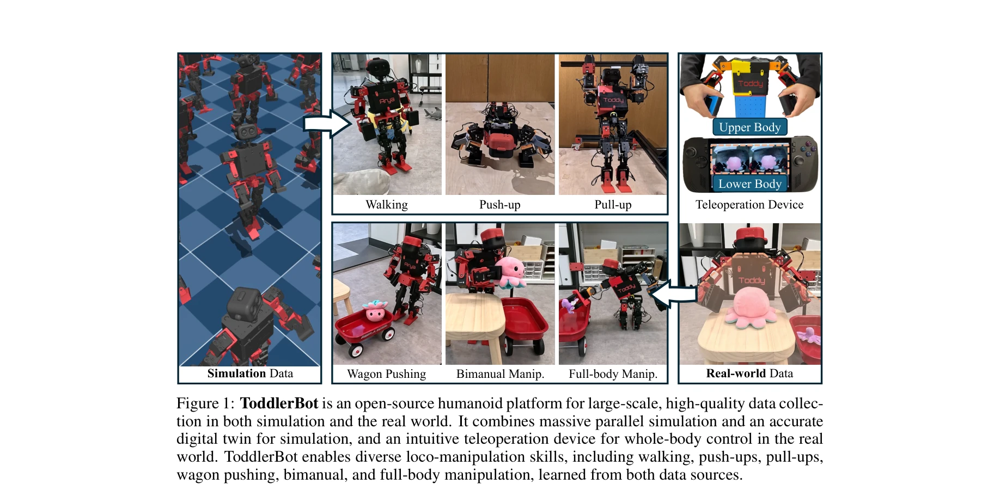
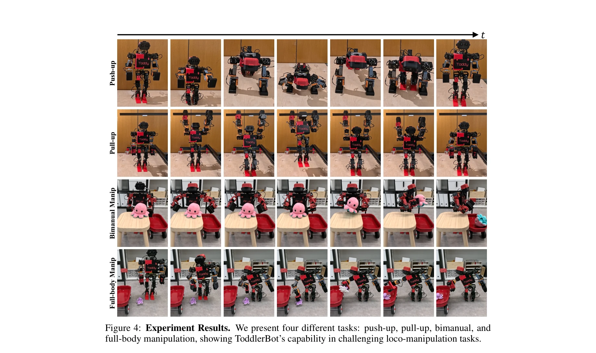
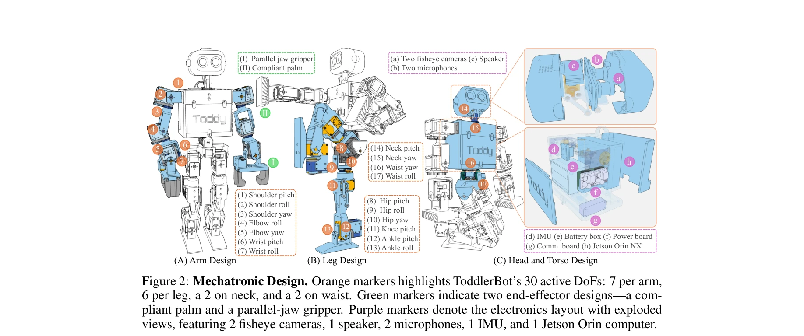

# ToddlerBot: Open-Source ML-Compatible Humanoid Platform for Loco-Manipulation

> **저자**: Haochen Shi, Weizhuo Wang, Shuran Song, C. Karen Liu | **날짜**: 2025-02-02 | **URL**: [https://arxiv.org/abs/2502.00893](https://arxiv.org/abs/2502.00893)

---

## Essence

*Figure 1: ToddlerBot is an open-source humanoid platform for large-scale, high-quality data collec-*

ToddlerBot은 머신러닝 기반 로봇 정책 학습을 위해 설계된 저비용, 오픈소스 미니어처 인형로봇으로, 시뮬레이션과 실제 환경 모두에서 고품질 데이터 수집을 가능하게 하며 zero-shot sim-to-real 정책 전이를 지원한다.

## Motivation

- **Known**: 기존 휴머노이드 로봇들은 높은 비용과 복잡한 유지보수로 인해 연구 접근성이 낮으며, 시뮬레이션-실제 환경 간 정책 전이가 어렵다는 것이 알려져 있다.
- **Gap**: 기존 미니어처 휴머노이드들은 자유도가 제한적이어서 조작과 이동을 모두 수행하기 어렵고, ML 기반 정책 학습에 필요한 양질의 시뮬레이션-실제 데이터 수집 기능이 부족하다.
- **Why**: 스케일 가능한 머신러닝 기반 로봇 정책 학습을 위해서는 비용 효율적이면서도 높은 정확도의 digital twin을 갖춘 플랫폼이 필수이며, 이는 로봇공학 연구의 민주화와 재현성 향상에 중요하다.
- **Approach**: plug-and-play zero-point calibration과 transferable motor system identification을 통해 high-fidelity digital twin을 구축하고, 직관적인 teleoperation 인터페이스로 whole-body 제어 및 데이터 수집을 가능하게 했으며, 3D-printed와 상용 부품만으로 6,000 USD 이하의 저비용 설계를 실현했다.

## Achievement

*Figure 4: Experiment Results. We present four different tasks: push-up, pull-up, bimanual, and*

- **30 DoF 미니어처 휴머노이드**: 기존 미니어처 휴머노이드 중 가장 많은 자유도를 갖추어 loco-manipulation 연구에 최적화
- **Zero-shot Sim-to-Real 정책 전이**: 정확한 system identification과 digital twin을 통해 시뮬레이션에서 학습한 정책을 실제 환경에 직접 적용 가능
- **양질의 데이터 수집 플랫폼**: 시뮬레이션 데이터와 human demonstration 기반 실제 데이터를 모두 효율적으로 수집 가능
- **완전한 재현성**: 3D-printed 설계와 상용 부품으로 구성되어 기본 기술 지식만으로 독립적 구축 가능 (CS 학생의 독립 복제 성공 및 5개 팀의 글로벌 복제 보고)
- **강력한 계산 능력**: CUDA accelerator를 탑재하여 시각과 이동 정책의 동시 추론 지원
- **다양한 loco-manipulation 작업 시연**: push-up, pull-up, wagon pushing, bimanual manipulation 등의 작업과 두 로봇의 협력 작업(toy tidying) 성공적 수행

## How

*Figure 2: Mechatronic Design. Orange markers highlights ToddlerBot’s 30 active DoFs: 7 per arm,*

- **System Identification Pipeline**: 모터의 정확한 특성을 파악하여 시뮬레이션 모델의 충실도 향상
- **Zero-point Calibration**: plug-and-play 방식의 캘리브레이션으로 신속한 시스템 설정 가능
- **Whole-body Teleoperation Interface**: 상하체를 동시에 제어할 수 있는 직관적 인터페이스로 human demonstration 데이터 수집
- **Keyframe-interpolated Motion & RL Policy**: 키프레임 보간 운동과 reinforcement learning 정책으로 다양한 행동 학습
- **Anthropomorphic Design**: 인간과 유사한 신체 구조(30 DoF)로 human demonstration 활용 극대화
- **Compact & Safe Design**: 0.56m, 3.4kg의 소형 경량 설계로 일반 환경에서 안전 운용

## Originality

- **첫 30 DoF 미니어처 휴머노이드**: 기존 미니어처 로봇들의 자유도 제약을 극복하여 superhuman range of motion 달성
- **ML-centric 설계 철학**: 정책 학습과 데이터 수집을 핵심 목표로 하는 새로운 로봇 설계 패러다임 제시
- **통합적 재현성 검증**: 독립적 복제와 글로벌 커뮤니티의 복제를 통한 체계적 재현성 입증
- **전이 가능한 System Identification**: 여러 로봇 인스턴스 간 정책의 zero-shot 전이 성공
- **포괄적 오픈소스 공개**: hardware design, digital twin, learning algorithms, tutorials을 모두 공개하여 접근성 극대화

## Limitation & Further Study

- **탑재 용량 제한**: 미니어처 크기로 인해 full-size 휴머노이드 대비 낮은 payload 용량 (인간 규모 객체 조작 불가)
- **확장성 검증 부족**: 대규모 데이터셋에서의 정책 학습 성공 사례가 제시되지 않음
- **동역학적 복잡성**: push-up, pull-up 같은 고난도 동역학 작업에서 더 정교한 제어 알고리즘 필요성 미해결
- **실시간 계산 성능**: onboard compute (2.50 TFLOPS)의 한계로 복잡한 vision-based policy의 온보드 실행 제약
- **후속 연구 제안**: (1) 대규모 reinforcement learning으로 long-horizon loco-manipulation skill 학습, (2) 다양한 embodiment 간의 정책 일반화 연구, (3) 인간 demonstration으로부터 효율적인 학습 방법론 개발

## Evaluation

- Novelty: 4/5
- Technical Soundness: 3/5
- Significance: 4/5
- Clarity: 4/5
- Overall: 4/5

**총평**: ToddlerBot은 ML-compatible 설계, 높은 자유도, 완벽한 재현성, 그리고 저비용이라는 독특한 조합으로 로봇공학 연구를 민주화하는 중요한 플랫폼이며, 시뮬레이션-실제 데이터 수집과 정책 학습을 위한 실질적인 도구를 제공한다.
