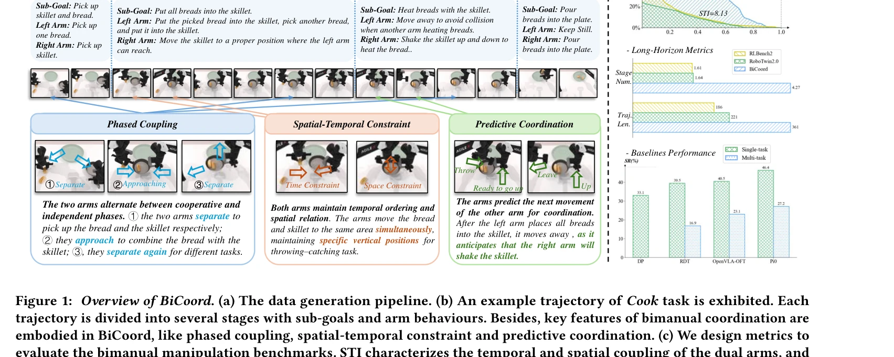

# BiCoord: 장기간 시공간 협응 양팔 조작 벤치마크

> **저자**:  | **날짜**: 2026-04-07 | **URL**: [https://arxiv.org/abs/2604.05831](https://arxiv.org/abs/2604.05831)

---

## Essence

*Figure 1: Overview of BiCoord. (a) The data generation pipeline. (b) An example trajectory of Cook task is exhibited. Ea*

BiCoord는 장시간 시공간 협응이 필요한 양팔 조작 벤치마크를 제시하며, 연속적 팔 간 의존성과 동적 역할 교환을 포함한 다양한 작업을 정의하고 이를 평가할 메트릭을 개발했다.

## Motivation

- **Known**: RoboTwin과 RLBench2 등의 시뮬레이션 벤치마크가 양팔 조작 연구를 촉진했으나, 기존 작업들은 단시간이고 약한 협응만 포함한다.
- **Gap**: 기존 벤치마크는 장시간 의존성과 계층적 구조를 반영하지 못하며, 공간-시간 결합도가 높은 진정한 협력 조작 작업이 부족하다.
- **Why**: 양팔 조작은 인간 수준의 기술 습득에 필수적이며, 실제 인간 조작은 강한 시공간 협응을 요구하므로 이를 반영하는 벤치마크가 필요하다.
- **Approach**: 데이터 생성 파이프라인을 통해 장시간 고도로 협응된 작업들을 설계하고, 시간적·공간적·시공간 관점에서 협응을 평가하는 정량 메트릭 (STI, SMT, SMP, MRD, ARD 등)을 제안한다.

## Achievement

*Figure 1: Overview of BiCoord. (a) The data generation pipeline. (b) An example trajectory of Cook task is exhibited. Ea*

- **BiCoord 벤치마크 구축**: phased coupling, spatial-temporal constraint, predictive coordination의 세 가지 특성을 포함한 장시간 양팔 조작 작업 세트 구성
- **Spatial-Temporal Integral (STI) 메트릭**: 팔 간 시공간 결합도를 측정하는 핵심 평가 지표 개발
- **종합 메트릭 스위트**: 시간적 (SMT, SMP), 공간적 (MRD, ARD), 장시간 (TL, SN, ON) 관점의 다층적 평가 체계 제시
- **기저선 성능 분석**: DP, RDT, Pi0, OpenVLA-OFT 등 최신 정책들이 장시간 고결합 작업에서 어려움을 겪음을 실증

## How

*Figure 1: Overview of BiCoord. (a) The data generation pipeline. (b) An example trajectory of Cook task is exhibited. Ea*

- Task Defining: 요구되는 협응 특성을 반영하여 작업 정의 및 서브-목표 설정
- Planning & Action Script: 각 서브-목표별 팔의 행동을 상세히 기술하는 스크립트 작성
- Verification: 작업과 스크립트의 타당성 검증 및 수정
- Trajectory Generation: 검증된 스크립트로부터 궤적 생성 및 Random Testing 수행
- Metrics Check: STI, SMT, SMP 등의 메트릭을 계산하여 협응 정도 평가
- Instruction Augmentation & Stage-Wise Annotation: 데이터 다양성 확대 및 각 단계별 주석 추가

## Originality

- 기존 벤치마크 대비 현저히 긴 궤적 길이와 다중 단계 구조로 장시간 협응 요구
- phased coupling, spatial-temporal constraint, predictive coordination 세 가지 협응 특성을 명시적으로 정의하고 설계에 반영
- Spatial-Temporal Integral (STI)을 통한 팔 간 결합도의 정량화로 기존 메트릭의 한계 극복
- 다층적 메트릭 (temporal, spatial, spatial-temporal, long-horizon) 체계로 종합적 평가 제공

## Limitation & Further Study

- 시뮬레이션 기반 벤치마크로서 실제 로봇 시스템으로의 sim-to-real 전이 검증 부족
- 현존 VLA 및 강화학습 기반 정책들의 근본적 한계로 인한 낮은 성공률 분석이 개선 방향 제시 부족
- 추가 협응 특성 (예: 힘 제어, 접촉 기반 상호작용)의 통합 가능성 미흡
- 후속 연구: 시뮬레이션 데이터 활용을 위한 더 강력한 학습 알고리즘 개발, 실제 로봇에서의 검증 및 적응 방법 연구

## Evaluation

- Novelty: 4/5
- Technical Soundness: 3/5
- Significance: 4/5
- Clarity: 4/5
- Overall: 4/5

**총평**: BiCoord는 양팔 조작 연구의 중요한 공백을 명확히 인식하고, 장시간·고도 협응 작업을 체계적으로 설계·평가하는 종합적인 벤치마크와 메트릭을 제공함으로써 협력 로봇 조작 분야 발전에 기여한다.