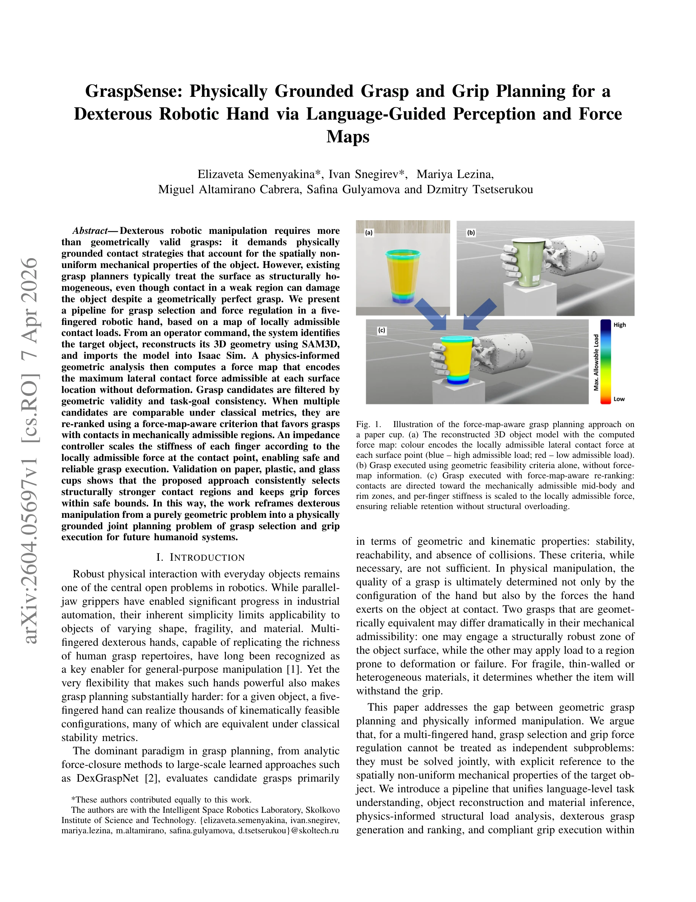
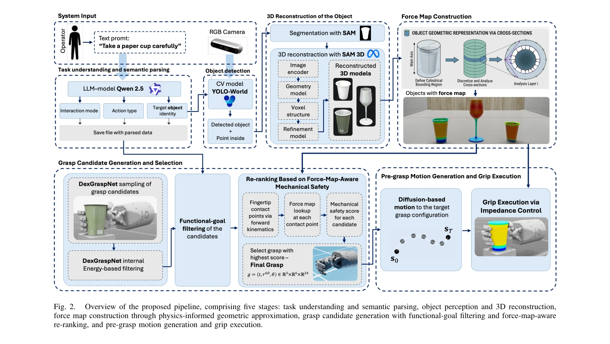

# GraspSense: 언어 기반 인지와 힘 맵을 활용한 손재주 로봇 파지 계획

> **저자**:  | **날짜**: 2026-04-07 | **URL**: [https://arxiv.org/abs/2604.05697](https://arxiv.org/abs/2604.05697)

---

## Essence

*Fig. 1.*

오브젝트의 공간적으로 비균일한 기계적 성질을 고려한 force map 기반 파지 계획 파이프라인을 제안하여, 기하학적으로 동등한 파지 후보들 중 구조적으로 안전한 접촉 영역을 선택하고 손가락별 임피던스를 조절하는 접근법을 제시한다.

## Motivation

- **Known**: 기존 파지 계획은 안정성, 도달가능성, 충돌회피 등 기하학적·운동학적 기준만으로 평가하며, impedance control을 통한 순응 조작이 이미 활용되고 있다. 또한 SAM3D 같은 3D 복원 기술과 LLM 기반 태스크 이해도 발전되어 있다.
- **Gap**: 기존 파지 계획자들은 오브젝트 표면을 구조적으로 균일하게 취급하여 구조적으로 취약한 영역에서의 접촉으로 인한 손상 위험을 간과하고 있으며, 파지 선택과 그립 힘 제어를 독립적인 부분 문제로 해결하고 있다.
- **Why**: 종이컵, 플라스틱컵, 유리잔 같은 일상용품의 안전한 파지와 조작을 위해서는 기하학적 타당성뿐 아니라 국소적 기계적 안전성을 동시에 고려하는 물리 기반 접근이 필수적이며, 이는 미래의 휴머노이드 시스템의 신뢰할 수 있는 조작 능력을 위한 토대가 된다.
- **Approach**: 자연언어 명령으로부터 출발하여 Qwen으로 태스크를 파싱하고, YOLO-World와 SAM으로 오브젝트를 감지·분할한 후 SAM3D로 3D 기하학을 복원한다. 이를 Isaac Sim에 임포트하여 국소 벽두께의 물리 기반 기하학적 근사를 통해 force map을 계산하고, 이를 파지 후보 재랭킹과 임피던스 제어에 활용한다.

## Achievement

*Fig. 1.*

- **Force map 구성 모듈**: 재구성된 3D 오브젝트 모델에 대해 물리 기반 기하학적 근사를 통해 국소 벽두께로부터 공간 분포하는 허용 가능 접촉 하중을 추정하고, 각 표면 영역별 기계적으로 안전한 접촉 력의 상한을 제공한다.
- **물리 기반 파지 선택 기준**: 고전적 다중 기준 랭킹(안정성, 도달가능성, 충돌회피)에 force-map-aware 재랭킹 단계를 확장하여, 기하학적으로 동등한 후보 중 접촉 영역이 기계적으로 가장 허용 가능한 것을 선택한다.
- **임피던스 기반 그립 실행 전략**: 각 접촉점의 국소 허용 력에 따라 손가락별 강성을 조절하는 공간적으로 비균일한 그립 전략으로, 오브젝트 구조에 대해 안전하면서도 확실하게 물체를 유지한다.
- **전체 파이프라인 통합**: 자연언어 명령에서 그립 실행까지 Isaac Sim에서 통합 구현되었으며, 종이컵, 플라스틱컵, 유리잔 3종 재료의 컵 형태 오브젝트에서 검증되었다.

## How

*Fig. 2.*

- Qwen LLM으로 자연언어 명령을 파싱하여 대상 오브젝트(O), 행동 유형(a), 상호작용 모드(λ) 추출
- YOLO-World로 오픈 어휘 오브젝트 감지 및 SAM으로 픽셀 정확 이진 마스크 생성
- SAM3D를 이용한 3D 기하학 복원 및 Isaac Sim으로 USD 포맷 변환
- 국소 벽두께의 물리 기반 기하학적 근사를 통한 force map 계산 (각 표면점에서 허용 가능한 측방향 접촉 력 인코딩)
- 파지 후보 생성 후 기하학적 타당성과 태스크 목표 일관성으로 필터링
- 고전적 메트릭이 비슷한 후보들을 force-map-aware 기준으로 재랭킹
- 임피던스 제어기로 각 접촉점의 국소 허용 력에 따라 손가락별 강성 조절

## Originality

- Force map을 파지 선택과 그립 실행의 첫 번째 우선 요소로 도입하여, 순수 기하학 문제에서 물리 기반 조인트 계획 문제로의 재구성
- 구조 해석으로 계산한 공간 분포 허용 력을 다중 기준 파지 랭킹에 명시적으로 통합하는 새로운 재랭킹 기준 제안
- 국소적 기계적 특성을 기반으로 하는 공간적으로 비균일한 grip 전략으로 순응 제어를 구조 인식적으로 확장
- 자연언어 이해에서 그립 실행까지의 완전한 엔드-투-엔드 파이프라인으로 통합하여 실제 휴머노이드 시스템 적용 가능성 제시

## Limitation & Further Study

- 벽두께 추정이 기하학적 근사에 의존하므로, 내부 강화재, 비규칙적 내부 구조, 불균질한 재료 분포 등 복잡한 구조는 정확하게 모델링하지 못할 수 있음
- 검증이 컵 형태의 3가지 재료(종이, 플라스틱, 유리)에만 제한되어, 복잡한 형상이나 다양한 재료의 오브젝트에 대한 일반화 가능성이 미검증됨
- Force map 계산이 정적 선형 탄성 이론에 기반하여 대변형, 비선형 거동, 시간 종속 특성 등을 반영하지 못함
- 실제 로봇 손과의 실험이 없이 Isaac Sim 시뮬레이션에만 기반하므로, 실제 센서 노이즈, 시간 지연, 모델-현실 갭 등의 영향 미평가
- 후속 연구로 물리 기반 FEM 시뮬레이션 통합, 실제 로봇 플랫폼에서의 하드웨어 검증, 동적 파지 상황에서의 적응형 힘 제어 확장 필요

## Evaluation

- Novelty: 4/5
- Technical Soundness: 3/5
- Significance: 4/5
- Clarity: 4/5
- Overall: 4/5

**총평**: 본 논문은 기하학적 파지 계획과 물리 기반 조작을 통합하는 창의적이고 실용적인 접근법을 제시하며, force map이라는 새로운 개념을 도입하여 파지 선택과 그립 제어를 체계적으로 연결한다. 다만 실제 로봇 실험의 부재와 복잡한 오브젝트에 대한 일반화 가능성이 추가 검증이 필요한 부분이다.
