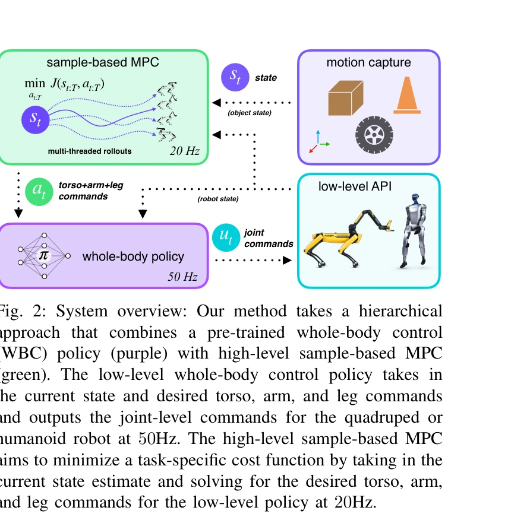
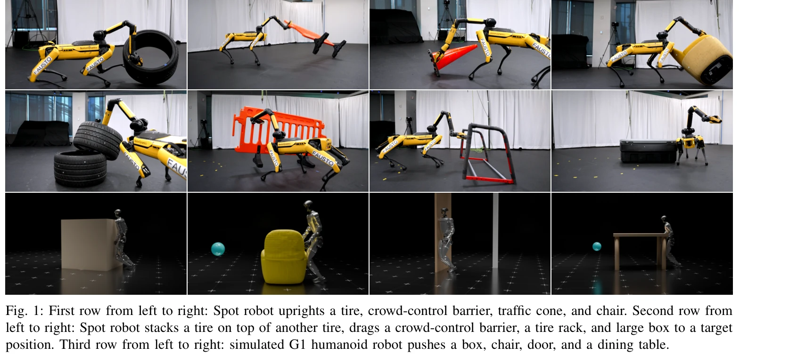

# Sumo: 동적이고 일반화 가능한 전신 이동-조작 제어

> **저자**:  | **날짜**: 2026-04-09 | **URL**: [https://arxiv.org/abs/2604.08508](https://arxiv.org/abs/2604.08508)

---

## Essence

*Fig. 2: System overview: Our method takes a hierarchical*

사전 학습된 전신 제어 정책과 테스트 시점 샘플 기반 MPC를 계층적으로 결합하여 로봇이 동적으로 대형 중량 물체를 조작할 수 있도록 하는 방법을 제안한다. 재학습 없이 다양한 물체와 작업에 일반화 가능하다.

## Motivation

- **Known**: RL은 견고한 전신 제어 정책을 학습할 수 있지만 작업 특화적 보상 엔지니어링이 필요하고, sample-based MPC는 훈련 불필요하지만 고자유도 동적 불안정 작업에서 어려움을 겪는다.
- **Gap**: 동적 전신 조작이 필요한 대형 중량 물체의 로코-조작(loco-manipulation) 작업에서 end-to-end RL과 sample-based MPC의 장점을 모두 활용할 수 있는 통합 방법이 부족하다.
- **Why**: 로봇의 전신 협응을 통해 자신보다 크고 무거운 물체를 동적으로 조작하는 능력은 실제 세계의 다양한 작업 시나리오에서 로봇의 적용성을 크게 확대할 수 있다.
- **Approach**: 계층적 구조로서 저수준의 RL 기반 전신 제어 정책(WBC)이 안정적인 기본 동작을 담당하고, 고수준의 sample-based MPC가 테스트 시점에 객체 모델과 비용 함수를 조정하여 다양한 조작 작업을 계획한다.

## Achievement

*Fig. 1: First row from left to right: Spot robot uprights a tire, crowd-control barrier, traffic cone, and chair. Second*

- **Spot 사족 로봇 실제 시연**: 타이어 세우기, 군중 통제 배리어 드래그, 椅子 적재 등 8가지 도전적인 로코-조작 작업 수행으로 로봇 자체 무게보다 무거운 물체 조작 입증
- **G1 인형형 로봇 시뮬레이션**: 도어 열기, 테이블 밀기 등 인형형 로봇으로의 확장 가능성 시연
- **재훈련 없이 일반화**: 객체 모델 또는 비용 함수만 변경하여 새로운 물체와 작업에 적응 가능
- **계층적 구조의 효율성**: End-to-end RL 및 end-to-end MPC 대비 더 간단한 작업 목표와 낮은 계산 복잡도로 동등 이상의 성능 달성
- **오픈소스 벤치마크**: 로코-조작 작업 데이터셋 및 코드 공개

## How

*Fig. 2: System overview: Our method takes a hierarchical*

- RL을 이용하여 광범위한 도메인 랜더마이제이션으로 견고한 전신 제어 정책 학습
- Sample-based MPC를 이용하여 로봇 상태와 객체 상태를 입력으로 받아 토르소, 팔, 다리 명령 최적화
- 저수준 WBC 정책(50Hz)이 고수준 MPC(20Hz) 명령을 joint 레벨 명령으로 변환
- 테스트 시점에서 객체 모델 업데이트 또는 비용 함수 조정으로 새로운 시나리오 적응
- Multi-threaded rollouts을 통해 실시간 계획 성능 확보

## Originality

- RL 기반 저수준 정책과 sample-based MPC 고수준 계획의 계층적 결합이 두 방법의 단점을 상호 보완하는 구조 제시
- 동적 로코-조작에서 테스트 시점 계획을 통한 재훈련 없는 일반화 방식 도입
- 대형 중량 물체의 조작 성능을 실제 로봇에서 정량적·정성적으로 검증한 최초 사례

## Limitation & Further Study

- Motion capture 시스템 의존으로 인한 실제 배포 시 센싱 인프라 필요성
- 현재 접근은 주로 푸시/드래그 등 접촉 중심 작업에 집중되어 있으며, 복잡한 조작 양식 확장 필요
- 객체 동역학 모델 정확성에 대한 민감도 분석 부족
- 계획 지평(planning horizon)과 정책 반응성 간 트레이드오프에 대한 더 깊은 분석 필요
- 후속 연구로서 비전 기반 객체 추적, 모델 학습 기반 동역학 개선, 더 복잡한 다중 접촉 시나리오 확장 고려

## Evaluation

- Novelty: 4/5
- Technical Soundness: 3/5
- Significance: 4/5
- Clarity: 4/5
- Overall: 4/5

**총평**: 본 논문은 RL과 sample-based MPC의 장점을 효과적으로 결합한 계층적 프레임워크로 로봇 로코-조작의 일반화 문제를 우아하게 해결했으며, 실제 로봇 시연으로 실무적 가치를 입증했다.