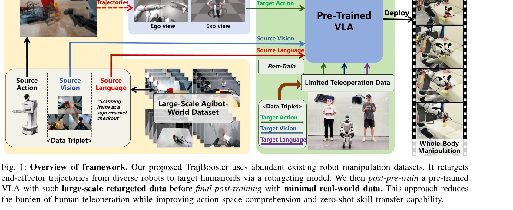

# TrajBooster: Boosting Humanoid Whole-Body Manipulation via Trajectory-Centric Learning

> **저자**: Jiacheng Liu, Pengxiang Ding, Qihang Zhou, Yuxuan Wu, Da Huang, Zimian Peng, Wei Xiao, Weinan Zhang, Lixin Yang, Cewu Lu, Donglin Wang | **날짜**: 2026-03-19 | **DOI**: [10.48550/arXiv.2509.11839](https://doi.org/10.48550/arXiv.2509.11839)

---

## Essence

*Fig. 1: Overview of framework. Our proposed TrajBooster uses abundant existing robot manipulation datasets. It retargets*

TrajBooster는 풍부한 바퀴달린 휴머노이드 데이터에서 추출한 말단 이펙터 궤적을 시뮬레이션에서 이족 휴머노이드로 재타겟팅하여 Vision-Language-Action 모델의 학습을 부스팅하는 cross-embodiment 프레임워크이다. 최소한의 텔레오퍼레이션 데이터(10분)로 이족 휴머노이드의 광범위한 전신 조작 능력을 실현한다.

## Motivation

- **Known**: VLA 모델은 다양한 구현체에 걸쳐 일반화 가능성을 보여주며, 휴머노이드 로봇은 텔레오퍼레이션을 통해 정교한 전신 제어를 달성할 수 있다. 하지만 이족 휴머노이드의 경우 고품질 시연 데이터가 부족할 때 새로운 action space에 빠르게 적응하기 어렵다.
- **Gap**: 기존 연구는 주로 tabletop 조작이나 coarse-grained 제어에 집중했으며, 광범위한 높이에서의 전신 조작을 수행하는 이족 휴머노이드 VLA는 충분한 같은-구현체 데이터의 수집 비용 때문에 미해결 과제로 남아있다.
- **Why**: 가정용 로봇 작업은 0.2~1.2m 범위의 광범위한 workspace에서 squatting, cross-height manipulation 등의 복잡한 전신 협응을 요구하며, 이를 위한 대규모 데이터 수집은 비용이 많이 들기 때문에 효율적인 cross-embodiment 전이 학습이 중요하다.
- **Approach**: morphology-agnostic 인터페이스로 6D 말단 이펙터 궤적을 사용하여 real-to-sim-to-real 파이프라인을 구성하고, heuristic-enhanced harmonized online DAgger를 통해 저차원 궤적 참조를 고차원 전신 action으로 변환한 후, heterogeneous triplets을 구성하여 VLA를 post-pre-train한다.

## Achievement

*Fig. 1: Overview of framework. Our proposed TrajBooster uses abundant existing robot manipulation datasets. It retargets*

- **Cross-embodiment 전이의 첫 실현**: 바퀴달린 휴머노이드의 광범위한 재타겟팅 action 데이터를 활용하여 이족 휴머노이드에서 VLA 기반의 전신 조작을 실제 환경에서 성공적으로 구현한 첫 사례
- **데이터 효율성**: 단 10분의 텔레오퍼레이션 데이터로 Unitree G1에서 squatting, cross-height manipulation, coordinated whole-body motion 등 복수의 가정용 작업 달성
- **강건성 및 일반화 향상**: 대규모 재타겟팅 데이터를 통한 post-pre-training으로 action space 이해도와 zero-shot skill transfer 능력이 크게 개선
- **광범위한 workspace 커버**: 기존 tabletop 중심 연구를 벗어나 0.2~1.2m의 전체 높이 범위에서 전신 조작 가능

## How

*Fig. 1: Overview of framework. Our proposed TrajBooster uses abundant existing robot manipulation datasets. It retargets*

- Real Trajectory Extraction: Agibot-World Beta 데이터셋에서 바퀴달린 휴머노이드의 6D 양팔 말단 이펙터 궤적 추출
- Retargeting in Simulation: Isaac Gym 시뮬레이터에서 heuristic-enhanced harmonized online DAgger를 이용하여 whole-body controller 학습으로 저차원 궤적 참조를 고차원 joint action으로 변환
- VLA Post-Pre-Training: heterogeneous triplets ⟨source vision, source language, target action⟩을 구성하여 기존 pre-trained VLA를 post-pre-train
- Fine-tuning and Deployment: 최소한의 실제 데이터(⟨target vision, target language, target action⟩ 10분)로 최종 post-training 후 Unitree G1에 배포

## Originality

- Morphology-agnostic 신호로서 말단 이펙터 궤적을 활용한 novel cross-embodiment 인터페이스 제안
- 저차원 궤적 참조를 전신 action으로 변환하는 heuristic-enhanced harmonized online DAgger 알고리즘의 개발
- Heterogeneous data triplet 구성을 통해 source perception을 target action과 연결하는 창의적 접근법
- 이족 휴머노이드의 광범위한 전신 조작을 VLA로 처음 실현한 기술적 기여

## Limitation & Further Study

- 시뮬레이션-현실 간극(sim-to-real gap)으로 인해 시뮬레이션 재타겟팅된 action과 실제 로봇 행동 간 불일치 가능성
- source 데이터셋(Agibot-World Beta)의 작업 다양성에 의존하므로, 데이터셋에 없는 새로운 작업 유형에 대한 일반화 제한 가능성
- 10분의 real teleoperation data는 특정 환경 특성에 overfitting할 수 있어, 미지의 환경으로의 강건한 전이 검증 부족
- 후속 연구 방향: (1) 더 정교한 sim-to-real 적응 기법 개발, (2) 다양한 형태의 휴머노이드 로봇으로 확장, (3) 온라인 학습을 통한 지속적 적응 메커니즘 구축

## Evaluation

- Novelty: 4/5
- Technical Soundness: 3/5
- Significance: 4/5
- Clarity: 4/5
- Overall: 4/5

**총평**: TrajBooster는 cross-embodiment 학습을 통해 데이터 부족 문제를 창의적으로 해결하며, 이족 휴머노이드의 광범위한 전신 조작을 VLA로 실현한 중요한 기여다. 다만 sim-to-real gap과 환경 일반화에 대한 더 깊은 분석이 보강되면 영향력이 더욱 증대될 것으로 예상된다.
