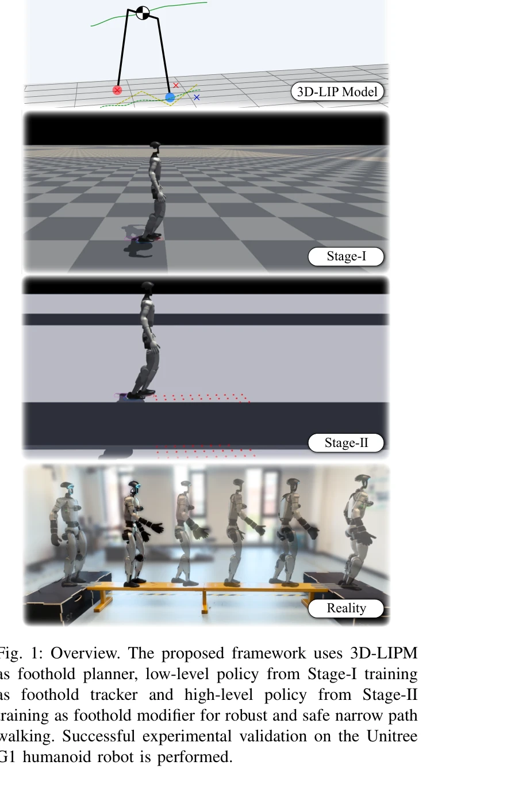

# Traversing Narrow Paths: A Two-Stage Reinforcement Learning Framework for Robust and Safe Humanoid Walking

> **저자**: TianChen Huang, Runchen Xu, Yu Wang, Wei Gao, Shiwu Zhang | **날짜**: 2025-08-28 | **URL**: [https://arxiv.org/abs/2508.20661](https://arxiv.org/abs/2508.20661)

---

## Essence

*Fig. 1: Overview. The proposed framework uses 3D-LIPM*

humanoid 로봇이 좁은 경로를 안전하게 통행하기 위해 3D-LIPM 기반 foothold planner와 두 단계 RL 학습 framework를 결합한 방법을 제안한다. Stage-I에서는 flat ground에서 foothold tracker를 학습하고, Stage-II에서는 narrow path에서 foothold modifier를 학습하여 robust하고 safe한 foot placement를 실현한다.

## Motivation

- **Known**: 기존 template-based 방법은 modeling discrepancy와 control latency에 취약하고, 순수 end-to-end RL 방법은 overfitting과 안전성 문제를 야기한다. 최근 residual learning 접근법이 physics-based prior와 data-driven refinement를 결합하는 방향으로 진화하고 있다.
- **Gap**: sparse foothold 조건에서 높은 성공률을 유지하면서 interpretability를 보존하고 minimal sensing으로 sim-to-real transfer가 가능한 framework이 부족하다. 특히 humanoid robot의 narrow beam traversal에 대한 하드웨어 검증된 방법이 제한적이다.
- **Why**: Humanoid robot의 narrow path traversal은 안전-critical한 작업으로서 perception delay와 contact uncertainty에 매우 취약하며, 정확한 foot placement 없이는 recovery margin이 사라진다. 따라서 interpretable한 제어와 robust한 tracking이 동시에 필요한 중요한 문제이다.
- **Approach**: Physics-guided 접근으로 3D-LIPM-MPC foothold planner를 base로 두고, Stage-I에서 disturbance를 통해 robust foothold tracker를 학습한 후, Stage-II에서 minimal terrain perception(anterior height map)을 활용해 body-frame residual을 예측하는 lightweight modifier를 학습한다.

## Achievement

*Fig. 1: Overview. The proposed framework uses 3D-LIPM*

- **Two-stage physics-guided learning**: 3D-LIPM-based foothold planner와 bounded body-frame residual을 활용하여 interpretability를 유지하면서 data-driven refinement를 수행
- **Curriculum learning setup**: Flat ground에서 narrow path로의 점진적 difficulty 증가를 통해 robust foothold tracker 및 terrain-aware modifier 학습
- **Minimal sensing requirement**: Compact anterior terrain height map과 onboard IMU/joint signals만 활용하여 lightweight perception pipeline 구현
- **Hardware validation**: Unitree G1 humanoid robot에서 0.2m 폭, 3m 길이의 beam을 20회 연속 성공 traversal 달성
- **Performance improvement**: Pure template-based 및 pure RL-based baseline 대비 success rate, centerline adherence, safety margins에서 우수한 성능

## How

*Fig. 2: The proposed framework for humanoid robot traversing narrow paths. A two-stage training curriculum is designed*

- Stage-I training: Flat ground에서 3D-LIPM planner의 foothold target에 intentional disturbance를 추가하여 low-level foothold tracker 학습
- Stage-II training: Narrow path 환경에서 anterior terrain height map을 입력으로 받아 LIPM-planned foothold을 refine하는 body-frame residual (∆x, ∆y, ∆ψ) 예측
- Task decomposition: 'where to step'은 LIPM-MPC가 담당하고, 'how to refine'만 RL이 학습하여 residual learning을 안전-critical 범위로 제한", 'Contact scheduling: Low-level policy가 swing/stance 전환 시간을 조절하여 swing duration을 modulate하고 landing accuracy 향상
- Perception module: Robot-centric anterior terrain height sampling으로 local perception 구현하여 sim-to-real gap 최소화

## Originality

- 기존 BeamDojo의 순수 RL 파이프라인 대신 explicit 3D-LIPM planner를 통한 interpretable foothold generation 도입
- Bounded residual learning을 통해 RL의 data efficiency와 template method의 safety guarantee를 동시에 확보
- Intentional disturbance를 통한 Stage-I robustness training이 기존 staged curriculum과 구별되는 특성
- Minimal sensing (anterior height map + proprioception)으로 heavy vision stack 회피하면서도 terrain-aware control 실현

## Limitation & Further Study

- Narrow path traversal에 특화된 방법으로, 보다 복잡한 terrain(계단, 불규칙한 step stones 등)에 대한 generalization 미검증
- 3D-LIPM은 simplified model로서 dynamic maneuver나 aggressive traversal 시나리오에서의 성능 제한 가능
- Stage-I과 Stage-II의 sequential training 구조로 인한 curriculum 설계의 craft 필요성 및 첫 번째 stage 실패의 cascading effect 위험
- 현재 실험은 single robot (Unitree G1)에 국한되어 다른 humanoid 플랫폼으로의 transfer 가능성 미확인
- Sim-to-real gap 완전 해소를 위한 domain randomization 또는 추가 보정 메커니즘의 상세 기술 부족

## Evaluation

- Novelty: 4/5
- Technical Soundness: 3/5
- Significance: 4/5
- Clarity: 4/5
- Overall: 4/5

**총평**: Humanoid robot의 narrow path traversal을 위한 physics-guided residual learning framework로, 명확한 interpretability와 minimal sensing requirement를 유지하면서도 높은 success rate를 달성한 우수한 연구이다. Hardware validation과 실용적 설계가 돋보이나, generalization scope와 다양한 terrain에 대한 검증이 추가되면 영향력이 더욱 높아질 것으로 예상된다.
