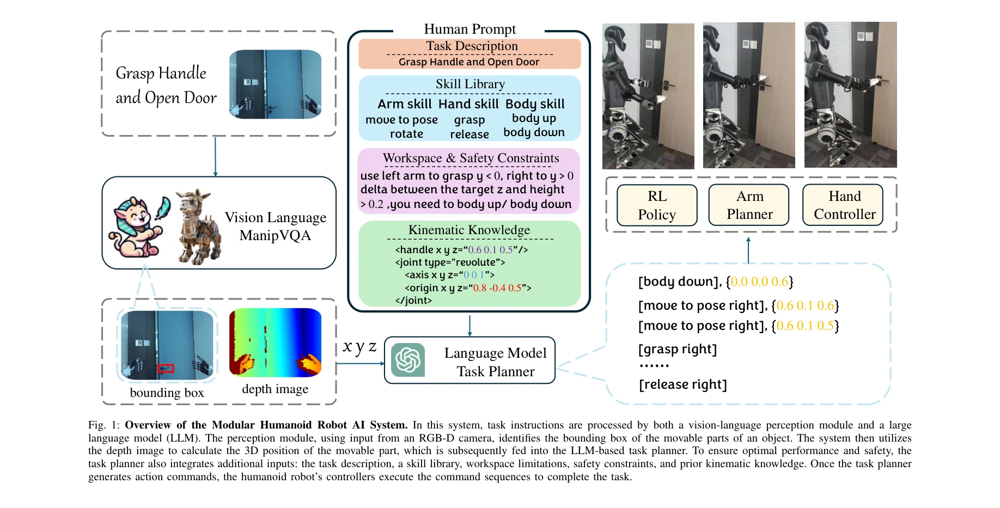
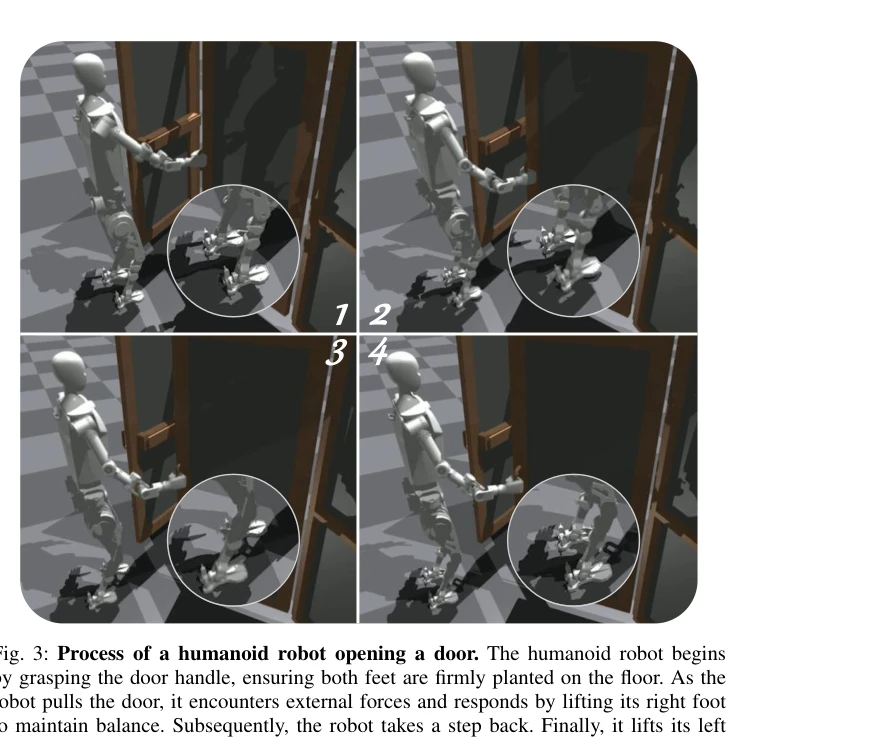

# Trinity: A Modular Humanoid Robot AI System

> **저자**: Jingkai Sun, Qiang Zhang, Gang Han, Wen Zhao, Zhe Yong, Yan He, Jiaxu Wang, Jiahang Cao, Yijie Guo, Renjing Xu | **날짜**: 2025-03-11 | **URL**: [https://arxiv.org/abs/2503.08338](https://arxiv.org/abs/2503.08338)

---

## Essence

*Fig. 1: Overview of the Modular Humanoid Robot AI System. In this system, task instructions are processed by both a visi*

Trinity는 RL, LLM, VLM을 통합하는 모듈형 인간형 로봇 AI 시스템으로, 복잡한 환경에서 효율적인 제어와 자연어 명령 이해를 가능하게 한다.

## Motivation

- **Known**: 인간형 로봇은 인간 거주 공간에서 작동할 수 있어 복잡한 작업이 기대되며, RL은 이족 보행 제어에 성공했고 LLM/VLM은 의미론적 이해와 환경 인식을 향상시킨다.
- **Gap**: 기존 연구는 단순 로봇 구조나 상체 제어만 다루며, 다양한 모델들이 고립되어 인간형 로봇에 통합되지 못했으며, 시뮬레이션과 현실의 갭이 크다.
- **Why**: 인간형 로봇의 복잡한 제어 문제를 해결하기 위해 다양한 AI 기술의 통합 및 계층적 모듈 설계가 필수적이며, 이는 시스템의 해석성과 안전성을 보장한다.
- **Approach**: 모듈형 및 계층적 구조로 LLM (의미론적 계획), VLM (환경 인식), RL (운동 제어)을 통합하여 각 모듈이 독립적으로 최적화되면서도 협력하도록 설계했다.

## Achievement

*Fig. 3: Process of a humanoid robot opening a door. The humanoid robot begins*

- **최초 통합 검증**: LLM, VLM, RL을 인간형 로봇 시스템에 최초로 통합하고 실제 대규모 인간형 로봇에서 실증했다.
- **모듈형 계층 설계**: 복잡한 문제를 분해하여 상호 교환 가능한 모델들로 처리함으로써 유연성과 확장성을 향상시켰다.
- **안전성과 해석성**: 다중 모듈 간 상호작용을 통해 시스템 해석성을 보장하고 인간-로봇 상호작용의 안전성을 확보했다.
- **복합 작업 능력**: 자연어 명령 이해, 시각 인식, 이족 보행, 양팔 조작을 포함한 복합 작업을 수행할 수 있다.

## How

*Fig. 1: Overview of the Modular Humanoid Robot AI System. In this system, task instructions are processed by both a visi*

- Task Planner가 자연어 명령을 LLM으로 처리하여 고수준 계획을 생성한다.
- VLM을 통해 환경 및 물체의 시각정보를 분석하여 ManipVQA로 그래스핑 위치를 결정한다.
- Arm Planner가 조작 목표를 설정하고 Hand Controller가 손 제어를 담당한다.
- RL Policy는 보행 정책을 제공하며, 상체 움직임에 따라 하체와 무게중심을 조정하는 분리된 locomotion policy를 유지한다.
- 모듈들이 계층적으로 상호작용하여 loco-manipulation 안정성을 유지한다.

## Originality

- RL, LLM, VLM의 세 가지 주요 AI 기술을 처음으로 인간형 로봇에 통합한 통합 시스템 아키텍처이다.
- 기존 방식과 달리 관절 키포인트 추적 대신 locomotion과 manipulation 정책을 분리하여 loco-manipulation 성능을 향상시켰다.
- 모듈형 계층 설계를 통해 각 모듈의 독립적 최적화와 협력을 동시에 달성하는 혁신적 접근이다.
- 시뮬레이션-현실 갭 극복을 위해 주기적 보상과 시연 궤적을 활용하는 새로운 학습 방법을 적용했다.

## Limitation & Further Study

- 논문은 실제 구현 세부사항 (예: VLM 아키텍처, RL 보상 함수, 통합 인터페이스)이 명확하게 기술되지 않았다.
- 현실 환경에서의 정량적 성능 평가 데이터 (성공률, 반응시간 등)가 부족하다.
- 다양한 인간형 로봇 플랫폼에서의 일반화 가능성이 미검증이다.
- 모듈 간 오류 전파 메커니즘과 실패 시나리오에 대한 분석이 필요하다.
- 후속연구는 더 정교한 손-환경 상호작용 모델링, 동적 환경 적응, 다중 작업 병렬 처리 능력 강화가 요구된다.

## Evaluation

- Novelty: 4/5
- Technical Soundness: 3/5
- Significance: 4/5
- Clarity: 3/5
- Overall: 4/5

**총평**: Trinity는 인간형 로봇의 복잡한 제어 문제를 해결하기 위해 최신 AI 기술들을 최초로 통합한 혁신적 시스템이며, 모듈형 계층 설계를 통해 안전성과 해석성을 보장한다. 다만 기술적 세부사항과 정량적 평가가 보강되어야 실제 임팩트를 확인할 수 있다.
