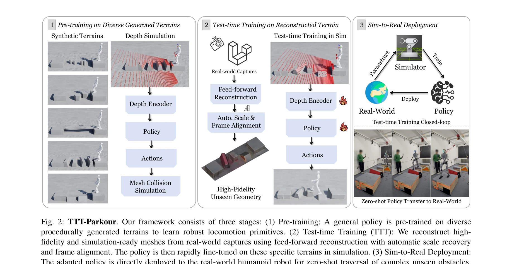
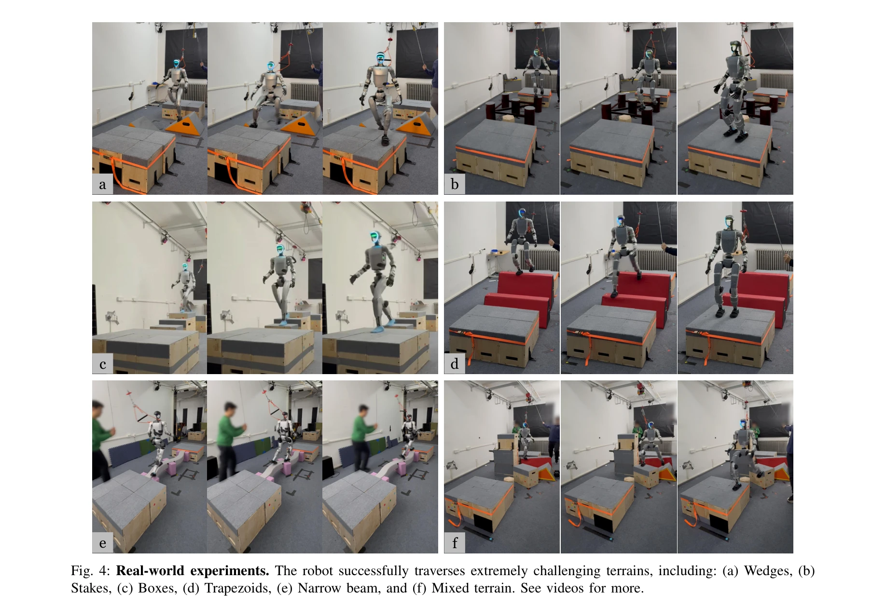

# TTT-Parkour: Rapid Test-Time Training for Perceptive Robot Parkour

> **저자**: Shaoting Zhu, Baijun Ye, Jiaxuan Wang, Jiakang Chen, Ziwen Zhuang, Linzhan Mou, Runhan Huang, Hang Zhao | **날짜**: 2026-02-02 | **DOI**: [10.48550/arXiv.2602.02331](https://doi.org/10.48550/arXiv.2602.02331)

---

## Essence

*Fig. 2: TTT-Parkour. Our framework consists of three stages: (1) Pre-training: A general policy is pre-trained on divers*

본 논문은 실시간 3D 기하학 재구성과 test-time training을 결합하여 휴머노이드 로봇이 미지의 복잡한 지형에서 10분 이내에 적응하고 파쿠르를 수행할 수 있는 real-to-sim-to-real 프레임워크 TTT-Parkour를 제안한다.

## Motivation

- **Known**: 일반 보행 정책은 광범위한 지형 분포에서는 성능을 보이지만, 절차적 생성으로는 모든 실제 환경을 커버할 수 없으므로 미지의 복잡 장애물에서는 실패한다.
- **Gap**: 실시간 적응이 필요하지만 기존 고충실도 재구성 방법(NeRF, 3DGS)은 계산 비용이 크고, feed-forward 방법은 스케일 모호성과 기하학적 왜곡으로 인해 물리 시뮬레이션에 부적합하다.
- **Why**: 복잡하고 예측 불가능한 실제 환경에서 휴머노이드 로봇을 배포하려면 빠른 적응 메커니즘이 필수적이며, 이는 로봇공학의 실용적 난제이다.
- **Approach**: 두 단계 학습: (1) 절차적으로 생성된 다양한 지형에서 정책을 사전 학습, (2) RGB-D 입력으로 재구성한 실제 지형 메시에서 빠른 test-time training을 수행한다.

## Achievement

*Fig. 4: Real-world experiments. The robot successfully traverses extremely challenging terrains, including: (a) Wedges, *

- **빠른 적응 파이프라인**: 캡처, 재구성, test-time training을 10분 이내에 완료하여 현장에서 신속한 정책 업데이트를 실현
- **높은 충실도 재구성**: 자동 스케일 복구 및 프레임 정렬을 포함한 feed-forward 기하학 재구성으로 물리 시뮬레이션에 적합한 메시 생성
- **강건한 zero-shot 전이**: test-time training 후 정책이 복잡한 장애물(쐐기, 말뚝, 상자, 사다리꼴, 좁은 빔)에서 강건한 sim-to-real 전이 시연
- **필수 단계 검증**: 사전 학습과 test-time training이 모두 극도로 어려운 지형 순회에 필수적임을 실증

## How

*Fig. 2: TTT-Parkour. Our framework consists of three stages: (1) Pre-training: A general policy is pre-trained on divers*

- CNN 기반 깊이 인코더와 MLP를 사용한 end-to-end 정책 아키텍처로 깊이 이미지와 proprioceptive 센서 데이터 처리
- PPO(Proximal Policy Optimization)를 사용하여 절차적으로 생성된 다양한 지형에서 사전 학습
- RGB-D 입력에서 feed-forward 방식으로 simulation-ready 메시 직접 재구성
- 자동 스케일 복구 및 프레임 정렬 기법으로 기하학적 정확성 보장
- 재구성된 메시에서 PPO를 사용하여 빠른 fine-tuning 수행
- discrete platform 순회 과제 정의로 foothold 선택 정밀성 강조

## Originality

- 로봇 보행 학습에서 빠른 test-time training 패러다임을 적용한 첫 사례
- feed-forward 재구성에 자동 스케일 복구와 프레임 정렬을 결합하여 시간 제약 하에서 simulation-ready 메시 생성
- real-to-sim-to-real 루프에서 인지 기반 end-to-end 보행을 두 단계 학습으로 통합
- 극도로 제한된 접촉 영역의 복잡한 장애물 환경에서 정밀한 foothold 선택 요구

## Limitation & Further Study

- 현재 fixed forward velocity command만 지원하며 명시적 각속도 제어 부재로 제어 자유도 제한
- RGB-D 입력의 occlusion과 깊이 센서 한계로 인한 재구성 정확도 저하 가능성
- test-time training 시간 10분은 여전히 현장 응답성에서 제약이 될 수 있음
- 절차적 생성 지형과 실제 지형 간의 유형 다양성이 제한될 수 있으므로 더 광범위한 지형에서의 일반화 검증 필요
- 후속 연구: multi-modal 센서 융합, 적응형 제어, 더 빠른 재구성 알고리즘 개발

## Evaluation

- Novelty: 4/5
- Technical Soundness: 4/5
- Significance: 4/5
- Clarity: 4/5
- Overall: 4/5

**총평**: 본 논문은 빠른 기하학 재구성과 test-time training을 결합하여 로봇이 미지의 복잡 지형에 신속히 적응하는 실용적 문제를 창의적으로 해결했으며, 높은 기술적 완성도와 강력한 실험적 검증으로 로봇 보행 분야에 중요한 기여를 한다.
