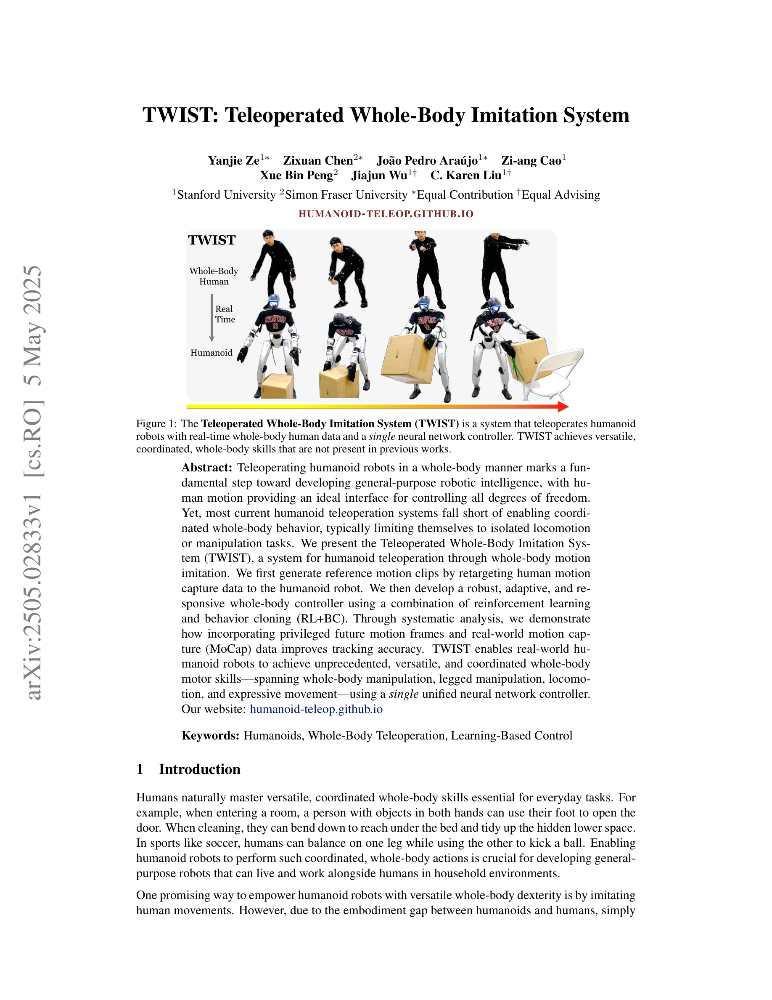
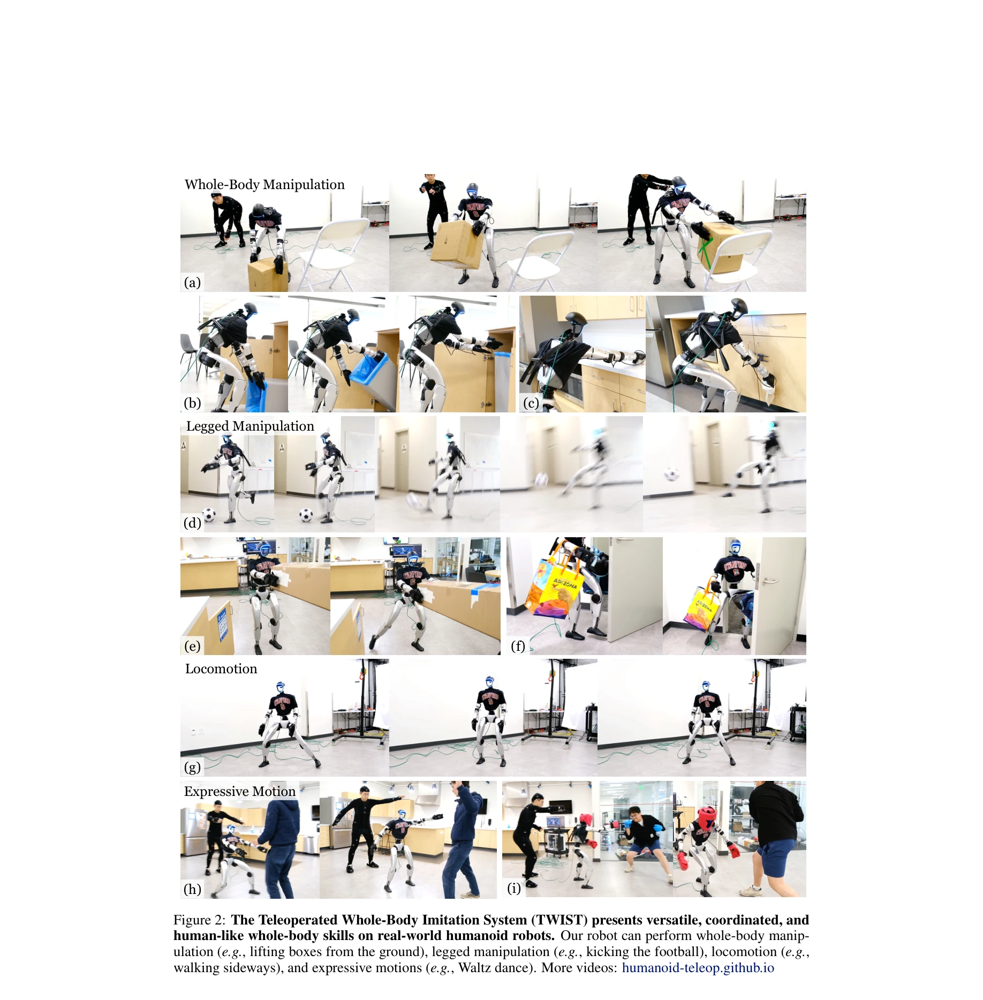
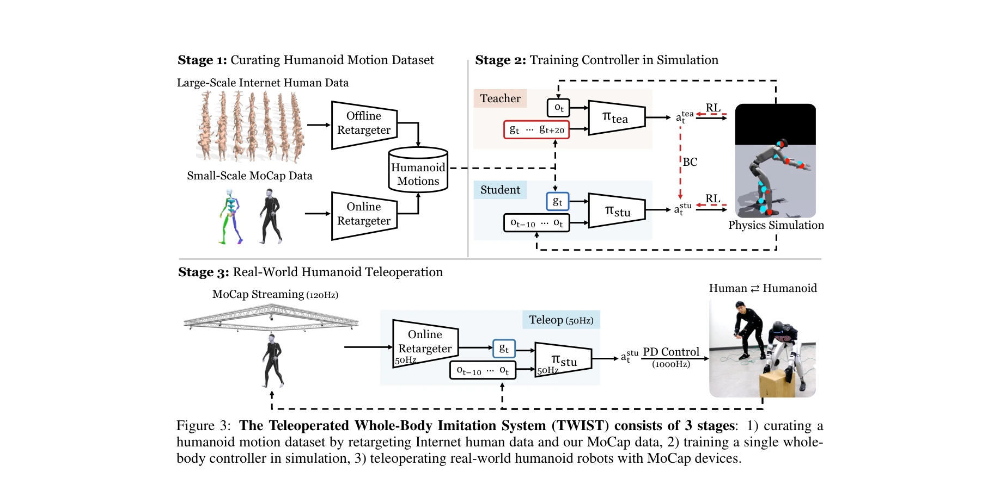

# TWIST: Teleoperated Whole-Body Imitation System

> **저자**: Yanjie Ze, Zixuan Chen, João Pedro Araújo, Zi-ang Cao, Xue Bin Peng, Jiajun Wu, C. Karen Liu | **날짜**: 2025-05-05 | **URL**: [https://arxiv.org/abs/2505.02833](https://arxiv.org/abs/2505.02833)

---

## Essence

*Figure 1: The Teleoperated Whole-Body Imitation System (TWIST) is a system that teleoperates humanoid*

TWIST는 실시간 모션 캡처 데이터를 기반으로 인간의 전신 동작을 휴머노이드 로봇에 모방시키는 통합 텔레오퍼레이션 시스템으로, RL+BC 조합의 단일 신경망 컨트롤러로 조작, 이동, 표현적 동작을 아우르는 다양한 전신 운동 기술을 수행한다.

## Motivation

- **Known**: 기존 휴머노이드 텔레오퍼레이션 시스템들은 주로 모듈식 모델 기반 컨트롤러를 사용하여 상체와 하체를 분리 제어하거나, learning-based 컨트롤러를 사용하더라도 전신 조정 기술이 제한적이다.
- **Gap**: 실시간 전신 동작 추적을 위한 정확한 reference motion과 다양한 동적 동작을 강건하게 추적할 수 있는 통합 컨트롤러가 부족하며, 오프라인 데이터와 실시간 teleoperation 간의 distribution shift가 해결되지 않았다.
- **Why**: 휴머노이드 로봇이 일상 환경에서 인간과 협력하기 위해서는 문을 발로 열면서 동시에 양손으로 물건을 들거나, 바닥 아래를 청소하기 위해 몸을 구부리는 등의 조정된 전신 기술이 필수적이다.
- **Approach**: motion capture를 통해 실시간 인간 동작을 수집하고 이를 휴머노이드에 retargeting하며, 특권적 미래 동작 프레임에 접근 가능한 teacher policy와 현재 프레임만 관찰하는 student policy로 구성된 two-stage teacher-student framework를 적용한 RL+BC 훈련을 수행한다.

## Achievement

*Figure 2: The Teleoperated Whole-Body Imitation System (TWIST) presents versatile, coordinated, and*

- **전신 텔레오퍼레이션 통합**: 단일 신경망 컨트롤러로 whole-body manipulation, legged manipulation, locomotion, expressive movement를 모두 수행할 수 있는 첫 시스템 구현
- **분포 이동 해결**: 소규모 온라인 MoCap 데이터(150 clips)를 대규모 오프라인 데이터(15K clips)와 결합하여 실시간 teleoperation에서의 안정성 대폭 향상
- **지연 시간 감소 기법**: Teacher-student framework를 통해 미래 정보의 이점을 student policy에 증류(distillation)하여 저지연 요구사항과 부드러운 동작을 동시에 달성
- **강건한 접촉 작업**: 대규모 end-effector perturbation으로 훈련하여 힘 가해기 작업에서의 떨림 현상 해결 및 강건성 향상
- **실제 로봇 성공**: Unitree G1 (29 DoF) 휴머노이드에서 다양한 실시간 전신 동작을 안정적으로 실행

## How

*Figure 3: The Teleoperated Whole-Body Imitation System (TWIST) consists of 3 stages: 1) curating a*

- Motion capture 디바이스로부터 120Hz로 실시간 인간 동작 데이터 수집
- Offline retargeter로 인터넷 데이터를 휴머노이드 관절 공간으로 변환하여 대규모 데이터셋 생성
- Online retargeter로 실시간 MoCap 데이터를 50Hz로 빠르게 retarget (3D 관절 위치와 방향 공동 최적화)
- Teacher policy를 특권적 미래 프레임(o_{t:t+T})에 접근 가능하도록 RL으로 훈련하여 부드러운 행동 학습
- Student policy를 현재 프레임(o_t)만 관찰하도록 teacher의 행동 복제(BC) 및 RL로 훈련
- 도메인 랜더마이제이션(base mass, friction, motor strength, gravity, push perturbation)으로 sim-to-real 간극 해소
- Tracking reward (key body position, joint position/velocity, root pose/velocity)와 penalty terms (contact, slipping, action rate)의 조합으로 reward 설계
- PD control (1000Hz)를 통해 정책의 목표 관절 위치를 실제 로봇 액추에이터에 구현

## Originality

- 실시간 MoCap 데이터와 오프라인 인터넷 데이터를 혼합하여 distribution shift 문제를 체계적으로 해결한 점이 혁신적
- Teacher-student framework에서 privileged future information을 student policy에 효과적으로 증류하는 방법론의 창의성
- Offline과 online retargeting의 gap을 3D 관절 위치-방향 공동 최적화로 해결한 기술적 기여
- 대규모 end-effector perturbation을 통한 접촉 작업 강건화가 전신 조작 성능 향상의 핵심 발견
- 단일 통합 컨트롤러로 previously disparate한 전신 동작들을 동시에 달성한 시스템 설계의 우수성

## Limitation & Further Study

- MoCap 시스템 의존성: 고비용의 motion capture 장비가 필수적이어서 광범위한 배포에 제약 (카메라 기반 pose estimation으로의 확장 검토 필요)
- 로봇 플랫폼 특정성: Unitree G1에만 검증되었으므로 다른 휴머노이드 로봇 형태로의 일반화 가능성 미확인
- 온라인 MoCap 데이터 규모 제한: 150개의 온라인 클립은 작은 규모이므로 더 다양한 동작 범위에 대한 효과 검증 부족
- 실시간 성능 분석 부재: 50Hz teleoperation의 지연 시간과 시스템 응답성에 대한 정량적 분석 및 인지 인간공학적 평가 필요
- 후속 연구: (1) vision-based teleoperation으로 확장, (2) 더 큰 규모의 온라인 MoCap 데이터 수집, (3) 다중 로봇 플랫폼에 대한 일반화, (4) 사용자 학습 곡선과 teleoperation 효율성 평가

## Evaluation

- Novelty: 4/5
- Technical Soundness: 3/5
- Significance: 4/5
- Clarity: 4/5
- Overall: 4/5

**총평**: TWIST는 실시간 전신 텔레오퍼레이션을 위해 MoCap 데이터, teacher-student learning, 도메인 특화 기법들을 정교하게 통합하여 휴머노이드 로봇의 다양하고 조정된 동작을 최초로 대규모로 달성한 중요한 시스템 기여작이다. 비록 MoCap 의존성과 단일 로봇 플랫폼 검증이라는 제약이 있으나, 휴머노이드 로봇 제어 분야에서 실질적이고 오래 지속될 가치가 있는 성과를 제시한다.
