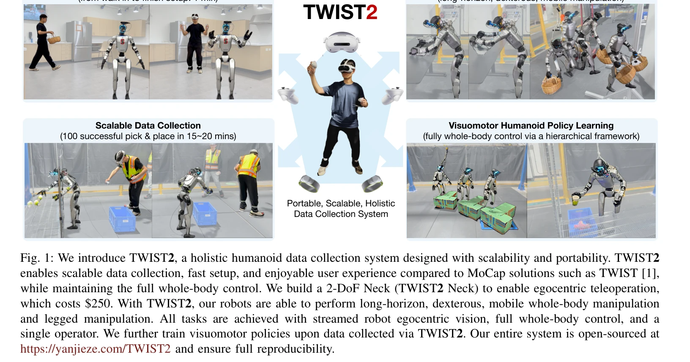
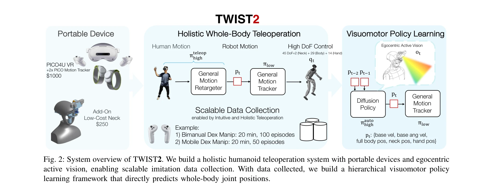

# TWIST2: Scalable, Portable, and Holistic Humanoid Data Collection System

> **저자**: Yanjie Ze, Siheng Zhao, Weizhuo Wang, Angjoo Kanazawa, Rocky Duan, Pieter Abbeel, Guanya Shi, Jiajun Wu, C. Karen Liu | **날짜**: 2025-11-04 | **DOI**: [10.48550/arXiv.2511.02832](https://doi.org/10.48550/arXiv.2511.02832)

---

## Essence

*Fig. 1: We introduce TWIST2, a holistic humanoid data collection system designed with scalability and portability. TWIST*

TWIST2는 고가의 모션캡처 없이 VR 기반 전신 원격 조종을 통해 휴머노이드 로봇의 대규모 데이터 수집을 가능하게 하는 포터블 시스템이며, 자세 추적 기반의 hierarchical visuomotor policy 학습을 제안한다.

## Motivation

- **Known**: 기존 휴머노이드 원격 조종 시스템은 decoupled control(하반신과 상반신 분리), 부분적 전신 제어, 또는 고가의 MoCap 장비에 의존하는 문제가 있다.
- **Gap**: 완전한 전신 제어를 유지하면서도 포터블하고 확장 가능한 휴머노이드 데이터 수집 시스템이 부재하다.
- **Why**: 대규모 데이터가 로봇 분야의 혁신을 주도했으나(LLM, VLA 모델 등) 휴머노이드 로봇은 효과적인 데이터 수집 프레임워크를 갖추지 못해 발전이 제한되고 있다.
- **Approach**: PICO4U VR 기기로 전신 모션을 포착하고 커스텀 2-DoF 로봇 목(TWIST2 Neck)으로 egocentric vision을 제공하며, motion tracking controller와 Diffusion Policy 기반 hierarchical 제어 프레임워크를 구축한다.

## Achievement

*Fig. 1: We introduce TWIST2, a holistic humanoid data collection system designed with scalability and portability. TWIST*

- **포터블 MoCap-프리 시스템**: 약 $250의 2-DoF 목을 포함하여 1분 내 설정 가능하고 실험실 외부에서도 배포 가능
- **효율적 데이터 수집**: 100개의 성공적 pick & place 시연을 15-20분 내에 거의 100% 성공률로 수집
- **전신 원격 조종**: towel folding/unfolding, door를 통한 물체 운반 등 장시간 손재주 있는 작업 시연
- **Vision 기반 자율 제어**: egocentric vision만으로 전신 dexterous pick & place와 동적 kicking 작업을 수행하는 정책 학습
- **완전 오픈소스**: 시스템, 데이터, 모델 전체 공개로 재현성 보장

## How

*Fig. 2: System overview of TWIST2. We build a holistic humanoid teleoperation system with portable devices and egocentri*

- PICO4U VR 헤드셋, 핸드 컨트롤러, 발목 모션 트래커를 사용하여 전신 인간 자세 캡처
- 커스텀 2-DoF TWIST2 Neck 설계로 로봇의 egocentric active stereo vision 실현
- 인간 신체 자세를 휴머노이드 로봇의 모터 조인트 위치로 변환하는 motion retargeting 파이프라인 구축
- Reinforcement learning과 대규모 시뮬레이션 상호작용을 통해 robust motion tracking controller 훈련
- Low-level motion tracker(자세 추적)와 high-level Diffusion Policy(시각 기반 예측)로 구성된 hierarchical visuomotor 정책 프레임워크 제안

## Originality

- 최초로 완전한 전신 제어와 포터블성을 동시에 달성한 VR 기반 휴머노이드 원격 조종 시스템
- 저비용 로봇 목 설계로 egocentric 원격 조종을 가능하게 하는 혁신적 하드웨어 솔루션
- Vision 기반 전신 자율 제어를 위한 hierarchical visuomotor policy 학습 프레임워크 최초 제안
- Root velocity 명령을 넘어 전체 관절 위치를 직접 예측하는 end-to-end 정책 학습 접근법

## Limitation & Further Study

- PICO4U VR 기기의 정확도 및 지연시간 한계로 인한 세밀한 조작 제약 가능성
- Egocentric vision이 필수적이라는 발견은 직관적이지만 원격 조종에서의 구체적 영향 분석 부족
- Hierarchical framework의 low-level과 high-level 컨트롤러 간 인터페이스 설계에 대한 상세한 설명 부족
- 다양한 휴머노이드 로봇 플랫폼(현재 Unitree G1만 사용)으로의 일반화 가능성 미검증
- Diffusion Policy의 계산 복잡도와 실시간 제어 성능에 대한 분석 부재
- 후속 연구: 다중 로봇 플랫폼 호환성, 더 복잡한 환경 상호작용, 자가지도학습 방법론 탐색 필요

## Evaluation

- Novelty: 4/5
- Technical Soundness: 3/5
- Significance: 4/5
- Clarity: 4/5
- Overall: 4/5

**총평**: TWIST2는 휴머노이드 로봇의 데이터 기반 학습을 가능하게 하는 실용적이고 확장 가능한 포터블 시스템으로, 완전한 전신 제어와 vision 기반 자율 정책을 결합한 점에서 높은 가치를 갖는다. 오픈소스 공개를 통해 커뮤니티 기여도가 큰 연구다.
