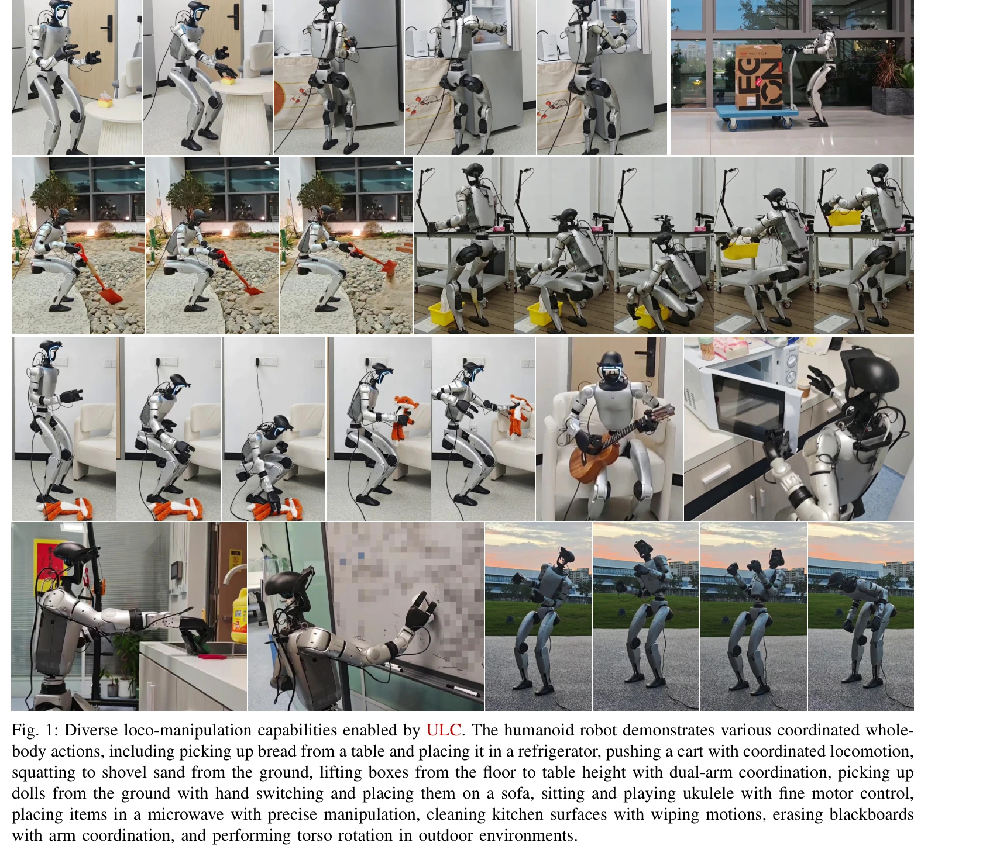
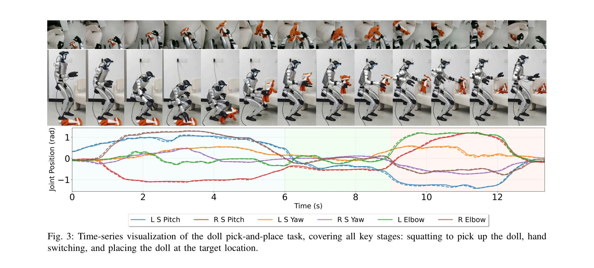
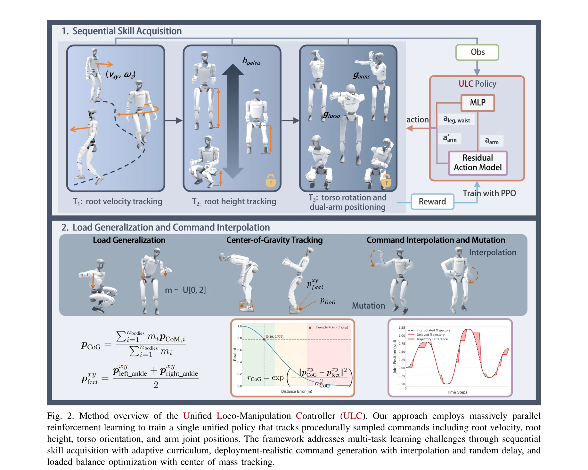

# ULC: A Unified and Fine-Grained Controller for Humanoid Loco-Manipulation

> **저자**: Wandong Sun, Luying Feng, Baoshi Cao, Yang Liu, Yaochu Jin, Zongwu Xie | **날짜**: 2025-07-09 | **URL**: [https://arxiv.org/abs/2507.06905](https://arxiv.org/abs/2507.06905)

---

## Essence

*Fig. 1: Diverse loco-manipulation capabilities enabled by ULC. The humanoid robot demonstrates various coordinated whole*

인간형 로봇의 통합 전신 제어를 위해 단일 정책으로 이동 및 조작을 동시에 수행하는 ULC를 제안하고, 순차적 기술 획득, 잔여 행동 모델링, 무게중심 추적 등을 통해 기존 계층적 분해 방식을 능가하는 성능을 달성했다.

## Motivation

- **Known**: 기존 인간형 로봇 제어 방식은 상체(조작) 및 하체(이동) 정책을 분리하는 계층적 구조를 사용하여 학습 복잡도를 감소시켰으나, 이는 서브시스템 간 협응을 제한한다.
- **Gap**: 단일 통합 정책이 추적 정확도, 광범위 작업공간, 강건성을 동시에 달성할 수 있는지 미지수였으며, 기존 분해 방식과 통합 방식 간의 성능 트레이드오프가 명확하지 않았다.
- **Why**: 인간형 로봇이 인간 중심 환경에서 이동과 조작을 동시에 수행해야 하므로, 전신 협응 제어는 복잡한 작업(물건 집기, 밀기, 정밀 조작 등) 수행에 필수적이다.
- **Approach**: 순차적 기술 획득을 통한 점진적 학습, 잔여 행동 모델링으로 미세한 제어 조정, 다항식 보간과 확률적 명령 해제로 배포 현실성 확보, 무게중심 추적으로 안정성 보장하는 통합 프레임워크를 제시한다.

## Achievement

*Fig. 3: Time-series visualization of the doll pick-and-place task, covering all key stages: squatting to pick up the dol*

- **단일 정책 통합 제어**: root velocity, root height, torso rotation, dual-arm joint positions를 동시에 end-to-end 방식으로 추적
- **성능 우월성**: 분해된 방식 대비 더 높은 추적 정확도와 더 넓은 작업공간 커버리지 달성
- **강건성 입증**: 외부 하중 및 배포 변동에 대한 일반화 능력 확보
- **다양한 작업 지원**: 냉장고 물건 정리, 모래 삽질, 상자 들기, 악기 연주 등 복잡한 로코-조작 작업 수행

## How

*Fig. 2: Method overview of the Unified Loco-Manipulation Controller (ULC). Our approach employs massively parallel*

- Sequential skill acquisition을 통해 명령 공간 복잡도를 단계적으로 증가시켜 효율적 탐색
- Residual action modeling (qfinal_arms = aarms + qdesired_arms)으로 미세한 제어 정밀도 향상
- 5차 다항식 보간(polynomial interpolation)과 확률적 명령 해제(stochastic command release)로 배포 현실성 모델링
- Load randomization과 center-of-gravity tracking으로 다양한 하중 조건에서의 안정성 확보
- Factorized command space (loco, torso, arms) 설계로 각 부위의 독립적 제어 가능성 유지
- Massive parallel RL을 통한 효율적 정책 학습

## Originality

- 기존 계층적 분해 방식과 달리 단일 통합 정책으로 전신 협응을 달성한 첫 시도
- Sequential skill acquisition과 residual action modeling의 결합으로 고차원 제어 문제의 안정적 해결
- Stochastic command release 메커니즘으로 배포 현실성과 명령 가능성 사이의 균형 달성
- Center-of-gravity tracking을 명시적 보상으로 포함하여 동적 안정성 보장

## Limitation & Further Study

- Unitree G1 로봇의 3-DOF 허리 설계에 국한되었으므로, 더 높은 자유도 로봇에 대한 일반화 미검증
- 시뮬레이션과 실제 로봇 간 sim-to-real transfer 성공률의 세부 분석 부족
- 명령 공간의 실행 가능성 제약이 여전히 존재하여 극단적 동작(예: 뒤로 달리기)의 범위 제한
- 후속 연구: 더 높은 자유도 시스템에 대한 확장, 비구조화된 환경에서의 시각적 피드백 통합, 다중 정책 앙상블 기법 탐색

## Evaluation

- Novelty: 4/5
- Technical Soundness: 3/5
- Significance: 4/5
- Clarity: 4/5
- Overall: 4/5

**총평**: 이 논문은 인간형 로봇의 로코-조작 제어에 있어 단일 통합 정책이 분해된 방식을 능가할 수 있음을 실험적으로 입증했으며, sequential skill acquisition, residual action modeling, stochastic command release 등의 기술적 혁신을 통해 강건한 전신 협응 제어를 실현했다. 제시된 방법론은 인간형 로봇의 실용화에 중요한 기여를 한다.
