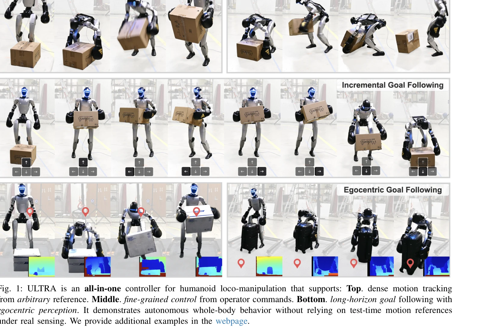

# ULTRA: Unified Multimodal Control for Autonomous Humanoid Whole-Body Loco-Manipulation

> **저자**: Xialin He, Sirui Xu, Xinyao Li, Runpei Dong, Liuyu Bian, Yu-Xiong Wang, Liang-Yan Gui | **날짜**: 2026-03-03 | **URL**: [https://arxiv.org/abs/2603.03279](https://arxiv.org/abs/2603.03279)

---

## Essence

*Fig. 1: ULTRA is an all-in-one controller for humanoid loco-manipulation that supports: Top. dense motion tracking*

인문모션 캡처 데이터를 물리 기반 신경 리타겟팅으로 휴머노이드에 변환하고, 밀집 참조와 희소 목표를 모두 지원하는 통합 다중모달 컨트롤러를 학습하여 자기중심 시각 기반 자율적 전신 로코-매니퓰레이션을 실현한다.

## Motivation

- **Known**: 휴머노이드 로코-매니퓰레이션에 대한 기존 연구는 참조 추적 기반 방식이나 저품질 리타겟팅, 고정된 컨트롤러 구조 때문에 자율성이 제한된다. 교사-학생 증류 패러다임과 adversarial RL 기반 모션 선행학습이 진행되었다.
- **Gap**: 기존 방법들은 (1) 접촉 중심 작업에서 물리적 일관성을 보장하는 확장 가능한 리타겟팅의 부재, (2) 밀집 참조와 희소 목표 사이를 매끄럽게 전환할 수 있는 통합 컨트롤러 부족, (3) 온보드 센싱 하에서의 자율적 행동 생성 한계를 가진다.
- **Why**: 실제 휴머노이드가 비구조화된 환경에서 실용적으로 유용하려면 대규모 물리 기반 스킬 확장, 다양한 지각·제어 모드 간 통합, 그리고 사전 정의된 참조 없는 자율적 행동이 필수적이다.
- **Approach**: physics-driven neural retargeting을 통해 MoCap을 확장 가능한 방식으로 리타겟팅하고, variational skill bottleneck과 RL finetuning을 활용한 teacher-student 증류로 통합 다중모달 컨트롤러를 구성한다.

## Achievement

*Fig. 1: ULTRA is an all-in-one controller for humanoid loco-manipulation that supports: Top. dense motion tracking*

- **Physics-driven Neural Retargeting**: simulation-constrained optimization과 RL을 결합하여 동역학·접촉 제약을 만족하는 물리적으로 타당한 MoCap 리타겟팅을 dataset scale로 수행하고, zero-shot augmentation으로 커버리지 확장
- **Unified Multimodal Controller**: 단일 정책으로 dense reference tracking, sparse goal-conditioning, blind/MoCap/depth perception 간 seamless 전환을 지원하며, availability masking으로 부분 관찰성 처리
- **Closed-loop Goal Stabilization**: variational skill bottleneck과 RL finetuning으로 offline 증류의 상태 커버리지 한계를 극복하고, 분포 외(out-of-distribution) 목표·실행에 대한 강건성 확보
- **Real-world Deployment**: Unitree G1 휴머노이드에서 egocentric depth perception 기반 자율적 전신 로코-매니퓰레이션을 구현하며, 참조 추적 기반 베이스라인 대비 성능 우월성 입증

## How

*Fig. 2: ULTRA follows four stages: (i) Neural Retargeting: an RL policy converts MoCap data into physically feasible*

- **Physics-driven Retargeting Pipeline**: MoCap 궤적을 Markov Decision Process(MDP)로 재정의하여 RL 정책이 kinematic, dynamic, contact constraint을 만족하는 리타겟된 동작 생성
- **Teacher-Student Distillation**: privileged universal tracker(MoCap 상태 접근)를 학생 정책으로 증류하여 diverse goal specification(dense reference + sparse target) 지원
- **Unified Tokenization with Availability Masking**: 참조·모달리티 부재 시에도 단일 정책 안정성 유지
- **Variational Skill Bottleneck**: 모션을 compact latent space로 압축하여 희소 목표 하에서 모호성 완화 및 일관된 행동 유지
- **RL Fine-tuning**: offline 증류 이후 RL을 적용하여 폐루프 목표 안정화, 부분 관찰성, 분포 외 상황에 대한 강건성 강화

## Originality

- Physics-driven neural retargeting을 RL scale로 처음 수행하여 dataset-wide retargeting과 zero-shot augmentation 가능성 제시
- Availability masking과 variational bottleneck의 조합으로 밀집·희소 조건화, 다중 센싱 모달리티를 단일 정책에 통합하는 새로운 아키텍처 제안
- Teacher-student 증류 이후 RL finetuning 단계를 명시적으로 적용하여 offline 커버리지 한계 극복
- Egocentric depth perception 기반 자율적 전신 로코-매니퓰레이션의 실제 구현 및 평가

## Limitation & Further Study

- Physics-driven retargeting의 계산 비용과 수렴 안정성 분석 부재—대규모 이질적 데이터셋에서의 확장성 검증 필요
- Egocentric depth perception의 object state inference 정확도 한계—occlusion, 조명 변화 등 극단적 조건에서의 성능 미제시
- Variational bottleneck의 압축률과 행동 다양성 간 trade-off 정량 분석 부족
- 실제 휴머노이드의 동역학 오차, 제어 지연, 센서 노이즈에 대한 민감도 분석 보강 필요
- 후속 연구: 적응형 리타겟팅, 온라인 학습 기반 센싱 모달리티 적응, 상호작용 환경의 동적 변화 대응

## Evaluation

- Novelty: 4/5
- Technical Soundness: 4/5
- Significance: 4/5
- Clarity: 4/5
- Overall: 4/5

**총평**: ULTRA는 물리 기반 신경 리타겟팅과 통합 다중모달 컨트롤러를 결합하여 휴머노이드 로코-매니퓰레이션의 자율성과 실용성을 획기적으로 향상시킨 의미 있는 연구이며, 실제 Unitree G1 플랫폼에서의 구현으로 높은 신뢰성을 입증한다.
