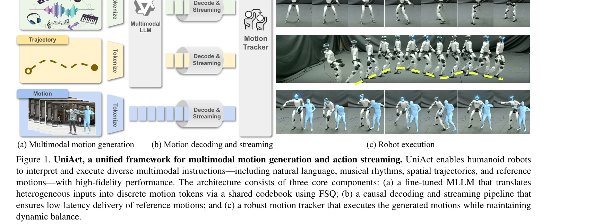
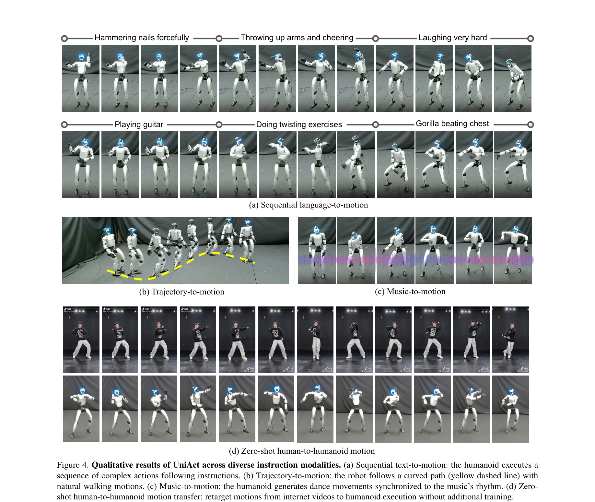
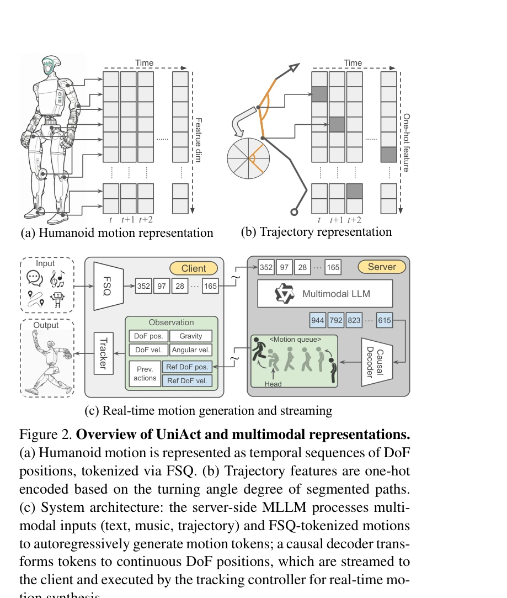

# UniAct: Unified Motion Generation and Action Streaming for Humanoid Robots

> **저자**: Nan Jiang, Zimo He, Wanhe Yu, Lexi Pang, Yunhao Li, Hongjie Li, Jieming Cui, Yuhan Li, Yizhou Wang, Yixin Zhu, Siyuan Huang | **날짜**: 2025-12-30 | **DOI**: [10.48550/arXiv.2512.24321](https://doi.org/10.48550/arXiv.2512.24321)

---

## Essence

*Figure 1. UniAct, a unified framework for multimodal motion generation and action streaming. UniAct enables humanoid rob*

UniAct는 MLLM과 causal streaming pipeline을 통합한 두 단계 프레임워크로, 언어, 음악, 궤적 등 다양한 멀티모달 지시사항을 sub-500 ms 지연시간으로 휴머노이드 로봇이 실행할 수 있게 한다. FSQ 기반의 통일된 discrete codebook을 통해 cross-modal alignment와 physically grounded motion generation을 달성한다.

## Motivation

- **Known**: 저수준 humanoid control은 motion tracking, force control, agile locomotion 등에서 상당한 진전을 이루었으나, 고수준의 멀티모달 인식과 저수준의 execution 사이의 갭이 여전히 존재한다. 기존 방법들은 end-to-end mapping 또는 two-step hierarchical pipelines을 따르지만 각각 장단점을 가지고 있다.
- **Gap**: 기존 방법들은 서로 다른 modality를 고립된 injection mechanism으로 처리하거나, hierarchical pipelines에서 real-time responsiveness를 희생하거나, end-to-end 구조에서 복잡한 semantic reasoning에 어려움을 겪는다. 또한 out-of-distribution 입력이나 imperfect human demonstrations에 대해 brittle하다.
- **Why**: 휴머노이드 로봇이 인간 수준의 유연성으로 다양한 멀티모달 지시를 따를 수 있는 versatile agent가 되려면, 고수준의 인식과 저수준의 제어 사이의 gap을 효과적으로 다리어야 하며, 이는 일반적인 humanoid assistant 실현의 핵심 과제다.
- **Approach**: UniAct는 text, music, trajectory, reference motions를 FSQ를 통해 unified discrete codebook으로 인코딩하고, fine-tuned MLLM이 이를 motion tokens로 생성한 후, causal decoder가 real-time commands로 변환하여 robust motion tracker가 실행하는 방식으로 작동한다.

## Achievement

*Figure 4. Qualitative results of UniAct across diverse instruction modalities. (a) Sequential text-to-motion: the humano*

- **Sub-500ms latency 달성**: 멀티모달 지시사항을 매우 빠른 응답 시간으로 처리
- **19% success rate 개선**: 저품질 reference motions의 zero-shot tracking에서 SOTA 대비 성능 향상
- **다양한 task 성공**: 복잡한 sequential commands 해석, 음악 동기화 dance, spatial trajectory following 등 광범위한 작업 수행
- **광범위한 실험 검증**: 1,000회 이상의 시뮬레이션과 100시간 이상의 실제 humanoid platform 운영으로 robust generalization 확인
- **UA-Net 데이터셋 구축**: 20시간의 고품질 robot motion과 다중 modality annotation을 포함한 large-scale benchmark 제공

## How

*Figure 2. Overview of UniAct and multimodal representations.*

- **FSQ 기반 tokenization**: 서로 다른 modality (text, music, trajectory, reference motion)를 unified discrete codebook으로 변환하여 cross-modal alignment 확보
- **Fine-tuned MLLM**: 멀티모달 입력을 처리하여 temporally coherent motion tokens 생성
- **Causal decoder + streaming pipeline**: 토큰을 real-time으로 streaming하여 low latency 달성
- **Robust motion tracker**: 생성된 reference motions을 high fidelity로 실행하며 dynamic balance 유지
- **Discrete action space**: 물리적으로 가능한 motion manifold에 제약하여 OOD 입력에 대한 robustness 향상

## Originality

- **통합 discrete codebook 설계**: FSQ를 활용하여 heterogeneous multimodal inputs를 unified representation으로 변환하는 novel approach
- **Causal streaming paradigm**: next-token prediction을 통해 low latency를 유지하면서 long-term temporal dependencies 처리
- **MLLM과 motion tracker의 효과적 결합**: 기존 bifurcated paradigms (one-step vs two-step)의 trade-off를 해결하는 새로운 아키텍처
- **Multimodal humanoid motion dataset**: 기존 datasets의 semantic meaning과 multimodal alignment 부재 문제를 해결한 comprehensive UA-Net 구축
- **Zero-shot imperfect motion tracking**: discrete action space의 physically grounded manifold이 OOD inputs에 대한 inherent robustness 제공

## Limitation & Further Study

- **Dataset 규모**: 20시간의 UA-Net이 실제 humanoid 학습에 충분한지 검증 필요, 더 큰 규모의 multimodal motion dataset 축적 요구
- **Generalization 범위**: 제시된 task들이 특정 modality 조합에 제한될 수 있으며, 새로운 instruction type에 대한 zero-shot generalization 성능 검증 부족
- **Real-world robustness 검증**: 100시간 운영이 다양한 환경 조건(실외, 불규칙적 interaction 등)에서의 robustness를 완전히 커버하는지 불명확
- **Computational resource 요구**: MLLM과 causal decoder의 combined computational overhead와 edge device 배포 가능성에 대한 분석 부족
- **후속 연구**: 더 큰 multimodal humanoid dataset 구축, 다양한 humanoid morphology에 대한 generalization, 동적 환경에서의 real-time adaptation 메커니즘 개발 필요

## Evaluation

- Novelty: 4/5
- Technical Soundness: 3/5
- Significance: 4/5
- Clarity: 4/5
- Overall: 4/5

**총평**: UniAct는 FSQ 기반의 unified discrete codebook과 MLLM, causal streaming pipeline을 효과적으로 결합하여 멀티모달 humanoid control의 perception-execution gap을 해결한 중요한 기여를 한다. Sub-500ms latency, 19% 성능 개선, 광범위한 실험 검증과 함께 UA-Net 데이터셋을 제공함으로써 humanoid embodied intelligence 분야의 발전을 크게 앞당길 수 있는 work다.
