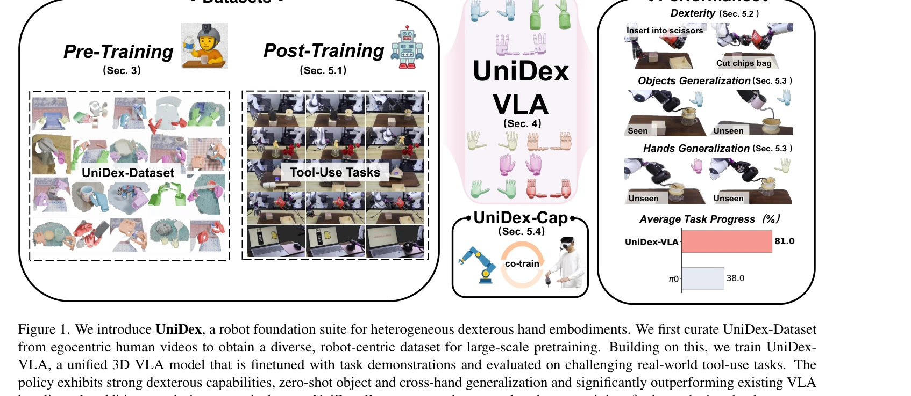
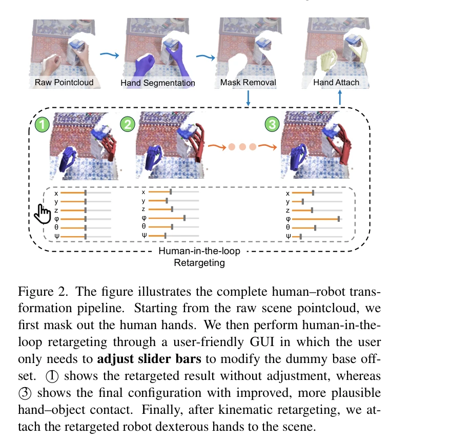

# UniDex: A Robot Foundation Suite for Universal Dexterous Hand Control from Egocentric Human Videos

> **저자**: Gu Zhang, Qicheng Xu, Haozhe Zhang, Jianhan Ma, Long He, Yiming Bao, Zeyu Ping, Zhecheng Yuan, Chenhao Lu, Chengbo Yuan, Tianhai Liang, Xiaoyu Tian, Maanping Shao, Feihong Zhang, Mingyu Ding, Yang Gao, Hao Zhao, Hang Zhao, Huazhe Xu | **날짜**: 2026-03-23 | **URL**: [https://arxiv.org/abs/2603.22264](https://arxiv.org/abs/2603.22264)

---

## Essence

*Figure 1. We introduce UniDex, a robot foundation suite for heterogeneous dexterous hand embodiments. We first curate Un*

인간의 자기중심 영상에서 로봇 손재주 손 제어를 위한 통합 기초 모델 스위트로, 8종 로봇 핸드를 지원하는 50K+ 궤적 데이터셋, 통합 액션 공간(FAAS), 그리고 vision-language-action 정책을 제공한다.

## Motivation

- **Known**: Robot foundation policies는 주로 병렬 그리퍼에 초점을 맞춰 왔으며, 인간 영상에서 로봇 데이터로의 변환 시도들이 있어왔으나 손재주 손에 대한 대규모 통합 모델은 부족하다.
- **Gap**: 손재주 손 제어는 고차원 제어, 다양한 손 형태의 이질성, 그리고 대규모 로봇 데이터 수집의 어려움으로 인해 기초 모델 개발이 제한되어 있다.
- **Why**: 손재주 손은 일상의 도구 사용 작업(가위질, 스프레이 사용 등)에 필수적이며, 통합 기초 모델은 다양한 손 형태로의 스킬 전이와 확장성을 가능하게 한다.
- **Approach**: 인간 자기중심 영상을 human-in-the-loop retargeting으로 로봇 실행 궤적으로 변환하여 UniDex-Dataset을 구축하고, Function-Actuator-Aligned Space(FAAS)라는 기능 중심의 통합 액션 공간을 정의하여 이를 기반으로 UniDex-VLA를 학습한다.

## Achievement

*Figure 1. We introduce UniDex, a robot foundation suite for heterogeneous dexterous hand embodiments. We first curate Un*

- **UniDex-Dataset**: 8개 로봇 핸드(6-24 DoF)에 걸친 9M 이미지-포인트클라우드-액션 프레임 쌍과 50K+ 궤적으로 구성된 대규모 통합 데이터셋 구축
- **FAAS & UniDex-VLA**: 기능 중심의 통합 액션 공간과 3D VLA 정책으로 도구 사용 작업에서 81% 평균 진행률 달성, π0 기준 대비 2배 이상 성능 향상
- **Cross-hand Generalization**: FAAS와 사전학습을 통해 미학습 손에 대한 zero-shot 전이 능력 달성
- **Human-Robot Co-training**: UniDex-Cap 포터블 캡처 셋업으로 인간 데이터와 로봇 데이터 결합 학습 가능, 실제 로봇 시연 데이터 필요성 감소

## How

*Figure 2. The figure illustrates the complete human–robot trans-*

- Human-in-the-loop retargeting: 손가락 끝 역기구학(inverse kinematics)과 대화형 조정을 결합하여 인간 손가락 궤적을 로봇에 맞춤, 손-물체 접촉 유지
- Visual domain gap 해소: 인간 손을 영상에서 마스킹하고 재타겟 로봇 손을 포인트클라우드에 부착하여 시각적 불일치 감소
- Function-Actuator-Aligned Space(FAAS) 정의: 기능적으로 유사한 액추에이터들을 공유 좌표계로 매핑하여 손 간 전이 가능
- 3D VLA 아키텍처: 단일 뷰 색상-깊이 입력과 언어 명령으로부터 액션을 예측하는 사전학습-미세조정 파이프라인
- UniDex-Cap 포터블 캡처: 동기화된 RGB-D 스트림과 인간 손 자세를 기록하여 같은 변환 파이프라인으로 로봇 궤적 생성

## Originality

- 손재주 손 제어를 위한 첫 대규모 통합 기초 모델 스위트 제시로, 기존 그리퍼 중심의 접근과 차별화
- Function-Actuator-Aligned Space(FAAS): 기능 중심의 통합 액션 공간으로 post-processing 없이 신뢰성 높은 cross-hand 전이 실현
- Human-to-robot 변환 파이프라인의 체계화: 단순한 손 마스킹과 포인트클라우드 합성으로 visual gap을 효과적으로 해소
- 포터블 캡처 셋업(UniDex-Cap)과의 통합: 인간-로봇 데이터 결합 학습으로 로봇 시연 데이터 수집 비용 감소 실증

## Limitation & Further Study

- 인간-로봇 간 형태학적 차이 극복의 한계: 모든 손 형태에 대해 완벽한 retargeting이 어려울 수 있으며, 매우 상이한 DoF 구조에서는 추가 조정 필요 가능
- 평가 범위의 제한: 주로 도구 사용 작업 5개에서 검증되었으며, 더 광범위한 조작 작업(미세한 객체 조작, 동역학 적응 필요 작업 등)에서의 성능 미검증
- 데이터셋의 영상 다양성: 기존 공개 자기중심 RGB-D 데이터셋 기반이므로 특정 환경/조명 편향 가능성
- 후속 연구 방향: (1) 더 극단적인 손 형태(초고DoF 또는 저DoF)에 대한 zero-shot 전이 강화, (2) 동적 객체 상호작용과 힘 제어가 필요한 작업으로 확대, (3) 실시간 적응 학습 능력 추가

## Evaluation

- Novelty: 4/5
- Technical Soundness: 3/5
- Significance: 4/5
- Clarity: 4/5
- Overall: 4/5

**총평**: UniDex는 손재주 손 조작의 기초 모델 개발에 체계적이고 실용적인 접근을 제시하며, FAAS와 human-robot co-training을 통해 확장성과 데이터 효율성을 동시에 달성한 의미 있는 기여이다.
