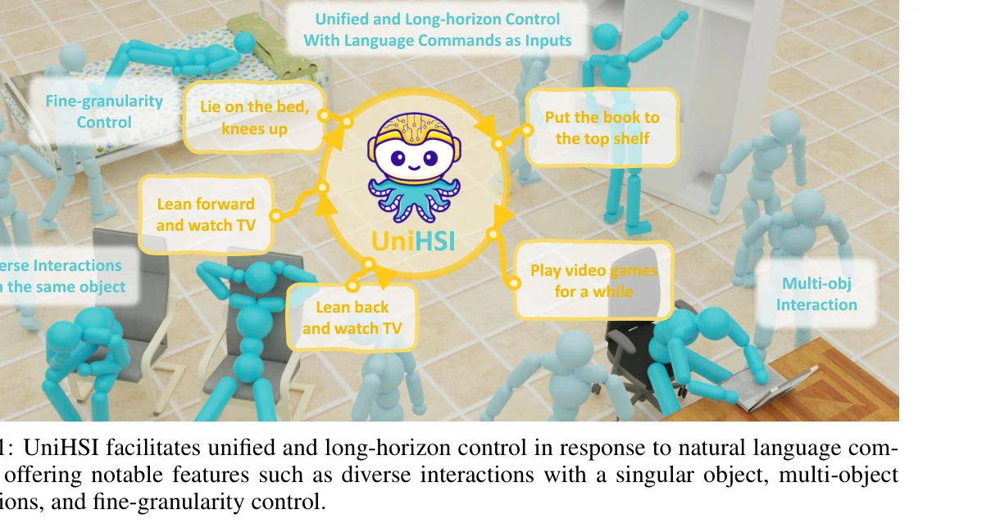
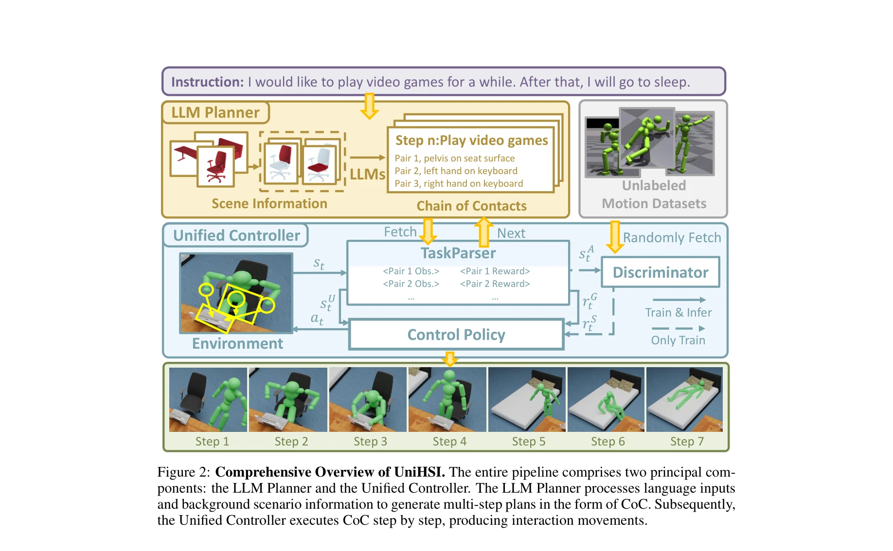

# Unified Human-Scene Interaction via Prompted Chain-of-Contacts

> **저자**: Zeqi Xiao, Tai Wang, Jingbo Wang, Jinkun Cao, Wenwei Zhang, Bo Dai, Dahua Lin, Jiangmiao Pang | **날짜**: 2023-09-14 | **URL**: [https://arxiv.org/abs/2309.07918](https://arxiv.org/abs/2309.07918)

---

## Essence

*Figure 1: UniHSI facilitates unified and long-horizon control in response to natural language com-*

본 논문은 Chain of Contacts(CoC)라는 통일된 표현을 통해 자연어 명령으로 다양한 인간-장면 상호작용을 제어하는 UniHSI 프레임워크를 제시한다. LLM 기반 플래너와 통일된 컨트롤러로 구성되어 있으며 ScenePlan 데이터셋을 포함한다.

## Motivation

- **Known**: 물리 기반 HSI 방법들은 운동 품질과 물리적 타당성을 향상시켰지만, 각 작업마다 별도의 정책 네트워크가 필요하며 주석이 달린 모션 수열에 의존한다. 언어 기반 모션 제어는 주로 장면과 무관한 모션 생성에 초점을 맞춰왔다.
- **Gap**: 기존 HSI 방법들은 통일된 상호작용 제어와 사용자 친화적 인터페이스가 부족하며, 다양한 상호작용을 하나의 모델로 처리하기 어렵고 주석 데이터의 요구량이 많다.
- **Why**: 자연어 기반 HSI 시스템은 구체화된 AI와 가상현실 응용에 필수적이며, 실무 배포를 위해서는 직관적인 인터페이스와 확장 가능한 설계가 필요하다.
- **Approach**: 상호작용을 순차적인 인간-객체 접촉 쌍으로 정의하는 Chain of Contacts 개념을 도입하고, LLM 플래너로 자연어를 CoC로 변환한 후 통일된 컨트롤러로 실행한다.

## Achievement

*Figure 1: UniHSI facilitates unified and long-horizon control in response to natural language com-*

- **통일된 상호작용 표현**: Chain of Contacts를 통해 단일 접촉 쌍으로 제한되지 않는 일반화 가능한 상호작용 정의 제시
- **주석 없는 훈련**: LLM의 상호작용 지식을 활용하여 상호작용 주석 없이 훈련 가능
- **다중 객체 및 장기 상호작용**: 전신 관절(15개)을 모델링하여 다중 객체 상호작용과 장기 전환 제어 지원
- **새 데이터셋**: PartNet과 ScanNet 기반의 수천 개 상호작용 계획을 포함하는 ScenePlan 데이터셋 구축
- **실제 장면 일반화**: 실제 스캔된 장면에 대한 강한 일반화 성능 입증

## How

*Figure 2: Comprehensive Overview of UniHSI. The entire pipeline comprises two principal com-*

- Chain of Contacts 정의: 인간 관절-객체 부분 접촉 쌍의 순차적 단계로 상호작용 모델링
- LLM 플래너 설계: 프롬프트 엔지니어링을 통해 자연어 명령을 CoC 형태의 작업 계획으로 번역
- TaskParser 구현: CoC를 기반으로 물리적 환경에서 관절 포즈와 객체 포인트 클라우드 수집
- 통일된 컨트롤러: adversarial motion prior framework와 물리 시뮬레이터를 활용한 현실적이고 물리적으로 타당한 모션 합성
- 순차적 평가: 현재 단계 완료 여부를 평가하고 다음 단계 자동 페칭으로 장기 상호작용 실현

## Originality

- Chain of Contacts라는 새로운 상호작용 표현으로 기존의 단일 접촉 중심 방법과 차별화
- LLM을 활용한 구조화된 작업 계획 생성으로 기존의 규칙 기반 또는 BERT 기반 접근과 구별
- 상호작용 주석 없이 훈련 가능한 프레임워크로 데이터 수집 비용 대폭 감소
- 전신 관절 제어와 다중 객체 상호작용을 지원하는 통일된 컨트롤러 설계
- ScenePlan 데이터셋 공개로 HSI 연구의 기초 제공

## Limitation & Further Study

- LLM 플래너의 정확성에 의존하므로 복잡한 상호작용의 경우 계획 오류 가능성
- 물리 시뮬레이션의 계산 비용으로 인한 실시간 응용의 어려움
- 현재 방법은 인간형 로봇 모델에 특화되어 있어 다양한 신체 형태로의 확장 미흡
- CoC의 세분성이 일부 미세한 상호작용 표현에 제한될 수 있음
- 후속 연구로 다양한 신체 형태와 극도로 복잡한 상호작용에 대한 확장 필요

## Evaluation

- Novelty: 4/5
- Technical Soundness: 3/5
- Significance: 4/5
- Clarity: 4/5
- Overall: 4/5

**총평**: 본 논문은 Chain of Contacts라는 창의적인 상호작용 표현과 LLM 기반 계획을 통합하여 통일된 HSI 프레임워크를 구현했으며, 주석 없는 훈련과 장기 상호작용 제어 등에서 실질적인 기여를 제시한다. ICLR 2024 게재 논문으로 높은 수준의 기술적 완성도와 실무 응용성을 갖추고 있다.
