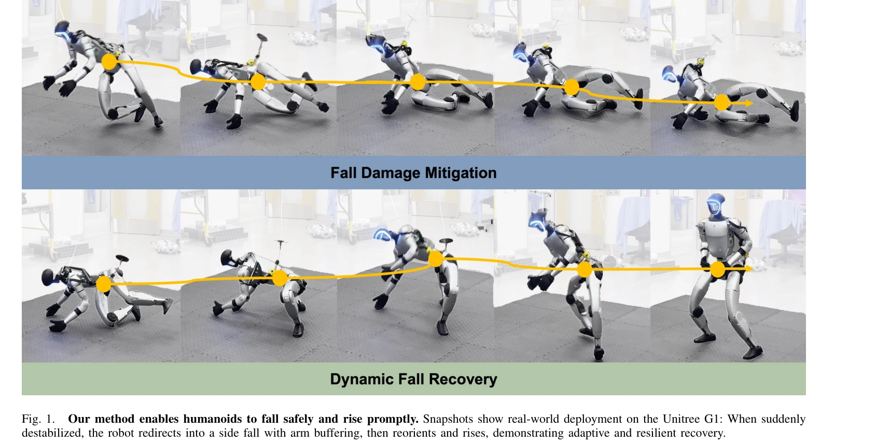
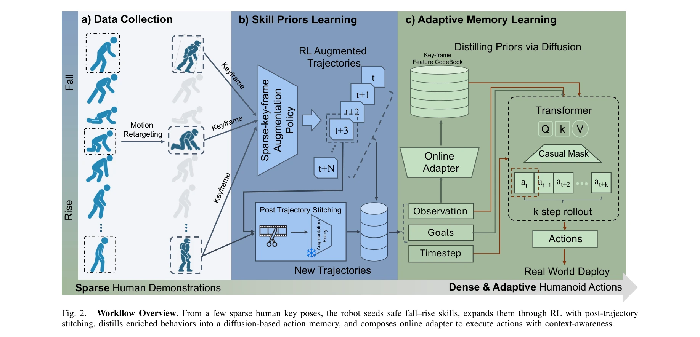

# Unified Humanoid Fall-Safety Policy from a Few Demonstrations

> **저자**: Zhengjie Xu, Ye Li, Kwan-yee Lin, Stella X. Yu | **날짜**: 2025-11-10 | **DOI**: [10.48550/arXiv.2511.07407](https://doi.org/10.48550/arXiv.2511.07407)

---

## Essence

*Fig. 1.*

인간 시연 몇 개와 강화학습, diffusion 기반 메모리를 결합하여 낙상 방지, 충격 완화, 신속한 회복을 하나의 통합 정책으로 학습하는 휴머노이드 로봇 제어 방법을 제안한다.

## Motivation

- **Known**: 휴머노이드 로봇의 낙상은 피할 수 없으며, 기존 연구는 낙상 방지, 제어된 하강, 또는 회복만을 개별적으로 다룬다. 균형 유지 제어와 학습 기반 제어 모두 제약이 있어 낙상-회복의 전체 과정을 통합으로 다루지 못했다.
- **Gap**: 기존 방법들은 낙상 방지와 회복을 분리하여 다루며, model-based 제어는 단순화된 동역학에 의존하고 learning-based 제어는 다양한 행동을 표현하기 어렵다. 낙상과 회복을 강결합된 물리 과정으로 통합하는 방법이 부재하다.
- **Why**: 휴머노이드 로봇의 낙상은 현실의 필연적 위험이며, 안전한 낙상과 신속한 회복은 실제 환경에서의 로봇 배치와 신뢰성을 크게 향상시킨다.
- **Approach**: 인간 시연에서 추출한 sparse key pose를 RL로 확장하여 safe skill prior를 구성하고, 이를 diffusion model로 압축하여 adaptive reactive memory를 만든다. 실행 시 학습된 feature로 safe pose 메모리를 동적으로 검색하여 온라인 적응 제어를 수행한다.

## Achievement

*Fig. 1.*

- **통합 정책 학습**: 낙상 방지, 충격 완화, 신속한 회복을 하나의 정책으로 통합하여 task-specific retraining 없이 세 가지 시나리오에 직접 적용 가능
- **Sim-to-real 전이**: 시뮬레이션에서 학습한 정책이 Unitree G1 실제 로봇에 견고하게 전이되며 다양한 교란에 대해 일관되게 빠른 회복 달성
- **충격력 감소**: 적응적 낙상 방향 전환과 팔 완충을 통해 충격력을 저감하고 관절 손상 위험 감소
- **소수 시연 학습**: 인간 시연 몇 개만으로 safe skill을 습득 가능하여 대규모 데이터 수집의 부담 완화

## How

*Fig. 2.*

- **인간 시연 수집**: 단안 비디오에서 인간의 낙상-회복 동작을 capture하고 Unitree G1 형태에 retarget
- **Seed skill 습득**: Sparse key pose를 RL로 최적화하여 로봇의 동역학에 맞게 fitting하고 dense reaction trajectory 생성
- **Safe skill 확장**: 호환 가능한 낙상과 회복 동작을 stitching하고 정책 rollout으로 다양한 낙상 변수와 회복 전략 생성
- **Diffusion 메모리**: 모든 safe reaction을 diffusion policy로 distill하여 multi-modal 행동 분포 표현
- **Adaptive 제어**: 학습된 feature로 과거 trajectory에서 다음 safe target pose 예측, 단계별 갱신으로 메모리에서 nearest neighbour 검색 및 안전 trajectory를 실시간 조립

## Originality

- **통합 프레임워크**: 낙상 방지-충격 완화-회복을 강결합 동역학 과정으로 통합하여 기존 분리된 접근과 차별화
- **Diffusion 기반 적응 메모리**: diffusion model을 safe reaction의 multi-modal 분포 표현에 활용하고 online feature extraction으로 실시간 적응 제어 구현
- **Sparse 시연 기반 학습**: 인간 시연 몇 개를 RL 기반 augmentation으로 확장하여 대규모 데이터 수집의 필요성 완화
- **Task 불변 정책**: 낙상만, 회복만, 전체 과정 중 어느 시나리오에서도 동일 정책으로 작동하는 일반성 확보

## Limitation & Further Study

- **시뮬레이션-현실 갭**: sim-to-real 전이의 견고성 평가는 제한된 환경(실내, 특정 바닥)에서 수행되었으며 야외 복잡한 지형에서의 성능 불확실
- **인간 시연 의존성**: safe skill prior의 초기값이 인간 시연에 의존하므로, 수집된 시연이 불충분하면 정책의 안전성과 다양성에 영향
- **계산 복잡도**: diffusion model 기반 메모리와 online feature extraction의 실시간 성능 및 로봇 onboard 계산 부하 분석 부재
- **비용-충격 trade-off**: 낙상 방지와 충격 완화 사이의 정확한 trade-off 분석 및 최적화 전략 미흡
- **후속 연구**: 다양한 휴머노이드 형태에 대한 generalization, 실시간 환경 변화(표면 특성, 동적 장애물)에 대한 강건성 개선, 더 큰 규모 disturbance 처리 능력 확대 필요

## Evaluation

- Novelty: 4/5
- Technical Soundness: 3/5
- Significance: 4/5
- Clarity: 4/5
- Overall: 4/5

**총평**: 이 논문은 낙상-회복을 처음으로 강결합 통합 과정으로 다루며 diffusion 기반 적응 메모리와 sparse 시연 학습을 결합하여 새로운 접근을 제시한다. 실제 로봇 배치와 견고한 sim-to-real 전이를 입증하여 안전한 휴머노이드 제어의 중요한 진전을 이룬다.
