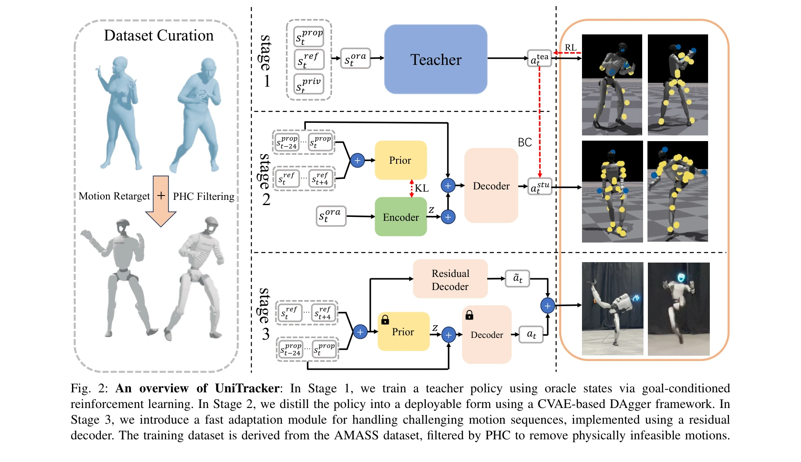
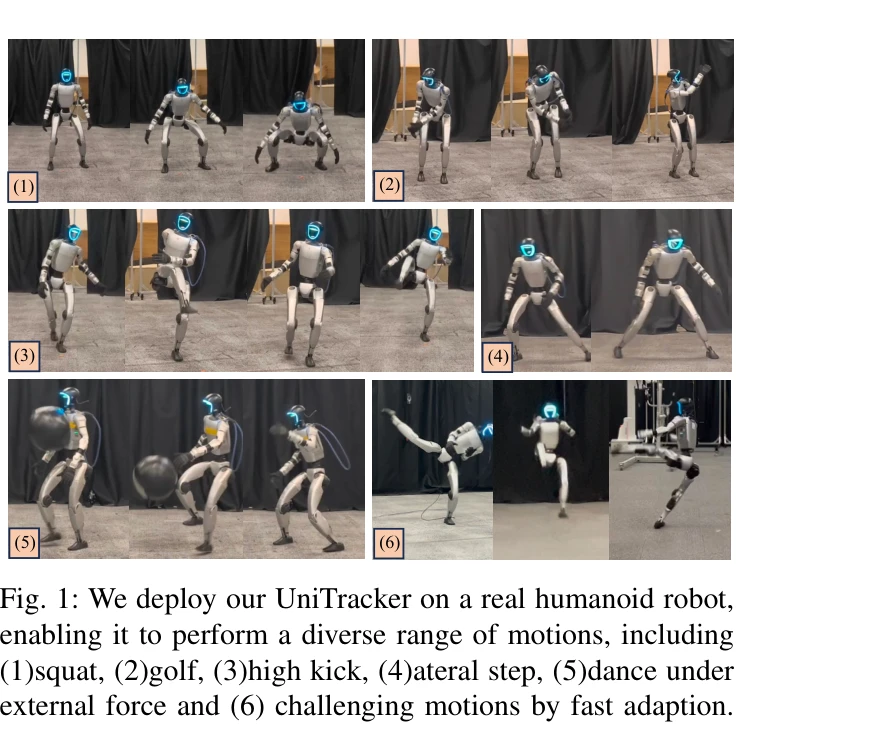

# UniTracker: Learning Universal Whole-Body Motion Tracker for Humanoid Robots

> **저자**: Kangning Yin, Weishuai Zeng, Ke Fan, Minyue Dai, Zirui Wang, Qiang Zhang, Zheng Tian, Jingbo Wang, Jiangmiao Pang, Weinan Zhang | **날짜**: 2025-07-10 | **URL**: [https://arxiv.org/abs/2507.07356](https://arxiv.org/abs/2507.07356)

---

## Essence

*Fig. 2: An overview of UniTracker: In Stage 1, we train a teacher policy using oracle states via goal-conditioned*

UniTracker는 Conditional Variational Autoencoder (CVAE)를 기반으로 한 3단계 학습 프레임워크로, 부분 관측 조건에서 인간형 로봇이 다양한 전신 운동을 추적할 수 있도록 한다. 전역 맥락을 인코더에 통합함으로써 방향 드리프트를 해결하고 일반화 성능을 향상시킨다.

## Motivation

- **Known**: Teacher-student 프레임워크를 통한 정책 증류는 널리 채택되고 있으나, 기존 MLP 기반 정책은 운동 다양성 손실, 제한된 표현력, 부분 관측에서의 전역 일관성 부족 문제를 겪고 있다.
- **Gap**: MLP 기반 DAgger 아키텍처는 운동의 다양성을 보존하지 못하고 보이지 않은 운동 시퀀스에 대한 일반화가 부족하며, 배포 시 방향 드리프트와 같은 전역 속성 불일치 문제가 발생한다.
- **Why**: 인간형 로봇의 실제 환경 배포를 위해서는 표현력 있고 일반화 가능한 전신 운동 제어가 필수적이며, 부분 관측 조건에서도 전역 맥락을 유지하면서 다양한 인간 행동을 추적해야 한다.
- **Approach**: CVAE 기반 student 정책으로 운동의 전역 잠재 표현을 학습하고, 부분 관측 prior를 전체 관측 encoder에 정렬하여 KL divergence 목표를 통해 전역 의도를 암묵적으로 주입한다. 또한 어려운 운동을 위한 빠른 적응 모듈을 추가하여 단일 시퀀스 및 배치 모드 적응을 지원한다.

## Achievement

*Fig. 1: We deploy our UniTracker on a real humanoid robot,*

- **다양하고 표현력 있는 운동 추적**: CVAE의 구조적 잠재 공간을 통해 운동 다양성을 보존하고 평균화되지 않은 표현력 있는 행동 생성
- **전역 일관성 개선**: 부분 관측 prior와 전체 관측 encoder의 정렬을 통해 방향 드리프트 및 전역 속성 불일치 문제 해결
- **높은 일반화 성능**: Unitree G1 로봇에서 8,100개 이상의 다양한 운동 시퀀스를 단일 정책으로 추적
- **빠른 적응 메커니즘**: 분포 밖 또는 어려운 운동에 대한 경량 파인튜닝으로 실제 배포 적용성 확장
- **실제 하드웨어 검증**: 시뮬레이션뿐 아니라 실제 인간형 로봇에서 추적 정확도, 강건성, 일반화 능력의 우월성 입증

## How

*Fig. 2: An overview of UniTracker: In Stage 1, we train a teacher policy using oracle states via goal-conditioned*

- Stage 1: Privileged observation(전체 상태 정보)을 사용하여 teacher 정책을 PPO로 학습, 고품질 참조 액션 생성
- Stage 2: CVAE 기반 student 정책 학습 - encoder는 전체 관측을 통해 구조적 잠재 표현 학습, prior network는 부분 관측 상태로 학습, KL divergence로 두 분포 정렬
- Stage 3: 배치 또는 단일 시퀀스에 대한 residual decoder 기반 빠른 적응 모듈, 어려운 운동에 대한 경량 파인튜닝
- 데이터셋 구성: AMASS 데이터셋에서 인간-물체 상호작용 제거, PHC 필터링을 통해 물리적으로 타당한 8,179개 운동 시퀀스 확보
- Goal-conditioned RL 포설: 상태 = 고유감각 정보 + 목표 상태, 액션 = 관절 위치 목표, 보상 함수 = 고유감각과 목표 상태 기반 dense signal

## Originality

- CVAE를 인간형 로봇 전신 운동 추적에 적용하여 구조화된 잠재 공간을 통한 운동 다양성 모델링
- 부분 관측 prior와 전체 관측 encoder의 명시적 정렬을 통한 전역 맥락 주입 기법 - 배포 시 부분 관측만 사용하면서도 학습 중 전역 정보 활용
- Teacher-student 프레임워크에 빠른 적응 단계를 추가하는 모듈식 3단계 파이프라인 구성
- 8,100개 이상의 다양한 인간 운동을 단일 정책으로 추적하는 범용 추적기 실현

## Limitation & Further Study

- CVAE 학습의 복잡성으로 인한 추가 계산 비용 및 하이퍼파라미터 튜닝 난제 미언급
- 부분 관측 prior와 전체 관측 encoder 정렬의 효과 정도에 대한 ablation 분석 필요
- Fast adaptation 모듈이 어느 정도의 out-of-distribution 운동까지 효과적인지 경계 분석 부족
- Real-world 배포 시 센서 노이즈, 기계적 마모 등 실제 환경 요인에 대한 강건성 평가 제한적
- 후속 연구: 다양한 인간형 로봇 플랫폼에 대한 일반화, 온라인 적응 능력 강화, 에너지 효율성 최적화

## Evaluation

- Novelty: 4/5
- Technical Soundness: 3/5
- Significance: 4/5
- Clarity: 4/5
- Overall: 4/5

**총평**: UniTracker는 CVAE 기반 구조를 통해 인간형 로봇의 전신 운동 추적에서 표현력, 일반화, 전역 일관성을 동시에 달성하는 실질적인 해결책을 제시하며, 8,100개 이상의 운동을 단일 정책으로 처리하는 범용성과 실제 로봇 배포에서의 우월한 성능으로 의의 있는 기여를 한다.
