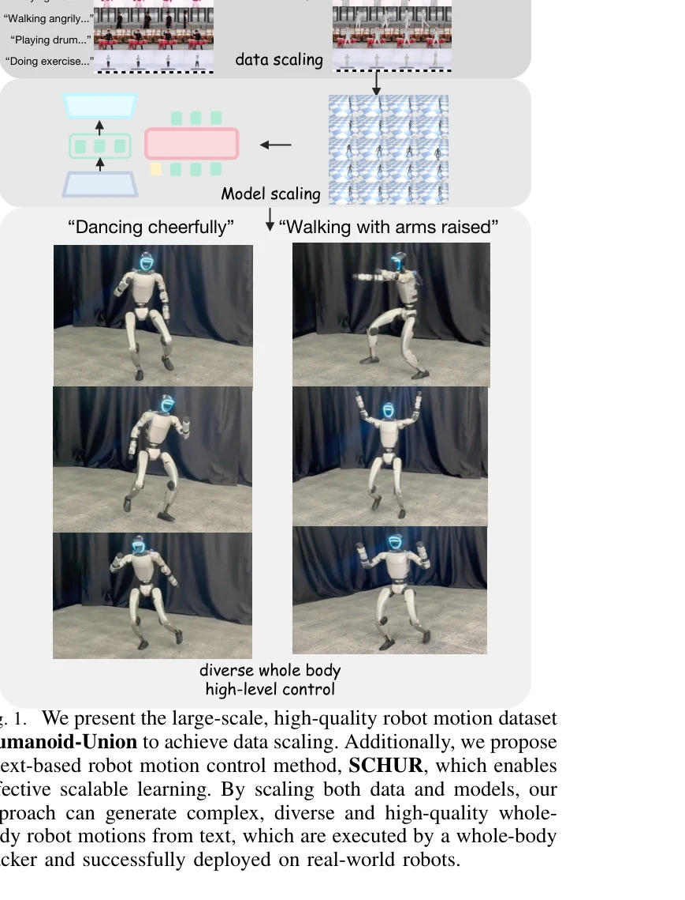
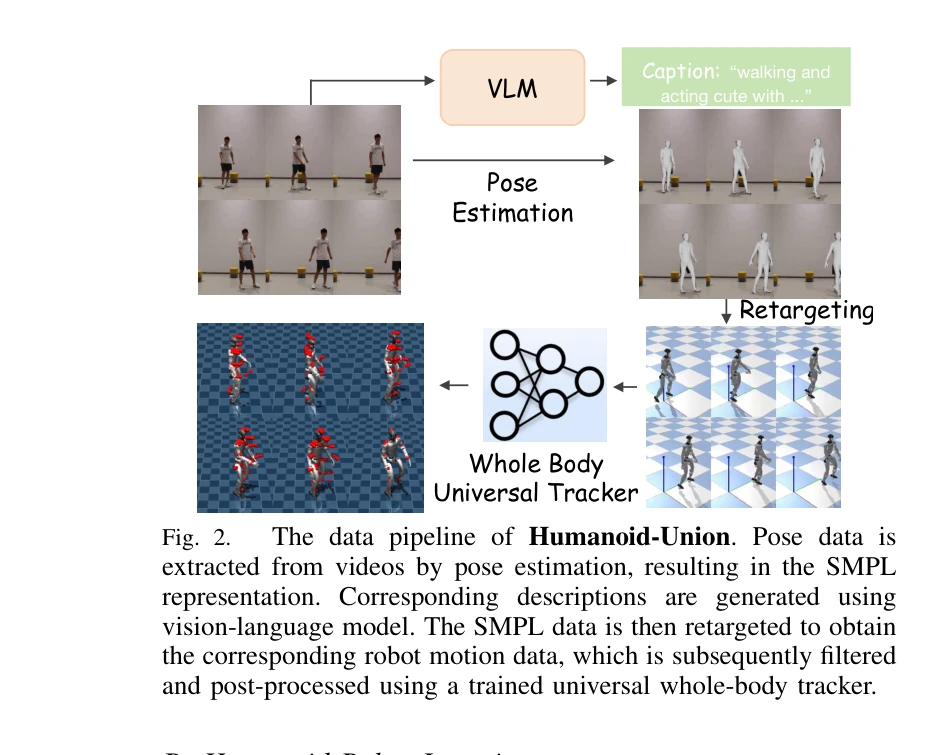

# Unveiling the Impact of Data and Model Scaling on High-Level Control for Humanoid Robots

> **저자**: Yuxi Wei, Zirui Wang, Kangning Yin, Yue Hu, Jingbo Wang, Siheng Chen | **날짜**: 2025-12-07 | **DOI**: [10.48550/arXiv.2511.09241](https://doi.org/10.48550/arXiv.2511.09241)

---

## Essence

*Fig. 1. We present the large-scale, high-quality robot motion dataset*

인간 동작 데이터로부터 자동 파이프라인을 통해 생성한 260시간 규모의 휴머노이드 로봇 모션 데이터셋 Humanoid-Union과 이를 활용한 확장 가능한 text-to-robot motion 생성 프레임워크 SCHUR을 제시한다.

## Motivation

- **Known**: 휴머노이드 로봇 제어에 인간 동작을 선행 정보로 활용하는 연구가 진행되어 왔으나, 소규모 데이터셋(예: HumanML3D 30시간 미만)에 의존하고 모델 스케일링 전략이 부족하다.
- **Gap**: 인간 동작 데이터의 거대 규모를 효과적으로 활용하면서도 로봇 실행 가능성을 보장하는 고품질 로봇 모션 데이터셋과 이에 맞춘 확장 가능한 학습 전략이 부재하다.
- **Why**: 데이터 스케일링은 로봇 학습의 핵심 병목이며, 인간 동작의 의미론적 정보를 활용한 고수준 제어는 휴머노이드 로봇의 일반화 성능과 표현력을 크게 향상시킬 수 있다.
- **Approach**: 인간 중심 비디오와 기존 모션 데이터를 자동 파이프라인으로 처리하여 로봇 모션 데이터셋을 생성하고, FSQ VAE 기반의 tokenization과 LLaMA 아키텍처를 결합한 SCHUR 프레임워크로 text-conditioned motion 생성을 수행한다.

## Achievement

*Fig. 1. We present the large-scale, high-quality robot motion dataset*

- **대규모 로봇 모션 데이터셋 구축**: 260시간 이상의 고품질 휴머노이드 로봇 모션 데이터와 자동 의미론적 주석으로 구성된 Humanoid-Union 데이터셋 제시
- **생성 품질 개선**: MPJPE 기준 37%, FID 기준 25%의 재구성 및 정렬 성능 향상 달성
- **확장성 검증**: 코드북 크기와 모델 파라미터 증가에 따른 지속적 성능 개선을 통해 data/model scaling의 효과성 입증
- **실제 로봇 배포**: 전신(whole-body) 로봇 모션의 실세계 휴머노이드 로봇 배포 및 추적 오류, 성공률 측면의 효과성 검증

## How

*Fig. 2.*

- **데이터 파이프라인**: pose estimation으로 SMPL 표현 추출 → vision-language model(GPT-4V)로 자동 주석 생성 → robot retargeting → universal whole-body motion tracker로 필터링 및 후처리
- **로봇 모션 표현**: root position/orientation, DoF에 추가로 forward kinematics로 계산된 virtual keypoint의 위치와 방향을 포함하여 표현 강화
- **Two-stage 생성 프레임워크**: (1단계) FSQ VAE를 이용한 모션 tokenization으로 VQ-VAE 대비 향상된 양자화 성능 달성, (2단계) prefix bidirectional attention mask를 적용한 LLaMA 기반 자회귀 생성
- **높은 품질 데이터 필터링**: universal tracker를 통한 로봇 운동학 및 물리 제약 검증으로 실행 불가능한 모션 제거

## Originality

- 인간 동작으로부터 파이프라인 자동화를 통해 거대 규모(260시간+) 로봇 모션 데이터셋을 최초로 구축하고 지속적 확장 가능성 제시
- 기존 human motion retargeting 방식의 분포 변화 문제를 회피하고 직접 로봇 모션 생성을 통해 모달리티 정렬(text-motion alignment) 강화
- FSQ VAE의 우수한 스케일링 특성을 활용하여 모션 tokenization에서 VQ-VAE 대비 더 효과적인 양자화 달성
- virtual keypoint를 모션 표현에 통합하여 로봇 운동학 제약을 명시적으로 반영하는 새로운 표현 방식 제시

## Limitation & Further Study

- 실세계 배포 검증이 제한적이며, 특정 저수준 executor에 대한 의존성으로 인한 일반화 한계 존재
- vision-language model(GPT-4V)에 의존한 자동 주석의 오류가 누적될 가능성 미검토
- 다양한 저수준 제어기(low-level executor)와의 호환성, 다양한 형태의 휴머노이드 로봇에 대한 적응성 평가 부족
- 후속 연구로 더 다양한 로봇 플랫폼에 대한 검증, vision-language 모델의 선택이 성능에 미치는 영향 분석, 다중 모달리티 제어(vision-language-action)로의 확장이 필요

## Evaluation

- Novelty: 4/5
- Technical Soundness: 4/5
- Significance: 4/5
- Clarity: 4/5
- Overall: 4/5

**총평**: 데이터 스케일링을 통해 휴머노이드 로봇 제어 문제에 systematic하게 접근한 우수한 논문으로, 대규모 데이터셋 구축과 확장 가능한 모델 설계 양측면에서 기여도가 높으며 실제 로봇 배포로 실효성을 입증했다.
