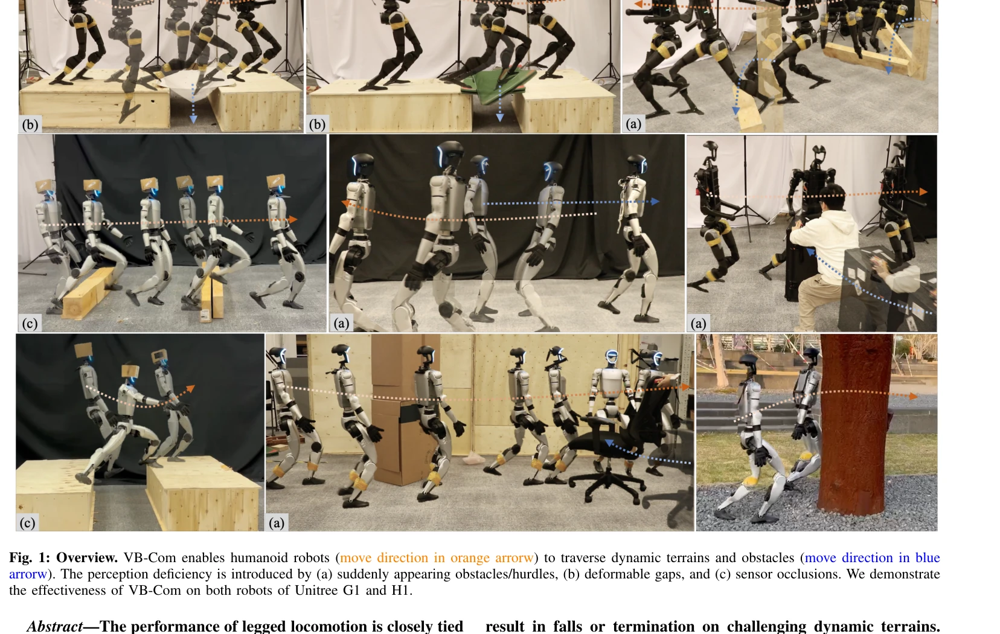
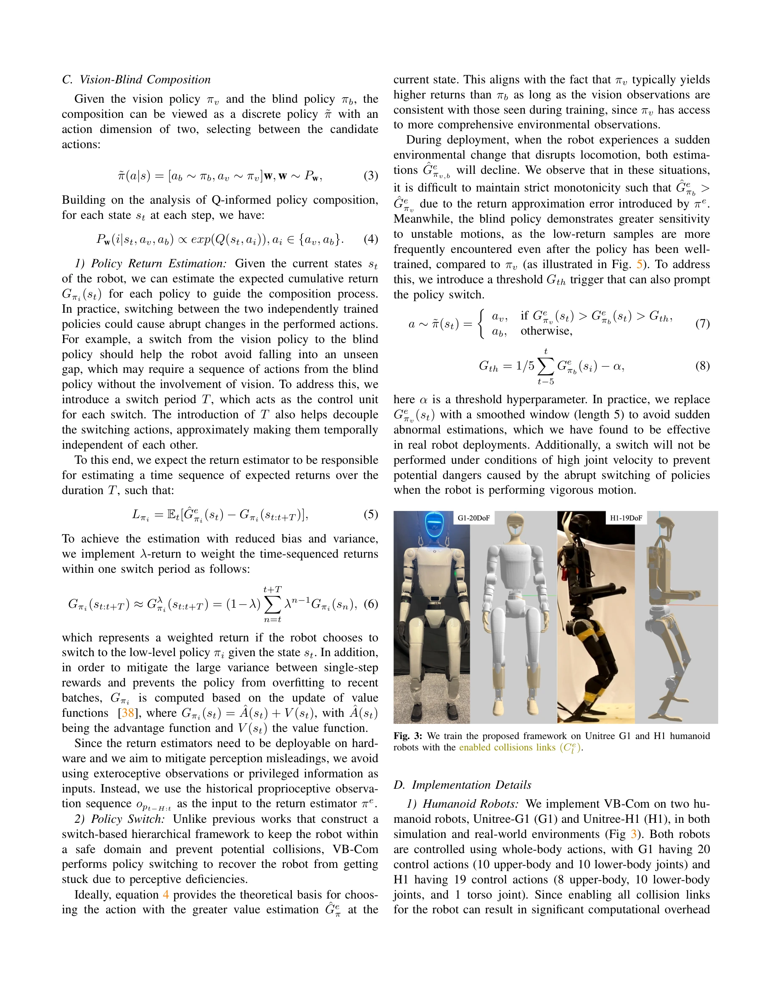

# VB-Com: Learning Vision-Blind Composite Humanoid Locomotion Against Deficient Perception

> **저자**: Junli Ren, Tao Huang, Huayi Wang, Zirui Wang, Qingwei Ben, Junfeng Long, Yanchao Yang, Jiangmiao Pang, Ping Luo | **날짜**: 2025-02-20 | **URL**: [https://arxiv.org/abs/2502.14814](https://arxiv.org/abs/2502.14814)

---

## Essence

*Fig. 1: Overview. VB-Com enables humanoid robots (move direction in orange arrorw) to traverse dynamic terrains and obst*

VB-Com은 휴머노이드 로봇이 시각 정책과 blind 정책을 동적으로 전환하여 결함 있는 지각 상황에서도 안정적인 보행 제어를 달성하는 복합 프레임워크이다.

## Motivation

- **Known**: Blind 정책은 고유감각만으로 견고하지만 속도가 느리고, Vision 정책은 빠르지만 시뮬레이션과 현실의 불일치로 인해 동적 지형에서 실패하기 쉽다.
- **Gap**: 기존 연구는 주로 사족동물 로봇에 초점을 맞춰 정적 지형만 다뤘으며, 휴머노이드 로봇의 불안정한 형태에서 지각 결함에 의한 빠른 실패를 복구하는 방법이 부족하다.
- **Why**: 휴머노이드 로봇은 무게중심 이동으로 인해 사족동물보다 회복 불가능한 낙상에 취약하므로, 동적 장애물과 지각 불확실성 상황에서 적응적으로 대응할 수 있는 제어 방법이 중요하다.
- **Approach**: Vision 정책과 Blind 정책을 PPO로 각각 훈련하고, 두 개의 return estimator를 이용하여 현재 상태에서 각 정책의 미래 수익을 예측한 후 동적으로 정책을 선택하는 방식으로 합성한다.

## Achievement

*Fig. 2: Overview of our framework: In VB-Com, we develop two locomotion policies—one perceptive and one non-perceptive—t*

- **동적 지형 및 동적 장애물 대응**: 갑자기 나타나는 장애물, 변형 가능한 간격, 센서 폐색 등 다양한 지각 결함 상황에서 휴머노이드 로봇의 보행 성공
- **Return Estimator 설계**: 고유감각 상태만으로 학습 가능한 하드웨어 배포 가능한 return estimator 개발으로 실시간 정책 전환 결정
- **Unitree G1, H1 검증**: 실제 휴머노이드 로봇 플랫폼에서 VB-Com의 효과성 입증

## How

*Fig. 3: We train the proposed framework on Unitree G1 and H1 humanoid*

- PPO 기반으로 Vision 정책 π_v(a|o_v, o_p)와 Blind 정책 π_b(a|o_p) 학습
- GAE(Generalized Advantage Estimation)를 통해 각 정책의 근사 return 계산
- Return estimator Q_v(o_p), Q_b(o_p)를 훈련하여 proprioceptive observation만으로 각 정책의 예상 수익 예측
- 합성 정책 π̃이 Q-informed policy composition으로 두 정책의 action을 선택할 확률 결정
- 시뮬레이션에서 perception noise(갑작스런 장애물, 변형 간격, 센서 폐색 등) 삽입하여 학습
- 실제 로봇에 배포하여 동적 지형과 정적 지형에서 성능 평가

## Originality

- 휴머노이드 로봇에 특화된 Vision-Blind 정책 합성 프레임워크 제안으로, 기존 사족동물 중심 연구와 차별화
- Return estimator를 통한 동적 정책 전환 메커니즘으로 빠른 복구(rapid recovery) 달성
- 시뮬레이션-현실 간격(domain gap)을 정책 선택으로 극복하는 새로운 접근법

## Limitation & Further Study

- Return estimator의 정확도가 정책 전환의 성공에 크게 영향을 미치는데, 극단적 지각 결함 상황에서의 일반화 성능 미검증
- 두 정책의 action space 동일 가정이 필요하므로 상이한 action space를 갖는 다양한 정책 조합에 대한 확장성 제한
- 동적 지형 생성의 계산 비용으로 인해 훈련 과정에서 완전한 환경 다양성 확보 어려움
- 후속 연구로 더 복잡한 지각 결함 상황(예: 다중 센서 동시 실패)에 대한 확장 및 시뮬레이션 정확도 향상 필요

## Evaluation

- Novelty: 4/5
- Technical Soundness: 4/5
- Significance: 4/5
- Clarity: 4/5
- Overall: 4/5

**총평**: 본 논문은 휴머노이드 로봇의 불안정한 특성을 고려하여 Vision-Blind 정책 합성이라는 혁신적인 접근으로 동적 지형에서의 견고한 보행을 달성했으며, 실제 로봇 플랫폼에서의 검증과 명확한 문제 정의로 높은 가치를 제공한다.
