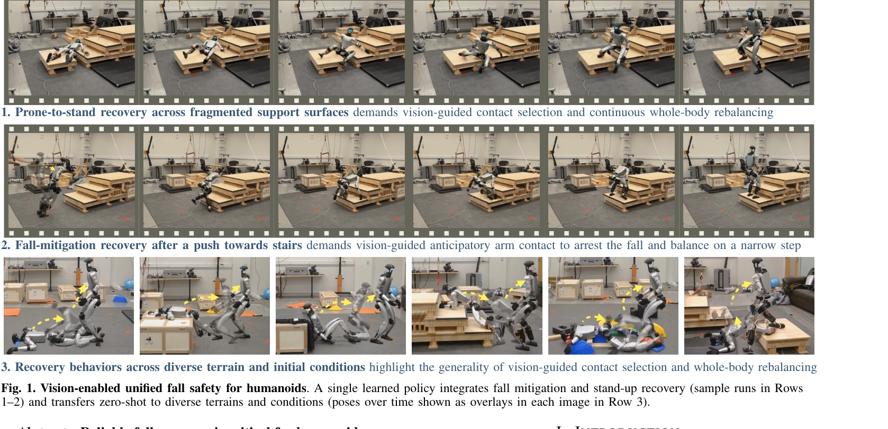
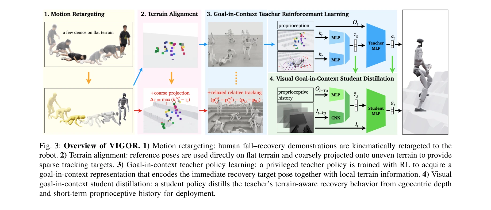

# VIGOR: Visual Goal-In-Context Inference for Unified Humanoid Fall Safety

> **저자**: Osher Azulay, Zhengjie Xu, Andrew Scheffer, Stella X. Yu | **날짜**: 2026-03-03 | **DOI**: [10.48550/arXiv.2602.16511](https://doi.org/10.48550/arXiv.2602.16511)

---

## Essence

*Fig. 1. Vision-enabled unified fall safety for humanoids. A single learned policy integrates fall mitigation and stand-u*

VIGOR는 egocentric depth와 proprioception을 활용하여 인간형 로봇의 낙상 회복을 통합적으로 해결하는 비전 기반 정책을 제시한다. Goal-in-context 잠재 표현을 통해 교사-학생 증류 학습으로 지형 인식형 낙상 안전을 달성한다.

## Motivation

- **Known**: 기존 방법들은 낙상 회피, 충격 완화, 일어나기 회복을 분리된 문제로 다루거나 평탄한 지형에서 RL/IL로 시력 없이 학습된 end-to-end 정책에 의존한다. 인간형 로봇은 높은 에너지 충격, 복잡한 전신 접촉, 큰 관점 변화를 경험한다.
- **Gap**: 기존 접근법은 낙상과 회복의 본질적 결합을 무시하며, 자세, 동역학, 지형을 단일 단체형 데이터 복잡성으로 취급하여 확장성과 일반화를 제한한다. 시각적 지형 인식 없이 학습된 정책은 비평탄 지형으로 전이되지 않는다.
- **Why**: 인간형 로봇이 복잡한 환경에서 작동하려면 신뢰할 수 있는 낙상 회복이 필수이며, 지형 인식과 전신 반응의 통합이 현장에서의 생존력을 결정한다.
- **Approach**: 자연 인간 낙상 자세가 높도록 제약되고 지형 간 전이 가능하다는 통찰과 빠른 반응이 통합된 지각-운동 표현을 요구한다는 통찰을 바탕으로, goal-in-context 잠재 표현을 통한 교사-학생 증류 학습을 제안한다.

## Achievement

*Fig. 1. Vision-enabled unified fall safety for humanoids. A single learned policy integrates fall mitigation and stand-u*

- **통합 낙상 안전 정책**: 낙상 회피, 충격 완화, 일어나기 회복을 단일 정책으로 통합하여 각 단계 간 상호작용을 명시적으로 모델링
- **인수분해된 데이터 생성**: 평탄 지형의 희소 인간 시연과 시뮬레이션 복잡 지형을 독립적으로 변화시켜 샘플 효율성을 향상
- **Zero-shot 전이**: 실제 Unitree G1에서 실세계 미세조정 없이 다양한 비평탄 지형으로 강건한 전이 달성
- **시각 기반 접촉 선택**: egocentric depth를 통한 지형 인식형 접촉 선택과 동역학 리다이렉션

## How

*Fig. 3: Overview of VIGOR. 1) Motion retargeting: human fall–recovery demonstrations are kinematically retargeted to the*

- 교사 정책: 희소 인간 시연(평탄 지형)과 시뮬레이션 복잡 지형에서 RL 학습, 국소 지형 기하학 접근 가능
- 학생 정책: egocentric depth와 단기 proprioceptive 이력만 사용하여 교사의 goal-in-context 잠재 표현 매칭
- Motion retargeting: 인간 낙상-회복 시연을 로봇 자세로 변환하여 자세 및 동역학 사전 정보 제공
- Goal-in-context 잠재: 다음 목표 자세와 국소 지형을 단일 지각-운동 공간에 통합하여 동시 조건화
- 시뮬레이션-실제 전이: 충분한 시뮬레이션 지형 다양성으로 zero-shot 실제 배포 가능

## Originality

- 낙상 회복의 통합적 설계: 기존의 단편화된 접근을 탈피하여 전체 낙상-회복 주기를 단일 정책으로 해결
- Goal-in-context 잠재 표현: 명시적 지형/동역학 예측 대신 지각-운동 공간에서 직접 행동 목표를 정의하는 새로운 표현
- 인수분해된 데이터 생성: 자세와 지형 변화를 독립 인수로 분리하여 희소 인간 시연의 확장성 확보
- 시각 기반 낙상 회복: 낙상 중 급격한 신체 회전과 자기 폐색 시나리오에서 egocentric depth 활용의 첫 사례

## Limitation & Further Study

- 실제 환경의 제한된 평가: 주로 Unitree G1 로봇에서만 검증되어 다른 인간형 로봇 플랫폼으로의 일반화 미지수
- 교사 정책의 지형 기하학 의존성: 교사는 국소 지형 정보 접근이 필수이므로 현장 배포 불가
- 시뮬레이션 지형 다양성: 훈련 시뮬레이션 지형이 실제 환경의 모든 기하학적 특성을 포함하는지 명확하지 않음
- 인간 시연의 스케일: 희소 인간 시연의 품질과 포즈 해석이 성능에 미치는 영향에 대한 정량적 분석 부족
- 후속연구: 다양한 로봇 형태에 대한 일반화, 극한 지형(계단, 경사도 변화)에서의 성능 평가, 교사 정책 제약 완화 방안 모색

## Evaluation

- Novelty: 4/5
- Technical Soundness: 3/5
- Significance: 4/5
- Clarity: 4/5
- Overall: 4/5

**총평**: VIGOR는 낙상 회복의 통합적 설계와 goal-in-context 잠재 표현이라는 개념적 혁신을 통해 인간형 로봇의 현장 적응성을 크게 향상시킨다. Zero-shot 전이 성과와 실제 로봇 검증으로 실무적 가치가 높으나, 단일 로봇 플랫폼 평가와 지형 다양성의 범위가 제한되어 향후 광범위한 검증이 필요하다.
