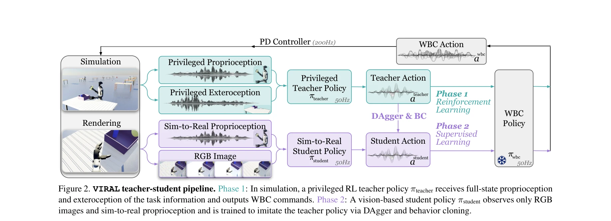
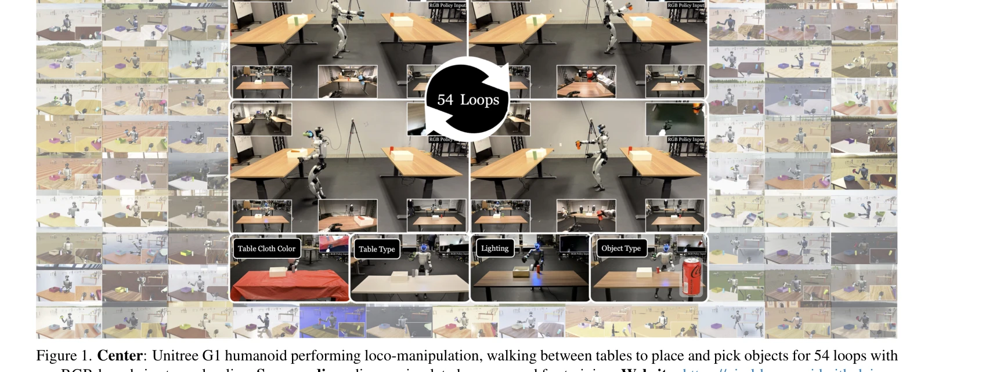

# VIRAL: Visual Sim-to-Real at Scale for Humanoid Loco-Manipulation

> **저자**: Tairan He, Zi Wang, Haoru Xue, Qingwei Ben, Zhengyi Luo, Wenli Xiao, Ye Yuan, Xingye Da, Fernando Castañeda, Shankar Sastry, Changliu Liu, Guanya Shi, Linxi Fan, Yuke Zhu | **날짜**: 2025-11-27 | **DOI**: [10.48550/arXiv.2511.15200](https://doi.org/10.48550/arXiv.2511.15200)

---

## Essence

*Figure 2. VIRAL teacher-student pipeline. Phase 1: In simulation, a privileged RL teacher policy πteacher receives full-*

VIRAL은 humanoid 로봇의 loco-manipulation을 대규모 시뮬레이션에서 학습하고 RGB 기반 vision policy로 실제 로봇에 zero-shot 배포하는 visual sim-to-real 프레임워크이다.

## Motivation

- **Known**: Sim-to-real은 legged locomotion에서 성공했지만, humanoid loco-manipulation (이동 + 조작의 결합)은 대부분 실제 데이터 기반 모방 학습에 의존해왔다.
- **Gap**: Humanoid loco-manipulation의 자율적 수행이 부족하며, 실제 데이터 수집의 비용이 높아 대규모 시뮬레이션 기반 학습의 실효성이 검증되지 않았다.
- **Why**: Humanoid 로봇의 실제 배포를 위해 장시간 자율적 loco-manipulation 능력이 필수적이며, 이는 일반 목적의 물리 지능 기반 로봇 실현에 중요하다.
- **Approach**: Teacher-student 구조를 통해 privileged state로 학습한 RL teacher를 vision-only student policy로 distill하고, 대규모 GPU 병렬화, visual domain randomization, real-to-sim alignment를 결합하여 sim-to-real gap을 극복한다.

## Achievement

*Figure 1. Center: Unitree G1 humanoid performing loco-manipulation, walking between tables to place and pick objects for*

- **Zero-shot 실제 배포**: RGB 기반 student policy가 실제 Unitree G1 humanoid에서 실시간 fine-tuning 없이 작동
- **장시간 자율 loco-manipulation**: 54회 연속 순환을 통해 보행, 물체 집기, 물체 배치를 수행
- **높은 성공률**: 전문가 텔레오퍼레이션 성능에 근접한 robustness와 다양한 공간·외형 변화에 대한 일반화
- **대규모 계산의 중요성 입증**: 64 GPUs 규모로 확장할 시 학습이 신뢰할 수 있게 되는 반면, 저계산 regime에서는 실패
- **포괄적 ablation 분석**: RGB 기반 humanoid loco-manipulation을 실현하기 위한 핵심 설계 선택지 규명

## How

*Figure 2. VIRAL teacher-student pipeline. Phase 1: In simulation, a privileged RL teacher policy πteacher receives full-*

- Teacher policy: privileged state (full proprioception, exteroception, object transforms)로부터 WBC 명령 (속도, 각속도, 관절 목표)을 PPO로 학습
- Reward design: walking, placing, grasping, turning 네 개의 task stage 별 보상 함수 설계
- Reference state initialization: demonstration으로부터 environment 초기화하여 RL 학습 효율 증대
- Student distillation: online DAgger와 behavior cloning 조합으로 RGB image와 sim-to-real proprioception만으로 teacher 행동 모방
- Large-scale visual training: Isaac Lab의 tiled rendering 활용하여 64 GPUs에서 병렬 학습
- Visual domain randomization: lighting, materials, camera parameters, image quality, sensor delays에 대한 광범위한 randomization
- Real-to-sim alignment: dexterous hand의 system identification과 camera extrinsics 보정으로 sim-to-real gap 축소

## Originality

- Humanoid 플랫폼에서 locomotion과 manipulation을 통합적으로 다루며, long-horizon continuous loco-manipulation의 실제 배포를 최초로 달성
- 대규모 GPU 계산 (64 GPUs)이 visual sim-to-real의 신뢰성에 미치는 중요성을 체계적으로 입증
- Teacher-student 구조와 privileged learning, visual domain randomization, real-to-sim alignment의 조합으로 실용적인 full-stack 솔루션 제시
- 54회 연속 순환 수행을 통해 기존 humanoid loco-manipulation 작업의 수준을 현저히 상향

## Limitation & Further Study

- 아직도 RGB만으로는 복잡한 환경에서의 적응성이 제한적일 수 있으며, 더 다양한 실제 환경 조건에서의 검증이 필요
- Dexterous hand의 system identification이 필요하여, 다른 로봇 플랫폼으로의 이식성이 낮을 수 있음
- 대규모 GPU 계산 (64 GPUs)이 필수적이므로 연구 재현성과 산업 적용의 진입 장벽이 높음
- Task가 제한적 (물체 집기, 배치)이므로 보다 복잡한 조작 작업으로의 확장 가능성에 대한 평가 필요
- 후속 연구: (1) compute 효율성 개선으로 더 작은 규모 GPU에서의 학습 가능성, (2) multi-task 및 in-context learning으로 더 일반화된 humanoid 기술 개발, (3) 실제 환경의 극단적 변화 (조명 부족, 부분 폐색 등)에 대한 적응

## Evaluation

- Novelty: 4/5
- Technical Soundness: 4/5
- Significance: 4/5
- Clarity: 4/5
- Overall: 4/5

**총평**: VIRAL은 humanoid loco-manipulation의 자율 실행을 시뮬레이션 기반 학습으로 성공시킨 중요한 기술적 성과이며, 대규모 계산과 체계적 설계의 필요성을 명확히 보여주는 동시에 로봇 공학의 실제 배포 가능성을 크게 높였다.
