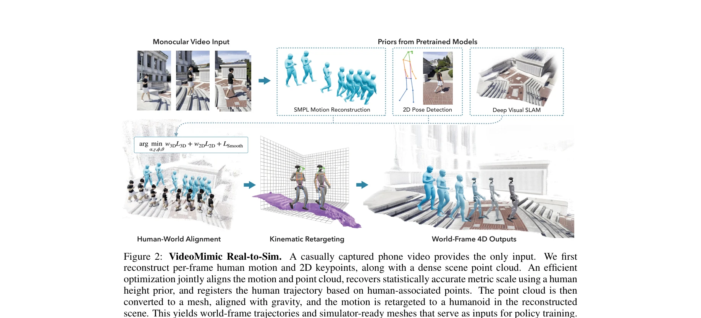
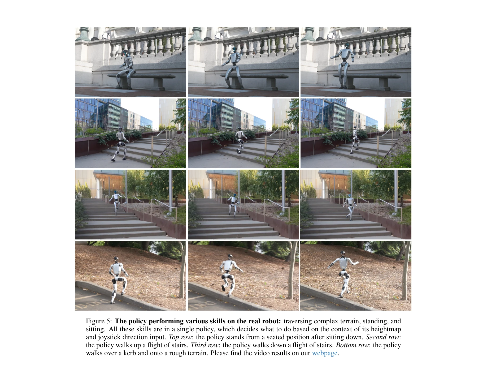

# Visual Imitation Enables Contextual Humanoid Control

> **저자**: Arthur Allshire, Hongsuk Choi, Junyi Zhang, David McAllister, Anthony Zhang, Chung Min Kim, Trevor Darrell, Pieter Abbeel, Jitendra Malik, Angjoo Kanazawa | **날짜**: 2025-05-06 | **URL**: [https://arxiv.org/abs/2505.03729](https://arxiv.org/abs/2505.03729)

---

## Essence

*Figure 2: VideoMimic Real-to-Sim. A casually captured phone video provides the only input. We first*

VIDEOMIMIC는 단순한 휴대폰 영상에서 인간-환경 4D 기하학을 공동 재구성하고, 이를 시뮬레이션에서 RL 정책으로 학습한 후 실제 휴머노이드 로봇에 배포하는 real-to-sim-to-real 파이프라인이다.

## Motivation

- **Known**: DeepMimic 등의 모방 학습 방식은 모션 캡처 데이터에 의존하고, 최근 legged robot 연구는 reward shaping 또는 MoCap 데이터를 통해 특정 행동을 학습해왔다.
- **Gap**: 기존 시각 기반 방법들은 인간만 또는 장면만 독립적으로 재구성하며, 환경-인식 전신 제어(contextual whole-body control)를 위한 물리적으로 일관성 있는 참조 동작을 제공하지 못했다.
- **Why**: 휴머노이드 로봇이 계단 오르기, 의자에 앉기 같은 다양한 환경 적응 행동을 단일 정책으로 수행할 수 있다면, 로봇 학습의 확장성을 크게 향상시킬 수 있다.
- **Approach**: 모노큘러 RGB 영상에서 VIMO, ViTPose, BSTRO, MegaSaM/MonST3R 등 사전학습 모델들로 인간 자세와 장면 포인트클라우드를 추출한 후, 메트릭 스케일과 joint 정렬을 위해 인간 높이 prior를 활용하여 공동 최적화하고, 최종적으로 retarget된 모션과 메시로 정책을 학습한다.

## Achievement

*Figure 5: The policy performing various skills on the real robot: traversing complex terrain, standing, and*

- **실제 로봇 배포**: Unitree G1 휴머노이드에서 계단 등하강, 의자/벤치 앉기/일어나기 등 robust하고 반복 가능한 contextual control 달성
- **단일 통합 정책**: 환경(height-map)과 root direction으로 조건화된 단일 policy로 명시적 task labeling 없이 행동 선택 및 실행
- **Scalable 데이터 파이프라인**: 123개 모노큘러 RGB 영상 데이터셋으로 학습하여 MoCap 및 pre-scanned scene 불필요
- **Unseen environment 일반화**: 학습하지 않은 환경에서도 높이맵 정보만으로 적절한 행동 생성

## How

*Figure 2: VideoMimic Real-to-Sim. A casually captured phone video provides the only input. We first*

- **전처리**: Grounded SAM2로 인간 detection/association, VIMO로 SMPL 파라미터 추출, ViTPose로 2D keypoint 검출, BSTRO로 발 contact 회귀, MegaSaM/MonST3R로 장면 포인트클라우드 획득
- **Joint 최적화**: 인간의 global translation/orientation, local pose, 그리고 장면 스케일 α를 동시에 최적화하며, SMPL 인간 높이 prior를 메트릭 참조로 활용
- **Retargeting**: 최적화된 인간 궤적을 humanoid 로봇으로 kinematic retargeting하되, joint limits, contact, collision 제약 조건 준수
- **RL 정책 학습**: Mesh와 retarget 데이터로 goal-conditioned DeepMimic 스타일 RL 수행, mass/friction/latency/sensor noise randomization으로 robustness 확보
- **Policy 증류**: DAgger를 통해 추적(tracking) policy를 proprioception, 11×11 height-map patch, goal vector만 관찰하는 generalist controller로 증류하고 PPO fine-tuning 수행

## Originality

- **공동 4D 재구성의 물리 기반 활용**: 인간-장면을 메트릭하게 공동 재구성하고 이를 직접 physics simulator에 적용 가능한 형태로 변환한 점이 새로움
- **End-to-end real-to-sim-to-real 파이프라인**: 단순 모노큘러 영상에서 로봇 정책까지 일관된 파이프라인 구축으로, 기존 isolated reconstruction + reward engineering 접근과 구별
- **Context-aware generalist policy**: 명시적 task 분류 없이 height-map과 root command만으로 다양한 행동을 자동 선택하는 unified policy 설계
- **실제 로봇 검증**: Unitree G1에서 실제 배포 성공으로 sim-to-real transfer의 실질적 가능성 입증

## Limitation & Further Study

- **영상 품질 의존성**: 휴대폰 영상 기반이므로 occlusion, motion blur, low resolution 상황에서의 재구성 정확도 미검증
- **Embodiment gap**: 인간-로봇 체형 차이에 의한 dynamical mismatch 가능성; 현재 kinematic retargeting만으로는 contact dynamics를 완벽히 보장하지 못함
- **환경 복잡도 제한**: 학습된 policy는 height-map이라는 제한된 환경 표현에만 의존하므로, 복잡한 장애물, 동적 환경 대응 미흡 가능
- **영상 데이터 규모**: 123개 영상으로 학습하여, 더 광범위한 행동 다양성(던지기, 미세 조작 등)을 다루기 위해서는 데이터 확장 필요
- **후속 연구 방향**: (1) 다중 시점 또는 RGB-D 영상 활용으로 재구성 정확도 향상, (2) contact-aware RL 목적함수로 dynamics 정확화, (3) 대규모 웹 영상 데이터를 활용한 pre-training

## Evaluation

- Novelty: 4/5
- Technical Soundness: 3/5
- Significance: 4/5
- Clarity: 4/5
- Overall: 4/5

**총평**: 이 논문은 일상 영상으로부터 휴머노이드 로봇의 문맥-인식 제어를 가능하게 하는 실용적이고 확장 가능한 파이프라인을 제시하며, 공동 4D 재구성과 RL 기반 정책 증류의 조합으로 높은 독창성을 보인다. 실제 로봇 배포 성공은 연구의 가치를 크게 높이나, 환경 표현의 제한성과 동역학 정확도 측면에서 개선 여지가 있다.