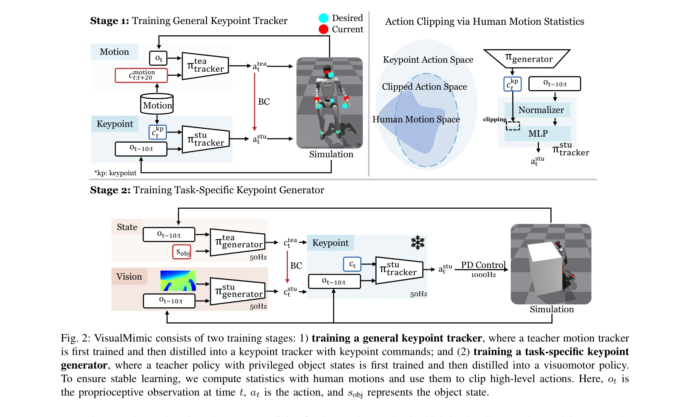
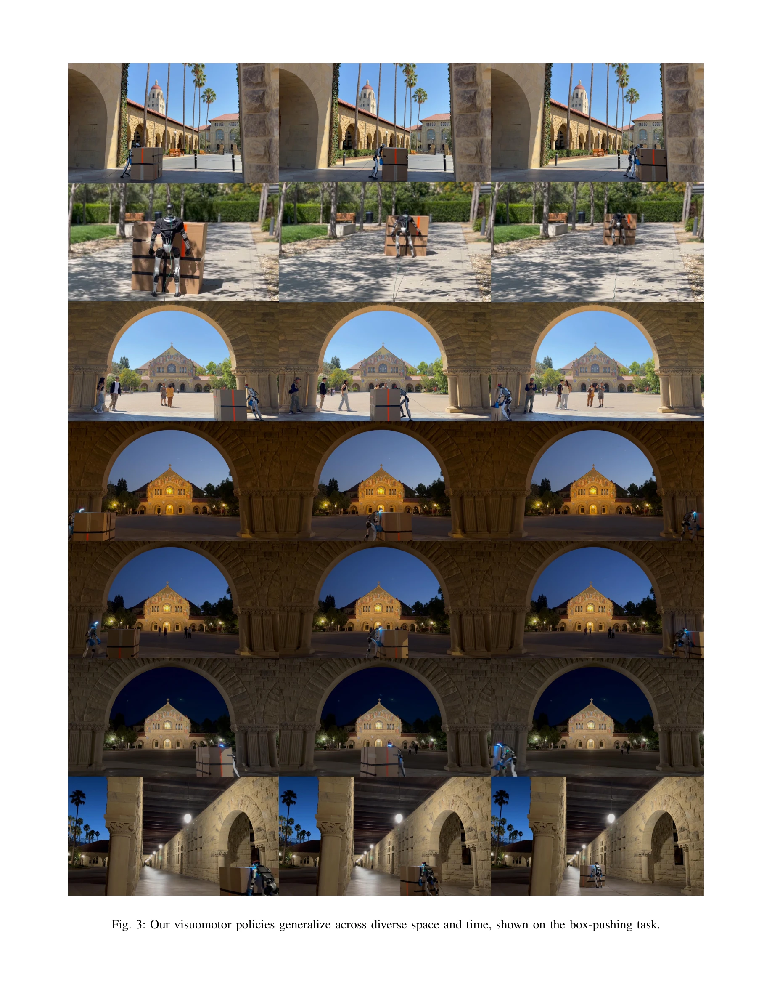

# VisualMimic: Visual Humanoid Loco-Manipulation via Motion Tracking and Generation

> **저자**: Shaofeng Yin, Yanjie Ze, Hong-Xing Yu, C. Karen Liu, Jiajun Wu | **날짜**: 2025-11-13 | **DOI**: [10.48550/arXiv.2509.20322](https://doi.org/10.48550/arXiv.2509.20322)

---

## Essence

*Fig. 2: VisualMimic consists of two training stages: 1) training a general keypoint tracker, where a teacher motion trac*

VisualMimic은 egocentric vision과 hierarchical whole-body control을 결합한 sim-to-real 프레임워크로, 인간의 동작 데이터로 학습한 task-agnostic keypoint tracker와 task-specific visuomotor policy를 통해 humanoid robot의 loco-manipulation을 실현한다.

## Motivation

- **Known**: Humanoid robot의 loco-manipulation은 기존에 외부 motion capture에 의존하거나 특정 작업에만 일반화되는 제약이 있었다. 또한 vision-based RL은 큰 exploration space로 인해 단순한 환경 상호작용(앉기, 계단 오르기)에만 제한되었다.
- **Gap**: Whole-body dexterity, loco-manipulation, visual policy를 모두 만족하면서 real-world에 zero-shot transfer 가능한 통합 프레임워크가 부재했다. 특히 keypoint command만으로는 human-like behavior를 완전히 포착하기 어려웠다.
- **Why**: Humanoid robot이 실제 환경에서 다양한 물체 조작과 이동을 동시에 수행할 수 있게 하는 것은 로보틱스의 오랜 목표이며, 외부 장비 없이 순수 egocentric vision만으로 작동 가능한 시스템은 실제 배포에 필수적이다.
- **Approach**: Teacher-student distillation 방식으로 (1) motion tracker를 이용해 전체 신체 동작을 학습한 후 keypoint tracker로 증류하고, (2) object state 접근권한이 있는 state-based policy로 먼저 학습한 후 visuomotor policy로 증류하며, action clipping과 noise injection으로 안정성을 확보한다.

## Achievement

*Fig. 3: Our visuomotor policies generalize across diverse space and time, shown on the box-pushing task.*

- **Zero-shot sim-to-real transfer**: Simulation에서만 학습한 정책이 실제 humanoid robot에 즉시 적용되어 복잡한 loco-manipulation 작업 수행
- **다양한 작업 성공**: 0.5kg 박스 1m 높이로 들어올리기, 3.8kg 대형 박스 밀기, football dribbling, kicking 등 diverse 작업 수행
- **Real-world 강건성**: 실외 환경에서 조명 변화, 불균형한 지면 등의 변수에도 안정적 성능 유지
- **Task-agnostic low-level policy**: 한 번 학습한 keypoint tracker가 모든 새로운 작업에 재사용 가능하여 scalability 향상

## How

*Fig. 2: VisualMimic consists of two training stages: 1) training a general keypoint tracker, where a teacher motion trac*

- **Stage 1 - General Keypoint Tracker**: (1) Teacher motion tracker를 미래 reference motion에 대한 접근권한으로 RL 학습, (2) DAgger를 이용해 keypoint commands만으로 동작하는 student keypoint tracker로 증류
- **Stage 2 - Task-Specific Keypoint Generator**: (1) Object state가 주어진 state-based policy πgenerator_tea를 RL로 학습, (2) Egocentric vision과 proprioception만 사용하는 visuomotor policy πgenerator_stu로 distillation
- **Stability 메커니즘**: (1) Low-level policy 학습 중 noisy commands 적응을 위해 noise injection, (2) Human motion statistics에 기반한 action clipping으로 feasible action space 제약
- **Sim-to-real Gap 해결**: Simulation의 depth image에 heavy masking 적용하여 real-world sensor noise 근사
- **Hierarchical Interface**: Body keypoints (root, hands, feet, head)를 command interface로 사용하여 compact하면서도 expressive한 설계

## Originality

- **Teacher-student distillation의 이중 적용**: Motion tracker → keypoint tracker, state-based policy → visuomotor policy로 두 단계에서 progressive distillation 적용
- **Human motion statistics 기반 action clipping**: RL exploration의 불안정성을 human motion data의 통계 정보로 제약하는 novel approach
- **Hierarchical keypoint command interface**: 전체 신체 제어를 compact한 keypoint로 추상화하면서도 human-like behavior 유지
- **Egocentric vision + whole-body control의 통합**: 기존의 상반된 접근(upper-body vs locomotion, simulation-only vs real-world)을 통합적으로 해결

## Limitation & Further Study

- **Human motion data 의존성**: Keypoint tracker 학습이 curated human motion data에 크게 의존하여, 특이한 작업은 충분한 reference motion 필요
- **Sim-to-real domain gap 잔존**: Heavy masking 등으로 완화하나, 실제로는 여전히 다양한 환경(조명, 표면 재질 등)에서 테스트 필요
- **작업 특화성**: 각 새로운 작업마다 high-level policy 재학습 필요 (low-level은 재사용하나 여전히 task-specific training 필수)
- **평가의 제한성**: Real-world 실험이 주로 controlled setting과 제한된 outdoor 환경에서만 수행되어 극한 환경 성능 미지수
- **Keypoint command의 표현 한계**: Root, hands, feet, head만으로 모든 복잡한 신체 동작을 완전히 표현하기 어려울 수 있음

## Evaluation

- Novelty: 4/5
- Technical Soundness: 3/5
- Significance: 4/5
- Clarity: 4/5
- Overall: 4/5

**총평**: VisualMimic은 teacher-student distillation의 창의적 이중 적용과 human motion statistics 기반 제약으로 humanoid loco-manipulation의 현실적 과제를 효과적으로 해결하며, 다양한 작업에서 zero-shot real-world transfer를 입증한 매우 의미 있는 연구이다.
