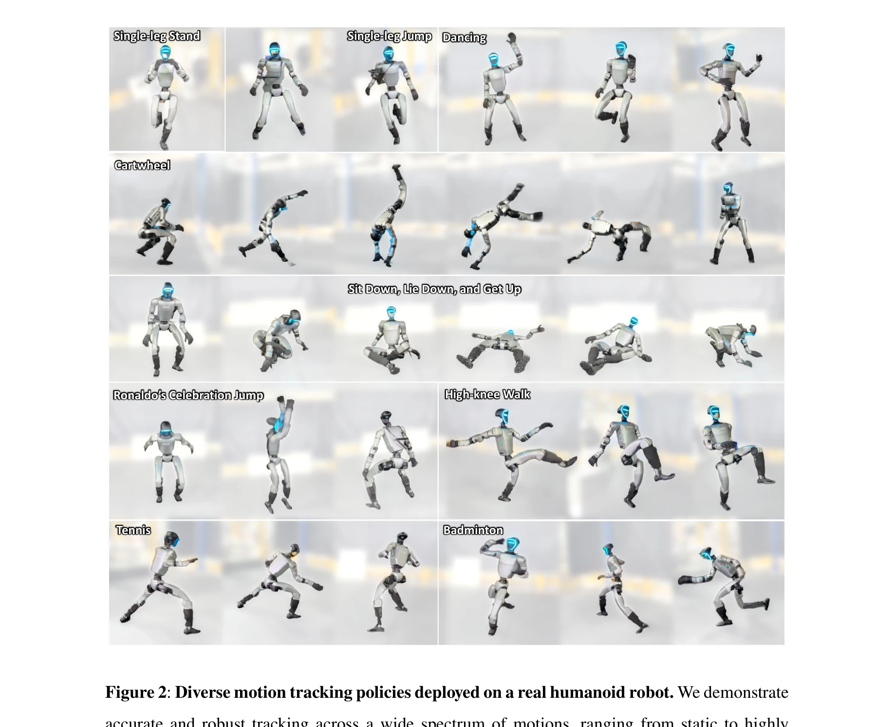

# VMP: Versatile Motion Priors for Robustly Tracking Motion on Physical Characters

> **저자**:  | **날짜**:  | **URL**: [https://la.disneyresearch.com/publication/vmp-versatile-motion-priors-for-robustly-tracking-motion-on-physical-characters/](https://la.disneyresearch.com/publication/vmp-versatile-motion-priors-for-robustly-tracking-motion-on-physical-characters/)

---

## Essence

*Figure 1: Overview of the proposed versatile humanoid control framework. (A) Scalable*

본 논문은 인간의 동작 시연으로부터 학습하여 휴머노이드 로봇이 자연스럽고 민첩한 동작을 수행하고, diffusion model 기반의 온라인 최적화를 통해 학습 중 보지 못한 다양한 작업을 제로샷으로 해결할 수 있는 BeyondMimic 프레임워크를 제시한다.

## Motivation

- **Known**: DeepMimic 스타일의 reward 기반 motion tracking은 민첩한 동작을 학습할 수 있지만 동작별 튜닝이 필요하고, hierarchical 또는 VAE 기반 방법들은 versatility를 제공하지만 자연스러움이나 적응성에서 제한을 가진다.
- **Gap**: 기존 방법들은 특정 동작이나 작업에 특화되어 있어 다양한 기술을 조합하고 학습 중 보지 못한 새로운 작업에 적응하기 어렵다. 또한 자연스러운 동작 품질을 유지하면서도 scalable한 제어 프레임워크가 부족하다.
- **Why**: 휴머노이드 로봇이 인간 환경에서 다양한 작업을 수행하려면 단순 모방을 넘어 자연스럽고 민첩하면서도 새로운 상황에 적응할 수 있는 versatile한 제어 능력이 필수적이며, 이는 로봇공학의 중요한 미해결 문제이다.
- **Approach**: 첫째, 고전역학 기반의 신중한 로봇 제어 모델링과 최소한의 domain randomization으로 compact한 reward 함수(3개 정규화 항 + 통합 작업 reward)를 구성하여 scalable motion tracking을 달성한다. 둘째, 다양한 원자적 기술들을 diffusion model로 학습한 후 classifier guidance를 통해 테스트 시점에 새로운 목표에 대한 온라인 최적화를 수행한다.

## Achievement

*Figure 2: Diverse motion tracking policies deployed on a real humanoid robot. We demonstrate*

- **Scalable motion tracking**: 단일 setup과 shared hyperparameters로 aerial cartwheel, spin-kick, flip-kick, sprinting 등 다양한 민첩한 동작을 human-like 성능으로 구현
- **Versatile task composition**: state-action co-diffusion model을 활용하여 학습 중 보지 못한 waypoint navigation, joystick teleoperation, obstacle avoidance 등을 제로샷으로 해결
- **Real-world deployment**: 실제 휴머노이드 로봇에서 다양한 실외 조건에서 우수한 성능을 입증하고, task-specific 재학습 없이 유연한 제어 능력을 최초로 실현
- **Unified framework**: 복잡한 RL 공식화 없이도 principled한 설계로 sim-to-real transfer를 달성하면서 동작의 자연스러움을 유지

## How

- 고전역학 원리에 기반한 로봇 actuation 모델링 및 시스템 구현으로 배포 시 지연 등의 discrepancy 최소화
- 세 가지 핵심 정규화 항(물리적 일관성 보장)과 동작 추적 reward로 구성된 compact한 reward 함수 설계
- domain randomization을 불확실한 물리 속성에만 적용하여 제어 목표 손상 최소화
- 다양한 원자적 동작들에 대해 동일한 정책 모델, reward 함수, hyperparameter로 RL 학습
- state-action co-diffusion model로 학습된 동작의 multimodal 분포를 캡처
- Classifier guidance를 통해 diffusion model의 gradient field를 이용한 테스트 시점 온라인 최적화
- 예측 제어 방식으로 미래 상태와 동작 모두에 대한 cost 함수 적용 가능하게 구성

## Originality

- Motion tracking과 generative 제어를 통합한 최초의 unified 휴머노이드 제어 프레임워크 제시
- Classifier guidance 기반의 diffusion model을 로봇 제어에 처음 적용하여 테스트 시점 온라인 최적화 실현
- 고전역학 기반의 신중한 시스템 모델링으로 domain randomization의 과도한 적용을 회피하는 새로운 접근
- State-action co-diffusion을 통해 predictive control 방식으로 diverse한 작업 조건을 처리하는 설계 혁신

## Limitation & Further Study

- Diffusion model의 계산 비용과 샘플링 시간에 대한 상세한 분석 부족 — 실시간 제어 적용 시 latency 영향 분석 필요
- 학습에 사용된 인간 동작 데이터의 규모, 다양성, 선택 기준에 대한 구체적 설명 부족
- 극단적 환경(매우 높은 경사면, 복잡한 장애물) 등에서의 성능 한계 및 실패 사례 분석 부족
- 다른 로봇 형태나 actuation 방식(예: legged 로봇 이외의 시스템)으로의 일반화 가능성 미검토
- 온라인 최적화 시 local optima에 빠질 가능성과 이를 완화하는 메커니즘에 대한 논의 부재
- 후속연구: 계산 효율성 개선, 다양한 로봇 플랫폼으로의 확장, 더 복잡한 인터랙션 시나리오 검증

## Evaluation

- Novelty: 4/5
- Technical Soundness: 4/5
- Significance: 4/5
- Clarity: 4/5
- Overall: 4/5

**총평**: BeyondMimic은 휴머노이드 로봇 제어의 오랜 과제인 agility, naturalness, versatility를 simultaneously하게 달성한 혁신적인 프레임워크이다. Compact한 이론적 기초와 diffusion 기반의 온라인 최적화의 조합으로 실제 로봇에서의 제로샷 적응을 최초로 구현하여 로봇공학 분야에 중대한 기여를 한다.
