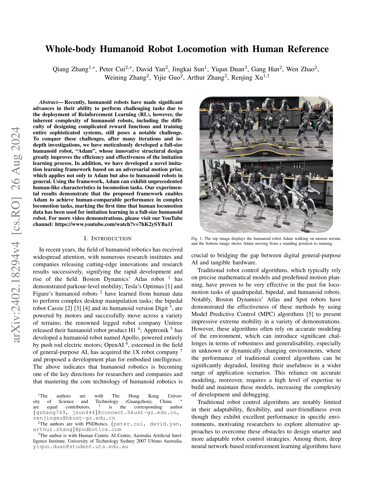
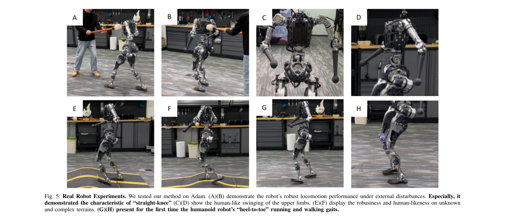
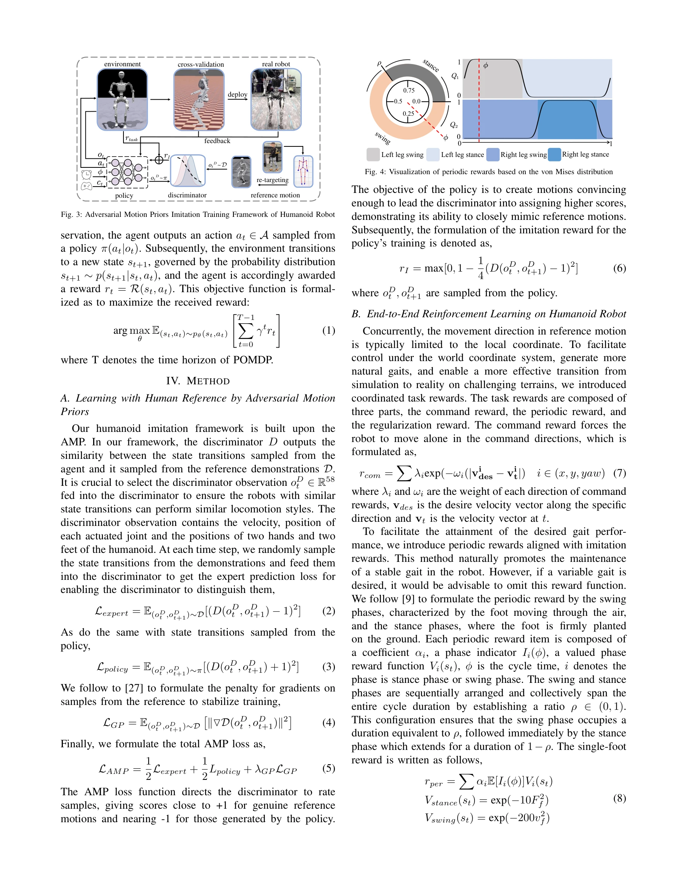

# Whole-body Humanoid Robot Locomotion with Human Reference

> **저자**: Qiang Zhang, Peter Cui, David Yan, Jingkai Sun, Yiqun Duan, Gang Han, Wen Zhao, Weining Zhang, Yijie Guo, Arthur Zhang, Renjing Xu | **날짜**: 2024-02-28 | **URL**: [https://arxiv.org/abs/2402.18294](https://arxiv.org/abs/2402.18294)

---

## Essence

*Fig. 1: The top image displays the humanoid robot Adam walking on unseen terrain,*

인간의 보행 데이터를 활용한 모방 학습 프레임워크를 통해 풀사이즈 휴머노이드 로봇 Adam이 인간 수준의 보행 성능을 달성하는 방법을 제시한다.

## Motivation

- **Known**: 강화학습이 사족 및 이족 로봇 보행에서 성공적이었으나, 복잡한 휴머노이드 로봇의 보상 함수 설계와 Sim2Real 전이 문제로 인해 실제 휴머노이드 로봇 제어 적용이 부족했다.
- **Gap**: 기존 AMP 방식은 운동학적 관계만 학습하여 물리 제약이 부족하고 시뮬레이션과 현실의 간극이 크며, 풀사이즈 휴머노이드 로봇에서 인간 보행 데이터를 활용한 성공적인 모방 학습 사례가 없었다.
- **Why**: 휴머노이드 로봇의 실용적 배포를 위해서는 복잡한 보상 함수 설계의 어려움을 해결하고 인간 수준의 자연스러운 보행 성능이 필수적이며, 이는 로봇 적응성과 안전성 향상으로 이어진다.
- **Approach**: 모터 구동 방식의 저비용 휴머노이드 로봇 Adam을 설계하고, adversarial motion prior를 기반으로 한 새로운 전신 모방 학습 프레임워크를 개발하여 인간 보행 데이터로부터 학습한다.

## Achievement

*Fig. 5: Real Robot Experiments. We tested our method on Adam. (A)(B) demonstrate the robot’s robust locomotion performan*

- **Adam 로봇 개발**: 인간 수준의 관절 범위를 가지면서도 저비용, 유지보수 용이한 모터 구동 모듈식 휴머노이드 로봇 설계
- **새로운 모방 학습 프레임워크**: adversarial motion prior 기반의 전신 모방 학습 방법으로 복잡한 보상 함수 설계 문제 해결
- **인간 수준 성능**: 풀사이즈 휴머노이드 로봇에서 인간 보행 데이터를 활용한 모방 학습의 첫 성공 사례 및 인간 비교 수준의 복잡 보행 작업 달성
- **Sim2Real 간극 감소**: 교차 검증 및 피드백 조정 단계를 통합하여 시뮬레이션과 실제 로봇 간의 성능 갭 최소화

## How

*Fig. 3: Adversarial Motion Priors Imitation Training Framework of Humanoid Robot*

- 모터-조인트 구동 방식의 모듈식 설계로 저비용화 및 유지보수성 향상
- 인간 보행 데이터를 기반으로 adversarial motion prior 학습
- von Mises 분포 기반의 주기적 보상 함수 설계
- 전신 정책 네트워크를 통한 통합 제어
- 실제 로봇 실험을 통한 반복적 피드백 및 파라미터 조정
- 미지의 지형에서의 강건성 검증

## Originality

- GAIL/AMP의 kinematic-only 학습 문제를 극복하고 물리 기반 제약을 통합한 새로운 adversarial motion prior 프레임워크
- 풀사이즈 휴머노이드 로봇에서 인간 보행 데이터 직접 활용의 첫 성공 사례
- 저비용 모터 구동 방식의 인간형 휴머노이드 로봇 설계로 기존 유압식 로봇의 비용 문제 해결
- 실제 로봇 환경에서의 Sim2Real 전이 문제를 체계적으로 해결하는 방법론

## Limitation & Further Study

- 실험 결과의 정량적 평가 지표(성공률, 에러율 등)가 상세히 제시되지 않아 성능 개선 정도의 객관적 검증 어려움
- 인간 보행 데이터셋의 규모, 다양성, 수집 방법에 대한 상세 설명 부족
- 다양한 지형 조건(경사, 장애물 등)에서의 일반화 능력 검증 미흡
- 다른 최신 휴머노이드 로봇(Atlas, Optimus 등)과의 성능 비교 분석 부재
- 학습에 필요한 시뮬레이션 시간, 수렴 성능 등 효율성 분석 결여
- **후속 연구**: 더 다양한 보행 스타일(계단, 불규칙한 지형), 전신 조작 작업으로의 확장; 다양한 체형의 인간 데이터 통합; 전이 학습을 통한 새로운 작업 학습 속도 개선

## Evaluation

- Novelty: 4/5
- Technical Soundness: 3/5
- Significance: 4/5
- Clarity: 4/5
- Overall: 4/5

**총평**: 휴머노이드 로봇 제어의 오래된 과제(복잡한 보상 함수, Sim2Real 간극)를 인간 모방 학습으로 효과적으로 해결하고 풀사이즈 로봇에서 첫 성공을 달성한 중요한 연구이다. 다만 정량적 평가 지표 부족과 경쟁 로봇과의 비교 분석이 보강되면 더욱 강력한 논문이 될 수 있다.