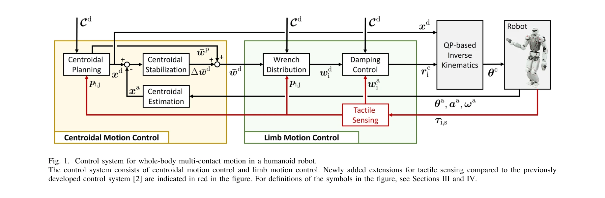
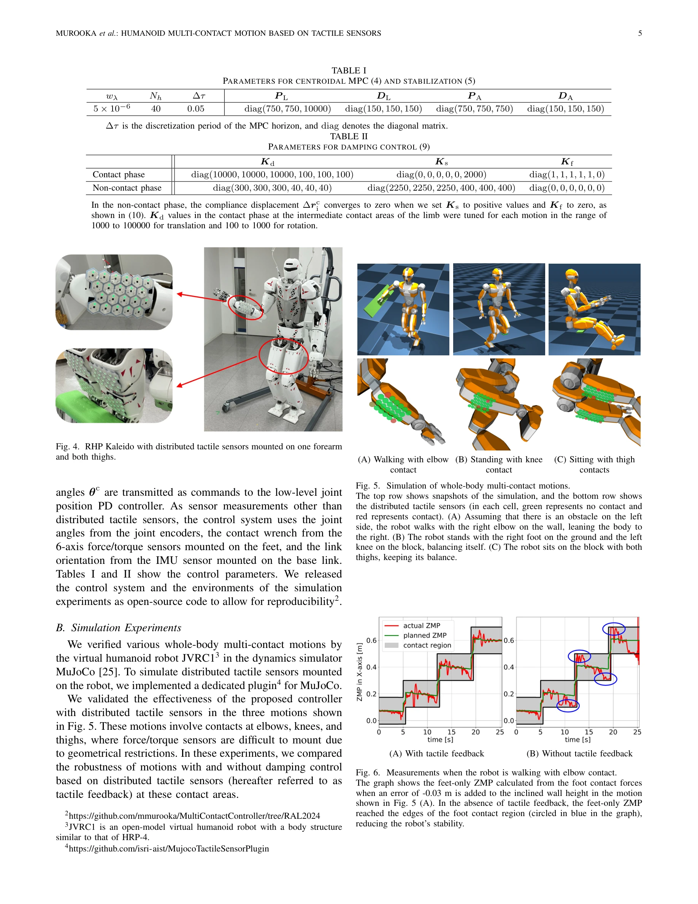

# Whole-body Multi-contact Motion Control for Humanoid Robots Based on Distributed Tactile Sensors

> **저자**: Masaki Murooka, Kensuke Fukumitsu, Marwan Hamze, Mitsuharu Morisawa, Hiroshi Kaminaga, Fumio Kanehiro, Eiichi Yoshida | **날짜**: 2025-05-26 | **URL**: [https://arxiv.org/abs/2505.19580](https://arxiv.org/abs/2505.19580)

---

## Essence

*Fig. 1. Control system for whole-body multi-contact motion in a humanoid robot.*

분산 촉각 센서를 장착한 휴머노이드 로봇이 팔꿈치, 무릎 등 중간 부위에서도 접촉하는 전신 다중 접촉 운동을 실현하는 제어 방법을 개발했다.

## Motivation

- **Known**: 기존 휴머노이드 로봇의 다중 접촉 운동은 주로 손과 발 등 극단부에만 국한되었으며, force/torque 센서가 장착된 영역에서만 접촉이 가능했다.
- **Gap**: 위치 제어 휴머노이드 로봇이 extremities 이외의 신체 부위에서 동적으로 접촉하면서 안정적인 balance를 유지하는 방법이 부족했다.
- **Why**: confined 환경에서 로봇이 강건하게 작동하려면 신체 전체를 활용한 접촉이 필수이며, 이는 재해 구조, 건설 등 현장 작업 적용성을 대폭 향상시킨다.
- **Approach**: deformable sheet-shaped 분산 촉각 센서를 로봇 사지 표면에 장착하고, 기존 MPC 기반 centroidal motion control 및 limb motion control을 확장하여 tactile feedback을 통한 balance control을 구현했다.

## Achievement

*Fig. 4. RHP Kaleido with distributed tactile sensors mounted on one forearm*

- **분산 촉각 센서 기반 접촉 감지**: 시트형 deformable 센서로 로봇 신체 형상 변화 최소화하면서 전신 접촉력 측정 가능
- **접촉 다각형 온라인 업데이트**: 측정된 실제 접촉 다각형과 예측된 다각형의 차이를 반영하여 wrench 분배 안정성 향상
- **확장된 제어 프레임워크**: 기존 extremities 전용 controller를 전신 다중 접촉으로 확장하고 tactile feedback을 centroidal planning과 limb control에 통합
- **시뮬레이션 및 실험 검증**: RHP Kaleido 휴머노이드 로봇에서 전완부 접촉으로 전진 보행, 대퇴부 접촉으로 앉은 자세 균형 유지 등 실현
- **안정성 향상**: tactile feedback이 disturbance와 environmental error에 대한 저항성 증대 입증

## How

*Fig. 1. Control system for whole-body multi-contact motion in a humanoid robot.*

- Contact wrench를 friction pyramid의 ridge vector λ와 contact polygon 꼭짓점 pi,j로 표현
- Newton-Euler equation 기반 nonlinear discrete system 구성
- MPC를 통해 centroidal state와 control input λ를 최적화 (목적함수: state 추적 오차와 control effort)
- 분산 촉각 센서로부터 실측 접촉 다각형을 추출하고 predefined 다각형과 비교하여 온라인 업데이트
- Damping control을 통해 접촉 wrench를 피드백으로 사용하여 limb motion 안정화
- Dynamics simulation과 life-sized humanoid 로봇 RHP Kaleido에서 검증

## Originality

- Position-controlled 휴머노이드 로봇이 forearm 등 intermediate area에서 동적 접촉을 실현한 첫 사례 (기존 quasi-static 방식 또는 torque-controlled 로봇만 가능했음)
- 분산 촉각 센서 기반 contact polygon 온라인 업데이트 기법으로 실제 환경의 불확실성 대응
- Tactile feedback을 centroidal control과 limb control 양쪽에 통합하는 통합 제어 프레임워크
- Balance control에서 tactile sensor의 명시적 활용 (기존 연구는 주로 interaction, manipulation, texture classification 중심)

## Limitation & Further Study

- Contact sequence (timing, location, area)는 수동 또는 global planner에서 결정되며, 자동 sequence 생성 미포함
- Distributed tactile sensor의 정확도, 응답 속도, calibration 요구사항에 대한 상세 분석 부재
- 실험은 제한된 시나리오(stepping forward with forearm, sitting with thigh contact)에서만 수행됨
- Friction coefficient, sensor noise, latency 등 환경 및 하드웨어 변수에 대한 robustness 분석 부족
- 후속 연구로 contact sequence 자동 생성, 더 복잡한 환경에서의 적응성, sensor fusion 및 learning 기반 개선 필요

## Evaluation

- Novelty: 4/5
- Technical Soundness: 3/5
- Significance: 4/5
- Clarity: 4/5
- Overall: 4/5

**총평**: 분산 촉각 센서와 MPC 기반 제어의 결합으로 위치 제어 휴머노이드의 전신 다중 접촉 운동을 처음 실현한 의미 있는 연구이며, confined 환경 작업 로봇의 실용화에 중요한 기여를 한다.