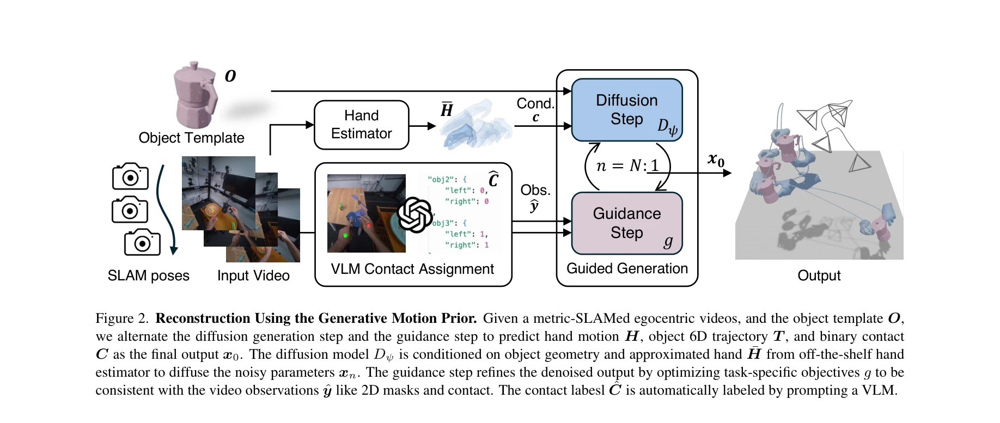
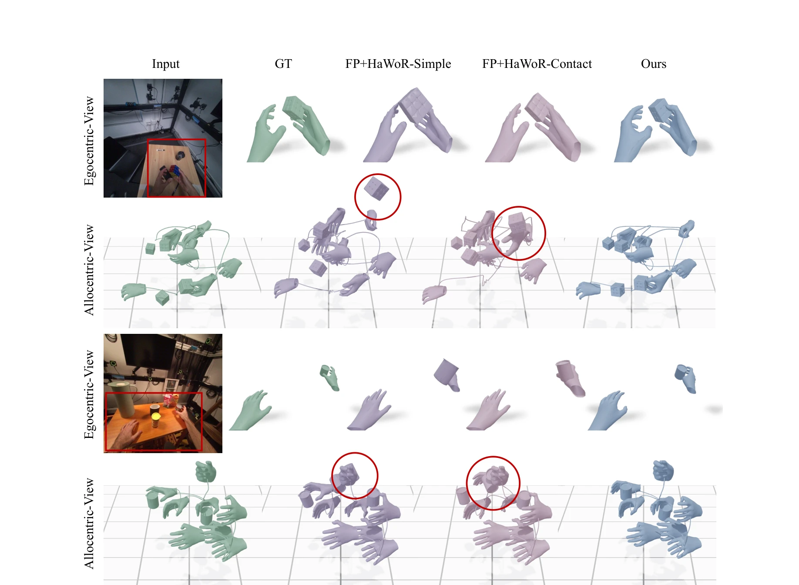

# WHOLE: World-Grounded Hand-Object Lifted from Egocentric Videos

> **저자**: Yufei Ye, Jiaman Li, Ryan Rong, C. Karen Liu | **날짜**: 2026-02-25 | **URL**: [https://arxiv.org/abs/2602.22209](https://arxiv.org/abs/2602.22209)

---

## Essence

*Figure 2. Reconstruction Using the Generative Motion Prior. Given a metric-SLAMed egocentric videos, and the object temp*

본 논문은 egocentric 비디오에서 손과 객체의 상호작용을 jointly하게 재구성하기 위해 diffusion-based generative motion prior를 학습하고, 테스트 시점에 visual observations와 VLM-기반 contact cues로 이를 guided generation하는 WHOLE 방법을 제안한다.

## Motivation

- **Known**: 손 포즈 추정과 객체 6D pose 추정은 각각 잘 연구되었으나, egocentric 비디오에서 카메라 움직임, 객체의 시야 진출입, 상호작용 중 심각한 occlusion으로 인해 두 작업을 독립적으로 수행하면 비일관적 결과가 발생한다.
- **Gap**: 기존 방법들은 손 또는 객체를 분리하여 복원하거나 hand-object interaction reconstruction도 국소적 좌표계에 제한되어 있으며, 전역 3D 공간에서 장시간 상호작용 시퀀스의 일관성 있는 재구성을 달성하지 못한다.
- **Why**: egocentric 경험 이해, 로봇 학습, AR/VR 환경 구성 등 실제 응용을 위해 인간의 손과 조작 객체의 일관성 있는 전역 3D 재구성이 필수적이다.
- **Approach**: 손과 객체의 상호작용 dynamics를 모델링하는 diffusion-based generative motion prior를 학습한 후, 테스트 시점에 segmentation mask, contact cues, SLAM poses 등의 visual observations로 guided generation을 수행하여 전역 좌표계에서 일관성 있는 trajectory를 생성한다.

## Achievement

*Figure 5. HOI Visualization. We show hand-object reconstructions from GT (green), FP+HaWor-Simple (purple), FP+HaWor-Con*

- **Hand Motion Estimation**: 기존 방법 대비 우수한 성능 달성
- **6D Object Pose Estimation**: 이전 SOTA를 넘는 성과
- **Hand-Object Interaction Reconstruction**: 전역 3D 공간에서 상호작용의 일관성 있는 재구성 실현
- **VLM-기반 Contact Localization**: 자동화된 contact annotation으로 ground-truth 레이블과 유사한 성능 달성

## How

*Figure 2. Reconstruction Using the Generative Motion Prior. Given a metric-SLAMed egocentric videos, and the object temp*

- Diffusion model을 조건 c ≡ (H̄, O)로 훈련하여 hand motion H, object trajectory T, contact label C를 생성
- Off-the-shelf hand estimator로부터 rough estimate H̄를 얻고, generative prior이 이를 refine
- Guidance step에서 2D segmentation masks, contact cues, temporal consistency objective로 denoised output을 최적화
- Vision-language model에 spatially grounded visual prompts를 적용하여 cluttered scenes에서도 robust한 contact 추론
- Gravity-aware local frame에서 hand-object dynamics를 모델링한 후 global world frame으로 변환
- Fixed-length time window (T=120)에서 motions을 생성하고 video observations와의 일관성 보장

## Originality

- 손과 객체의 **joint generative modeling**: 기존의 독립적 처리 방식에서 벗어나 상호의존성을 명시적으로 모델링
- **Guided generation framework**: Diffusion prior를 video observations로 guided하여 reconstruction과 plausibility의 균형 달성
- **VLM-based spatial grounding**: Vision-language model의 contact detection 능력을 visual prompts로 향상시키는 novel approach
- **Global 4D motion reconstruction**: Egocentric 비디오에서 전역 world coordinate frame에서의 일관성 있는 long-sequence 재구성

## Limitation & Further Study

- Object template가 사전에 주어져야 함 (template-free 접근의 필요성)
- Fixed-length time window (T=120)의 제약이 매우 긴 interaction sequences 처리 시 한계
- Metric-SLAM이 정확하게 계산되어야 한다는 가정이 실제 환경에서 제약
- VLM-기반 contact annotation의 자동화가 여전히 오류에 취약할 가능성
- HOT3D 데이터셋에서만 평가되어 다양한 시나리오에서의 generalization 검증 필요
- Multiple objects 동시 상호작용이나 복잡한 occlusion 처리의 확장성 미흡

## Evaluation

- Novelty: 4/5
- Technical Soundness: 3/5
- Significance: 4/5
- Clarity: 4/5
- Overall: 4/5

**총평**: 본 논문은 egocentric 비디오에서 손과 객체 재구성을 joint generative modeling으로 해결하는 novel한 접근을 제시하며, guided generation 프레임워크와 VLM-기반 contact grounding을 통해 기존 분리된 방법보다 일관성 있는 결과를 달성한다. 실제 응용을 위해 template-free 접근과 일반화 검증이 필요하나, 전반적으로 매우 가치 있는 기여로 평가된다.