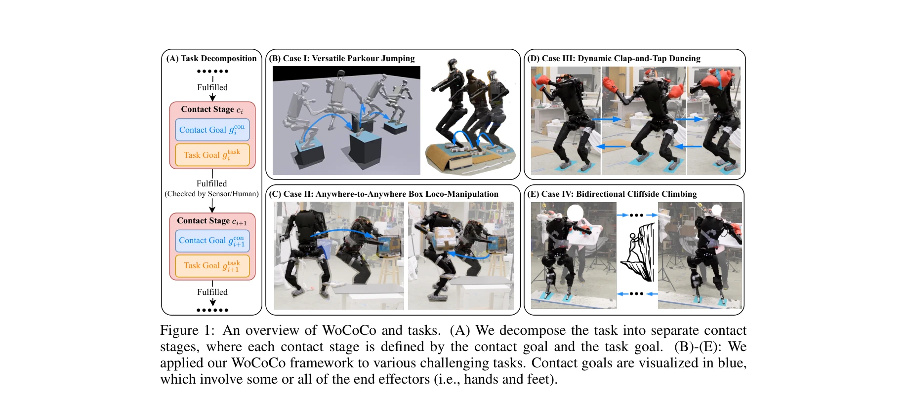
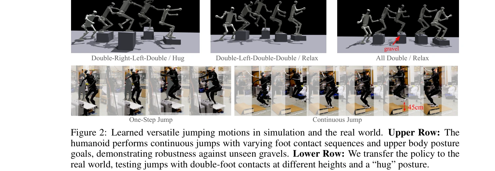

# WoCoCo: Learning Whole-Body Humanoid Control with Sequential Contacts

> **저자**: Chong Zhang, Wenli Xiao, Tairan He, Guanya Shi | **날짜**: 2024-06-10 | **URL**: [https://arxiv.org/abs/2406.06005](https://arxiv.org/abs/2406.06005)

---

## Essence

*Figure 1: An overview of WoCoCo and tasks. (A) We decompose the task into separate contact*

WoCoCo는 순차적 접촉을 포함하는 휴머노이드 로봇의 전신 제어를 학습하기 위한 강화학습 프레임워크로, 작업을 접촉 단계로 자연스럽게 분해하여 task-agnostic한 보상과 sim-to-real 설계를 통해 복잡한 동작을 학습한다.

## Motivation

- **Known**: Model-free RL은 로봇 제어에서 강건성을 보여왔으나, 순차적 접촉을 포함한 task-specific tuning과 state machine 설계가 필요하고 장기 지평 탐색에서 어려움을 겪는다. Model-based 방법(예: Crocoddyl)은 여러 작업에 적응 가능하지만 시간이 오래 걸린다.
- **Gap**: 순차적 접촉 계획을 만족하면서도 RL의 강건성을 유지하고 minimal한 task-specific tuning으로 여러 복잡한 휴머노이드 작업을 통일된 방식으로 해결하는 일반적인 프레임워크가 부재하다.
- **Why**: 휴머노이드 로봇이 현실 환경에서 파쿠르 점프, 상자 조작, 댄싱, 클라이밍 등 다양한 순차적 접촉 기반 작업을 수행해야 하며, 이는 복잡한 로봇 상호작용의 핵심이다.
- **Approach**: 작업을 접촉 목표와 task 목표로 정의된 여러 접촉 단계로 분해하고, dense contact rewards, stage count rewards, curiosity rewards로 구성된 WoCoCo reward와 curriculum 기반 sim-to-real 파이프라인을 통해 PPO로 정책을 학습한다.

## Achievement

*Figure 1: An overview of WoCoCo and tasks. (A) We decompose the task into separate contact*

- **일반적인 프레임워크**: 휴머노이드와 22-DoF 공룡 로봇 모두에 적용 가능한 통일된 WoCoCo 프레임워크 제시
- **Minimal task-specific 설계**: 각 작업마다 1-2개의 task-related 항만 지정하면 되는 간단한 reward 설계
- **네 가지 현실 로봇 작업**: parkour jumping, box loco-manipulation, dynamic clap-and-tap dancing, cliffside climbing을 모션 priors 없이 end-to-end RL로 해결 (각각이 단일 RL 정책으로 해결한 첫 사례)
- **효과적인 탐색**: stage count rewards로 장기 지평 탐색 문제를 해결하고 dense contact rewards로 sparse contact 신호 대응

## How

*Figure 2: Learned versatile jumping motions in simulation and the real world. Upper Row: The*

- **Task decomposition**: 순차적 접촉 계획을 여러 contact stage로 분해하며, 각 stage는 contact goal과 task goal 정의
- **WoCoCo reward design**: rcon (dense contact rewards - 각 올바른/잘못된 접촉을 계산), rstage (stage count rewards - 완료한 stage 수 기반), rcuri (task-agnostic curiosity rewards) 결합
- **Dense contact rewards**: 0-1 이진 보상 대신 모든 접촉 상태를 개별 계산하여 정책에 세밀한 guidance 제공
- **Stage count rewards**: 현재 stage에 머물러있으려는 단기적 행동을 방지하고 다음 stage 탐색 유도
- **Curriculum-based sim-to-real**: (1) domain randomization 없이 학습, (2) domain randomization 추가, (3) regularization rewards 가중치 증가 세 단계로 sim-to-real 전이 안정화
- **Symmetry augmentation**: PPO와 함께 대칭성 증강 활용
- **End-to-end MLP policy**: low-level PD controller로 제어되는 joint target positions를 직접 출력

## Originality

- **Contact stage 기반 task 분해**: 순차적 접촉을 명시적으로 모델링하는 자연스러운 문제 재구성
- **Dense contact rewards**: 0-1 이진 보상의 한계를 벗어나 모든 접촉 상태를 계산하는 새로운 reward design
- **Stage count rewards**: 장기 탐색을 유도하는 task-agnostic 접근
- **Task-agnostic curiosity rewards**: 특정 작업이나 도메인에 의존하지 않는 탐색 메커니즘
- **통일된 sim-to-real 파이프라인**: curriculum 기반 domain randomization으로 여러 이질적 작업에 공통 적용 가능

## Limitation & Further Study

- **Contact stage 사전 정의**: 현재 프레임워크는 접촉 단계를 휴리스틱하게 미리 정의해야 하며, 고수준 contact planner와의 통합 필요
- **센서/인간 기반 stage 전환**: stage fulfillment 확인이 센서나 인간 관찰에 의존하므로 완전 자동화된 시스템 구축에는 추가 작업 필요
- **Generalization 한계**: 제시된 작업들이 특정 환경과 로봇에 맞춰진 것으로, 다른 형태의 로봇이나 극도로 다른 환경에서의 성능은 미지수
- **후속 연구**: high-level contact planner와의 자동 통합, 다양한 로봇 형태와 환경에서의 generalization 검증, stage 자동 발견 메커니즘 개발 필요

## Evaluation

- Novelty: 4/5
- Technical Soundness: 3/5
- Significance: 4/5
- Clarity: 4/5
- Overall: 4/5

**총평**: WoCoCo는 순차적 접촉 기반 휴머노이드 제어의 오래된 문제를 task decomposition과 task-agnostic reward design으로 우아하게 해결하며, 네 가지 도전적인 현실 로봇 작업에서 입증된 일반성과 실용성으로 로봇 학습 분야에 유의미한 기여를 한다.