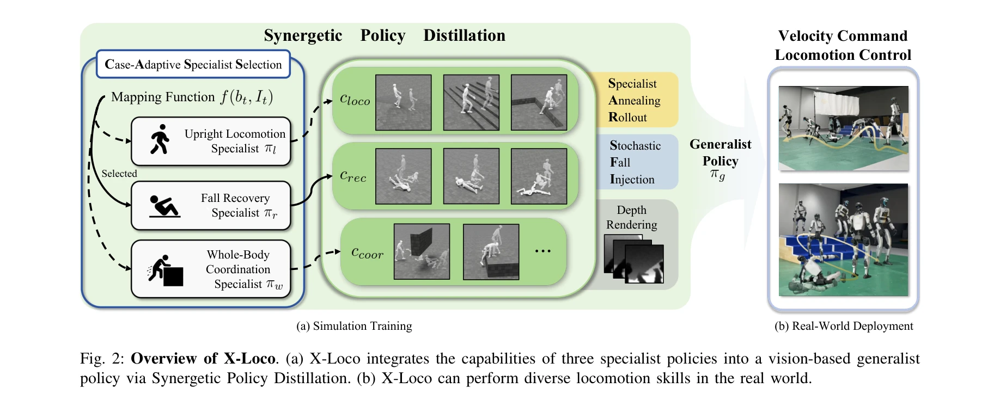
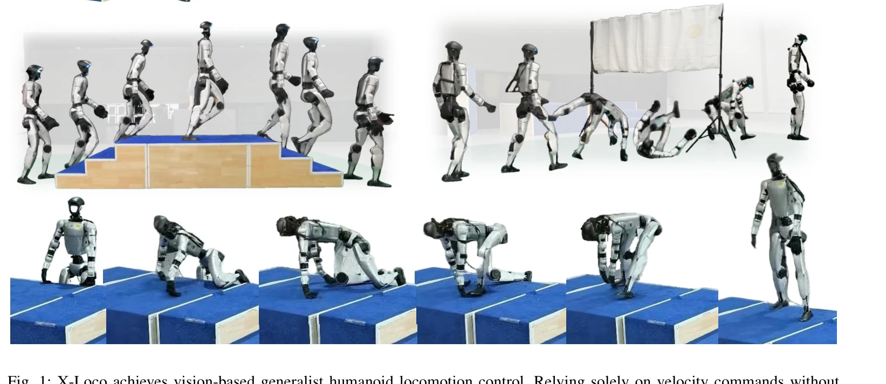

# X-Loco: Towards Generalist Humanoid Locomotion Control via Synergetic Policy Distillation

> **저자**:  | **날짜**: 2026-03-31 | **URL**: [https://arxiv.org/abs/2603.03733](https://arxiv.org/abs/2603.03733)

---

## Essence

*Fig. 2: Overview of X-Loco. (a) X-Loco integrates the capabilities of three specialist policies into a vision-based gene*

X-Loco는 시너지 정책 증류(Synergetic Policy Distillation)를 통해 세 개의 전문가 정책(직립 보행, 넘어짐 복구, 전신 협응)을 통합하여 비전 기반 범용 휴머노이드 보행 정책을 학습하는 프레임워크이다. 속도 명령만으로 계단 오르내리기, 넘어짐 복구, 박스 오르기 등 다양한 보행 스킬을 단일 정책으로 수행한다.

## Motivation

- **Known**: 최근 휴머노이드 로봇은 직립 보행, 넘어짐 복구, 전신 협응 등 개별 스킬에서 강한 성능을 보였으나, 이러한 다양한 스킬들을 하나의 정책으로 통합하는 것은 서로 충돌하는 제어 목표와 동역학의 차이로 인해 어렵다.
- **Gap**: 기존 방법들은 특정 보행 스킬(지형 횡단 또는 넘어짐 복구)에 집중하거나 모션 추적에 의존하여 참조 모션 없이 자율적으로 다양한 보행 스킬을 수행하는 비전 기반 범용 컨트롤러를 개발하지 못했다.
- **Why**: 휴머노이드 로봇의 실제 배포를 위해 복잡한 환경에서 넘어짐 후 자동으로 보행을 재개하고, 다양한 지형을 횡단하며, 접촉이 많은 스킬을 수행할 수 있는 통합된 범용 정책이 필수적이다.
- **Approach**: 여러 전문가 정책을 학습한 후, Case-Adaptive Specialist Selection 메커니즘으로 로봇 상태와 지형에 따라 가장 적절한 전문가를 동적으로 선택하여 학생 정책을 가이드하는 synergetic distillation 패러다임을 사용한다.

## Achievement

*Fig. 1: X-Loco achieves vision-based generalist humanoid locomotion control. Relying solely on velocity commands without*

- **통합된 범용 정책**: 직립 보행, 넘어짐 복구, 전신 협응 스킬을 참조 모션 없이 속도 명령만으로 단일 정책으로 통합
- **Synergetic Policy Distillation**: 다중 전문가 정책의 전문성을 효과적으로 통합하면서 서로 다른 스킬 간의 간섭을 완화
- **학습 효율성 향상**: Specialist Annealing Rollout과 Stochastic Fall Injection을 통한 효율적인 전문가 지식 내재화 및 실패 시나리오 노출
- **실제 로봇 검증**: Unitree G1에서 배포되어 다양한 지형과 도전 시나리오에서 우수한 성능과 안정성 입증

## How

*Fig. 2: Overview of X-Loco. (a) X-Loco integrates the capabilities of three specialist policies into a vision-based gene*

- 세 개의 전문가 정책(upright locomotion specialist, fall recovery specialist, whole-body coordination specialist) 독립적으로 학습
- Case-Adaptive Specialist Selection (CASS) 메커니즘: 로봇 상태와 지형을 기반으로 가장 관련성 높은 전문가 정책을 동적으로 선택하여 학생 정책에 행동 가이드 제공
- Specialist Annealing Rollout (SAR): 초기 단계에서 전문가 정책의 롤아웃 비율을 높게 시작하여 학생 정책이 최적 상태-행동 분포를 커버하도록 하고, 점진적으로 감소시킴
- Stochastic Fall Injection (SFI): 훈련 중 능동적 외부 교란을 적용하여 정책이 예상 밖의 균형 손실에 적응하도록 강제
- PPO와 GAE를 사용하여 전문가 및 학생 정책 학습
- Depth rendering을 위한 빠르고 독립적인 카메라 렌더링 구현으로 시뮬레이션 학습 효율화

## Originality

- 처음으로 직립 보행, 전신 협응, 넘어짐 복구를 모두 통합한 비전 기반 휴머노이드 보행 제어 프레임워크 제시
- Case-Adaptive Specialist Selection 메커니즘으로 로봇의 상태와 환경에 따라 동적으로 전문가를 선택하는 새로운 접근
- Specialist Annealing Rollout을 통한 적응형 혼합 비율 기반 데이터 수집 전략으로 학습 효율성 향상
- Stochastic Fall Injection으로 보행과 넘어짐 복구 간의 전환을 자연스럽게 유도하는 새로운 메커니즘

## Limitation & Further Study

- 세 개의 전문가 정책을 미리 학습해야 하므로 초기 학습 비용이 높음
- 현재는 Unitree G1 플랫폼에만 검증되었으며, 다른 휴머노이드 로봇 플랫폼으로의 일반화 가능성 불명확
- 시뮬레이터에서 렌더링된 깊이 이미지에 의존하므로, 실제 환경의 노이즈와 빛 조건 변화에 대한 강건성 추가 검증 필요
- reward engineering이 여전히 각 전문가 정책별로 필요하며, 전체 프레임워크의 완전 자동화 미실현
- 후속 연구로 더 많은 전문가 정책 통합, 시뮬레이션-현실 간격 감소, 실시간 환경 적응성 향상 필요

## Evaluation

- Novelty: 4/5
- Technical Soundness: 3/5
- Significance: 4/5
- Clarity: 4/5
- Overall: 4/5

**총평**: X-Loco는 multiple specialist policies를 synergetic distillation으로 효과적으로 통합하여 휴머노이드 로봇의 범용 보행 제어를 실현한 혁신적 프레임워크이다. 직립 보행, 넘어짐 복구, 전신 협응을 단일 비전 기반 정책으로 통합하고 실제 로봇에서 검증한 점에서 매우 의미 있는 기여이며, 추가적으로 다양한 플랫폼으로의 확장과 더욱 강화된 시뮬레이션-현실 변환이 필요하다.